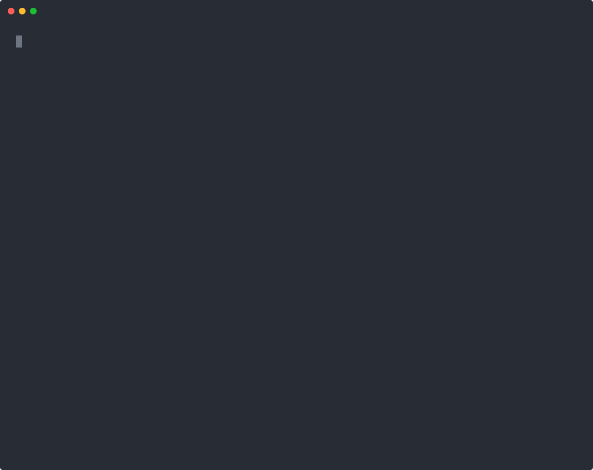
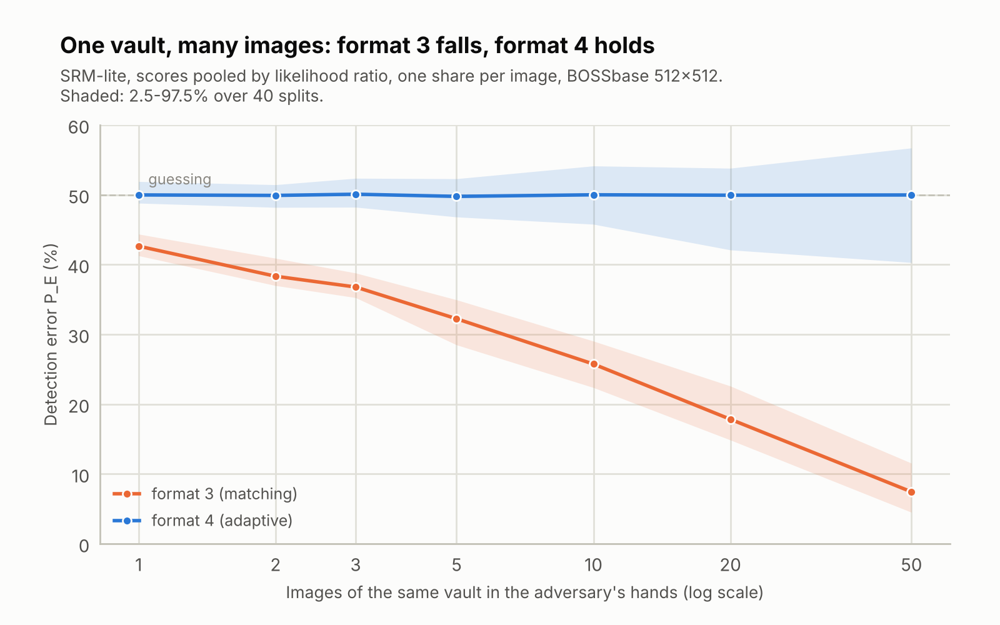
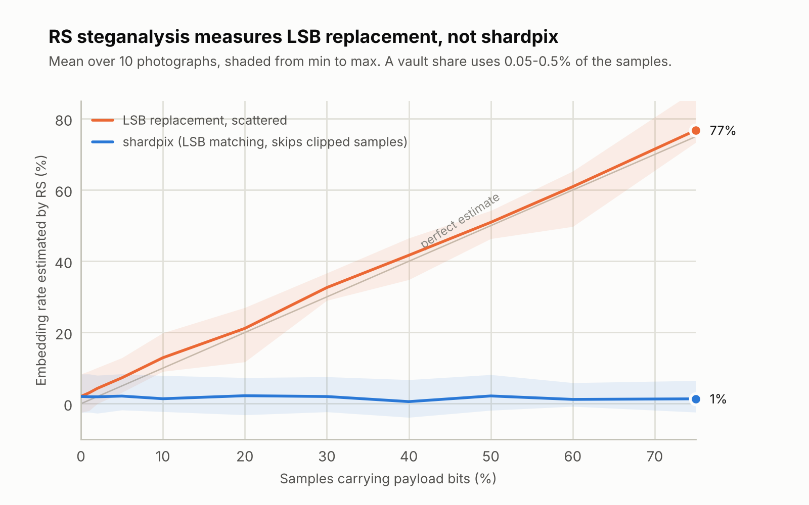
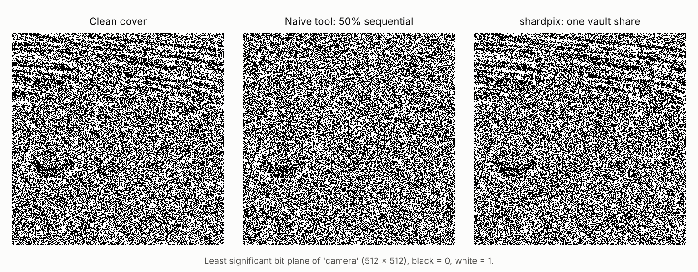
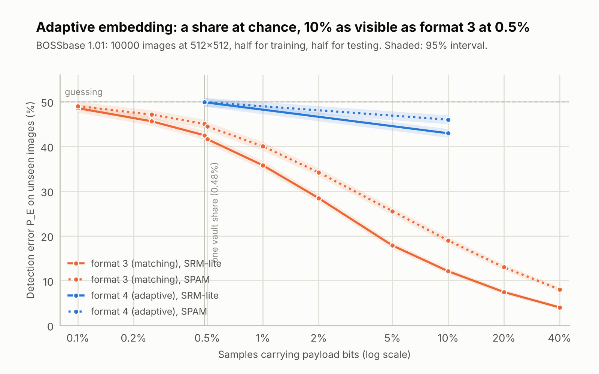

# shardpix

[](https://github.com/Just-Ipavon/shardpix/actions/workflows/ci.yml)
[](https://www.python.org/)
[](LICENSE)

[English](README.md) · **Italiano**

Cifra un file e nasconde la chiave in foto dall'aspetto del tutto normale: la
divide in *n* quote, una per immagine, in modo che *k* immagini qualsiasi
aprano il file e un numero minore non riveli nulla. Le immagini non hanno
modifiche visibili e superano la steganalisi classica; gli attacchi che lo
verificano, il test del chi-quadro e l'analisi RS, sono inclusi nel tool.

> **Progetto didattico: revisione di sicurezza interna, nessun audit
> indipendente.** La crittografia viene dalla libreria `cryptography`; la
> condivisione del segreto, l'inserimento nelle immagini e la steganalisi sono
> implementati qui. Il codice è passato per analisi statica, fuzzing,
> mutation testing e una revisione manuale secondo OWASP ASVS — vedi la
> [revisione di sicurezza](docs_it/06-security-review.md) — ma nessuna terza
> parte ne ha fatto un audit. Per segreti che non puoi permetterti di perdere
> usa strumenti consolidati come [age](https://age-encryption.org).



## Perché è importante

Dividere una chiave con lo schema di Shamir e nascondere le quote nelle
immagini non è un'idea nuova. Quello che di solito manca è la domanda che un
avversario si farebbe davvero: **non "questa foto nasconde qualcosa?", ma
"queste foto, prese insieme, nascondono qualcosa?"** Chi trova una quota
spesso ne trova altre della stessa cassaforte: i custodi si conoscono, usano
lo stesso cloud, scrivono alle stesse persone. Gli schemi che uniscono
condivisione del segreto e steganografia vengono valutati un'immagine alla
volta, di solito con strumenti generici, e quasi sempre nascondono le quote
nei bit meno significativi (LSB).

shardpix è costruito attorno a quella domanda e ne misura la risposta:

- **Una sola immagine è il test sbagliato.** Con un inserimento di tipo LSB
  (il formato 3, tenuto come termine di confronto) un rilevatore addestrato
  sbaglia il 42,6% delle volte su una singola immagine 512x512: sembra quasi
  sicuro. Con 50 immagini della stessa cassaforte, combinando i punteggi,
  sbaglia solo il 7,4% delle volte: insieme, le quote tradiscono la
  cassaforte.
- **L'inserimento adattivo regge.** Il formato 4 colloca ogni quota con
  codici a traliccio di sindrome (STC) dove la foto è più ricca di dettagli;
  sulle stesse 10.000 immagini di BOSSbase il rilevatore aggregato resta al
  livello del caso, circa 50%, da 1 a 50 immagini.
- **Foto vere, non foto di laboratorio.** Le foto del telefono sono JPEG,
  quindi shardpix nasconde la quota direttamente nei coefficienti del JPEG
  (formato 5) e restituisce un JPEG con le stesse impostazioni di qualità e
  gli stessi metadati, senza conversioni che tradirebbero l'immagine.
- **Tutto è riproducibile.** Rilevatori, dataset, controlli positivi e
  intervalli di confidenza sono nel repository; ogni numero di questo README
  si può rigenerare.

<picture>
  <source media="(prefers-color-scheme: dark)" srcset="assets/pooled-512-dark.png">
  
</picture>

## Come funziona

```text
notes.pdf ──AES-256-GCM, chiave casuale K──────►  notes.pdf.spx      conservalo dove vuoi
K ─────────Shamir su GF(256), 3 su 5───────────►  5 quote autenticate
quota i ───±1 adattivo, poche centinaia di modifiche►  photo_i.jpg   una per custode
```

- **Il file vault** è testo cifrato. Può stare su un disco condiviso o in una
  e-mail: senza la chiave è inutilizzabile.
- **La chiave** esiste solo sotto forma di quote. Tre quote qualsiasi su cinque
  la ricostruiscono; due non dicono nulla, nemmeno con potenza di calcolo
  illimitata.
- **Ogni quota** è nascosta in una foto, tra posizioni candidate che solo la
  passphrase permette di trovare, con le poche modifiche messe dove la foto
  ha più texture, e cifrata in modo che i bit nascosti
  sembrino rumore.

## Funzionalità

| Comando | Cosa fa |
| --- | --- |
| `seal` | Cifra un file e nasconde una quota della chiave in ciascuna immagine |
| `unseal` | Apre un vault con *k* immagini qualsiasi e fa un resoconto su ognuna |
| `embed` / `extract` | Nasconde o recupera un messaggio o un file in una singola immagine |
| `split` / `combine` | Condivisione del segreto di Shamir con quote stampabili e autenticate |
| `inspect` | Mostra se un'immagine contiene una quota, e di quale vault |
| `analyze` | Esegue il test del chi-quadro e l'analisi RS su qualsiasi immagine |
| `capacity` | Mostra quanti byte può contenere un'immagine |

Le immagini danneggiate vengono individuate invece di far fallire in silenzio
il recupero, e un insieme di quote contraffatte non può mai passare per la
chiave vera.

## Installazione

shardpix richiede Python 3.10 o successivo. Installalo con
[pipx](https://pipx.pypa.io), che lo mette in un ambiente tutto suo e aggiunge
il comando `shardpix` al `PATH`: funziona in ogni terminale e in ogni
cartella.

```bash
# 1. pipx, una volta sola
sudo apt install pipx            # Debian, Ubuntu, Kali
brew install pipx                # macOS
py -m pip install --user pipx    # Windows
pipx ensurepath                  # poi apri un nuovo terminale

# 2. shardpix, direttamente da GitHub
pipx install git+https://github.com/Just-Ipavon/shardpix.git
shardpix --version
```

Aggiornalo all'ultima versione con `pipx reinstall shardpix`, rimuovilo con
`pipx uninstall shardpix`.

### Per lo sviluppo

Per lavorare sul codice usa invece un ambiente virtuale. In questo caso il
comando `shardpix` esiste solo finché l'ambiente è attivo: in un nuovo
terminale riesegui `source .venv/bin/activate` (`.venv\Scripts\activate` su
Windows).

```bash
git clone https://github.com/Just-Ipavon/shardpix.git
cd shardpix
python3 -m venv .venv && source .venv/bin/activate
pip install -e ".[dev]"
```

## Utilizzo

```bash
# Sigilla un file dietro 3 foto su 5 (chiede una passphrase)
shardpix seal verbale.pdf foto/*.png -k 3 -p

# Aprilo con tre immagini qualsiasi
shardpix unseal sealed/verbale.pdf.spx sealed/spiaggia.png sealed/gatto.png sealed/strada.png -p

# Nascondi un breve messaggio in un'immagine e rileggilo
shardpix embed foto.png -o vacanze.png -t "ci vediamo a mezzogiorno" -p
shardpix extract vacanze.png -p

# Dividi un segreto in quote stampabili: 2 qualsiasi su 3 lo ricostruiscono
shardpix split -t "codice cassaforte 4815" -k 2 -n 3 -d quote/
shardpix combine quote/share-*-1.txt quote/share-*-3.txt

# Cerca le impronte statistiche dell'inserimento nei bit meno significativi
shardpix analyze sospetta.png
```

### Opzioni

| Opzione | Significato |
| --- | --- |
| `-k, --threshold` | Immagini (o quote) necessarie per il recupero |
| `-n, --shares` | Quote da creare (`split`) |
| `-d, --directory` | Cartella di output (`seal`: predefinita `./sealed`; `split`: un file per quota) |
| `-p, --passphrase` | Chiede una passphrase |
| `--passphrase-file` | Legge la passphrase dalla prima riga di un file |
| `-o, --output` | File di output |
| `--name` | Nome del file vault (`seal`) |
| `-f, --force` | Sovrascrive gli output esistenti (gli input non vengono mai sovrascritti) |

Le passphrase non sono mai accettate come argomenti della riga di comando:
finirebbero nella cronologia della shell e nell'elenco dei processi.

### Quando qualcosa va storto

`unseal` riporta cosa è successo a ogni immagine — qui un custode ha ritagliato
la propria foto e un altro ha mandato quella sbagliata — così anche un
recupero fallito ti dice quale custode chiamare:

```text
  Image                Share    Status        Detail
  sealed/cat.png          #3    used
  sealed/street.png       #5    used
  sealed/beach.png        #2    used
  sealed/rocket.png             no payload    no share: wrong passphrase or edited image
  old/photo.png                 no payload    no share: wrong passphrase or edited image
Recovered minutes.pdf (47.1 KiB) to minutes.pdf
```

## Rilevabilità

<picture>
  <source media="(prefers-color-scheme: dark)" srcset="assets/rs-estimate-dark.png">
  
</picture>

L'analisi RS misura quasi esattamente la classica LSB replacement e non vede
shardpix a nessun tasso di inserimento. Al tasso che un vault usa davvero, tra
lo 0,05% e lo 0,5% dei campioni, la variazione mediana della stima RS su dieci
fotografie è di 0,07 punti. Il piano dei bit meno significativi racconta la
stessa cosa a occhio nudo:



I rilevatori addestrati sono più forti. Su BOSSbase, 10.000 fotografie mai
compresse, un classificatore basato sui rich model, addestrato nelle
condizioni più favorevoli per chi attacca, sbaglia nel 42,5% dei casi su una
quota nascosta in una foto in scala di grigi 512x512, contro il 50% di chi
tira a caso: un segnale debole, ma non nullo. Il segnale cala con la radice
quadrata della dimensione dell'immagine: al tasso più basso misurato i
rilevatori erano entro 1,5 punti dal caso.

Questo valeva per il formato 3. **Il formato 4, con inserimento adattivo, è
al livello del caso**: gli stessi rilevatori sulle stesse 10.000 immagini
sbagliano il 49,9% delle volte su una quota, e iniziano a vedere qualcosa
solo al 10% dei campioni, dove il formato 3 veniva scoperto nove volte su
dieci. Le foto a colori di almeno 2 megapixel restano la scelta più
prudente.

<picture>
  <source media="(prefers-color-scheme: dark)" srcset="assets/ml-format-comparison-512-dark.png">
  
</picture>

I risultati completi, l'attacco del chi-quadro, i rilevatori addestrati e i
limiti noti sono in [docs_it/05-security-analysis.md](docs_it/05-security-analysis.md).
Per riprodurli: `pip install -e ".[bench]"` e poi
`python -m shardpix.analysis.benchmark`; per i rilevatori addestrati
`pip install -e ".[bench,ml]"` e `python -m shardpix.analysis.ml_benchmark`
su una copia di BOSSbase.

## Foto del telefono e altre immagini

**Usa le foto scattate dal telefono così come sono.** shardpix legge i primi
byte di ogni immagine e nasconde la quota nel modo in cui quel file è
memorizzato:

| Immagine | Come viene nascosta la quota | Risultato |
| --- | --- | --- |
| JPEG (foto del telefono, fotocamere) | Nei coefficienti del JPEG stesso (formato 5): mai decodificato né ricompresso, stesse tabelle di qualità ed EXIF | `.jpg` |
| PNG, TIFF, BMP, esportazione da RAW | Nei pixel (formato 4) | `.png` |
| HEIC dell'iPhone | Non leggibile: imposta la fotocamera su *Più compatibile* (JPEG) | — |

Scegli foto con texture, scattate da te e mai condivise, e invia i risultati
come file, non come "foto" in un'app di messaggistica, che le ricomprime.
Dettagli e istruzioni passo passo:
[docs_it/07-covers-and-formats.md](docs_it/07-covers-and-formats.md).

## Scelte progettuali

**Si divide la chiave, non il file.** Viene condivisa solo la chiave da 32
byte, quindi ogni immagine contiene circa 160 byte qualunque sia la
dimensione del file. È proprio un carico così piccolo a rendere le immagini
difficili da distinguere dagli originali.

**Le quote si verificano a vicenda senza rivelare nulla.** Lo schema di
Shamir puro restituisce in silenzio un risultato sbagliato se una quota è
danneggiata. Qui ogni quota ha un MAC, ma la chiave del MAC viene condivisa
insieme al segreto: meno di *k* quote restano indipendenti dal segreto anche se
è una password corta, cosa che non varrebbe con un MAC basato sul segreto
stesso.

**Un insieme di quote contraffatte non può vincere.** L'identificativo del
vault è pubblico, quindi chiunque può fabbricare quote coerenti tra loro. Il
recupero cerca ogni gruppo di quote che si autenticano a vicenda e lascia
decidere al tag AES-GCM del vault quale sia quello vero.

**Prima misurato, poi corretto.** La prima versione usava la LSB matching
semplice. Il benchmark ha mostrato che l'analisi RS leggeva il 22% su una foto
con ampie zone nere: un campione a 0 può solo salire, e uno spostamento in
un'unica direzione è identico alla LSB replacement. Ora i campioni fuori
dall'intervallo 2–253 non vengono mai usati, e la stima è scesa al 4,5%.

**Le modifiche vanno dove la foto è già rumorosa.** Dal formato 4 il carico
viene scritto come codice a traliccio di sindrome (STC) su campioni
candidati scelti con la chiave: il codificatore può scegliere quali campioni
modificare e sceglie quelli con il costo HiLL più basso, nel fogliame e
nella grana invece che nel cielo. Una quota cambia circa un terzo dei
campioni di prima (208 contro 633 in una foto 512x512), e chi estrae non ha
bisogno di sapere dove sono.

**Le posizioni costano quanto il carico.** Le posizioni vengono da un
percorso ChaCha20 con campionamento a rifiuto, derivato dalla passphrase e da
un salt diverso per ogni immagine. Inserire una quota in una foto da 48
megapixel richiede lo stesso tempo che in una miniatura, e due immagini
sigillate con la stessa passphrase non hanno nulla in comune.

**Ogni formato è fissato dai test.** Dei test a risposta nota bloccano il
percorso, i byte delle quote, i pixel delle immagini e i byte del vault: un
refactoring o un aggiornamento di libreria che renderebbe illeggibili le
immagini esistenti fa fallire prima la build.

## Architettura

```text
shardpix/
├── cli.py              comandi, passphrase, protezione da sovrascritture, codici di uscita
├── vault.py            seal e unseal: AES-256-GCM + Shamir + steganografia
├── media.py            JPEG o pixel: sceglie il formato dal file
├── jpeg.py             formato 5: inserimento nei coefficienti JPEG
├── stego.py            derivazione delle chiavi, percorso, formati v4 (adattivo) e v3, framing
├── stc.py              codici a traliccio di sindrome (Viterbi)
├── costs.py            costi HiLL delle modifiche
├── shamir.py           condivisione del segreto, formato delle quote, MAC, recupero robusto
├── gf256.py            aritmetica in GF(2^8) e interpolazione di Lagrange
├── images.py           qualsiasi immagine in ingresso, PNG senza perdita in uscita
├── errors.py           gerarchia delle eccezioni
└── analysis/
    ├── chi_square.py   attacco del chi-quadro di Westfeld–Pfitzmann
    ├── rs.py           analisi RS di Fridrich–Goljan–Du
    ├── benchmark.py    esperimenti di rilevabilità e grafici
    ├── features.py     caratteristiche SPAM e SRM-lite per la steganalisi
    ├── ensemble.py     classificatore a ensemble di Kodovský–Fridrich–Holub
    ├── cnn.py          rete convoluzionale per la steganalisi (PyTorch)
    ├── ml_benchmark.py esperimenti con rilevatori addestrati su BOSSbase
    └── pooled.py       un avversario con più immagini della stessa cassaforte
```

## Documentazione

La documentazione tecnica completa è disponibile in italiano in
[docs_it/](docs_it/README.md) e, nella versione originale in inglese, in
[docs/](docs/README.md): architettura e decisioni di progetto, casi d'uso, un
riferimento funzione per funzione, il comportamento a runtime, un'analisi di
sicurezza e una revisione di sicurezza interna, con diagrammi UML. In caso di
differenze fa fede la versione inglese. Per segnalare una vulnerabilità vedi
[SECURITY.md](SECURITY.md).

| Documento | Contenuto |
| --- | --- |
| [01 — Architettura](docs_it/01-architecture.md) | Contesto, pacchetti, modello dei dati, formati su disco, dodici decisioni architetturali |
| [02 — Casi d'uso](docs_it/02-use-cases.md) | Attori, diagramma dei casi d'uso, nove specifiche dettagliate, scenari operativi |
| [03 — Riferimento delle funzioni](docs_it/03-function-reference.md) | Ogni funzione: comportamento, casi limite, errori, test che la coprono |
| [04 — Comportamento a runtime](docs_it/04-runtime-behaviour.md) | Diagrammi di sequenza, algoritmo di recupero delle quote, codici di uscita, tempi |
| [05 — Analisi di sicurezza](docs_it/05-security-analysis.md) | Modello delle minacce, proprietà di sicurezza, risultati della steganalisi, limiti |
| [06 — Revisione di sicurezza](docs_it/06-security-review.md) | Analisi statica, fuzzing, mutation testing, checklist ASVS, problemi trovati e correzioni |
| [07 — Foto e formati](docs_it/07-covers-and-formats.md) | PNG e JPEG, metodi di inserimento, foto del telefono |

## Licenza

MIT — vedi [LICENSE](LICENSE).
