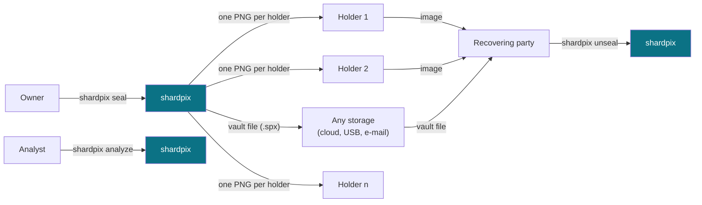
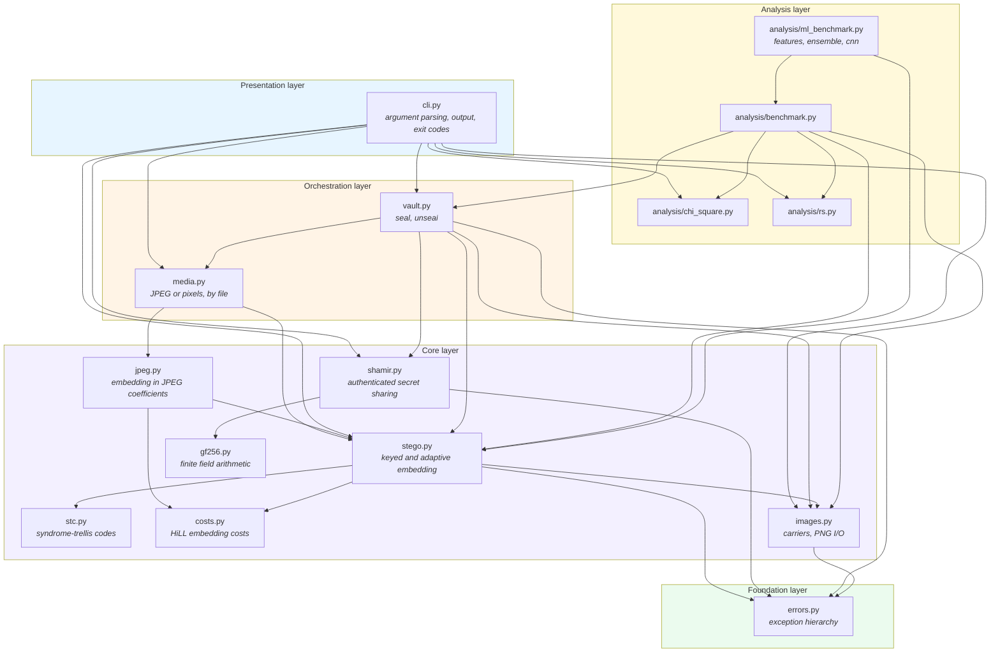
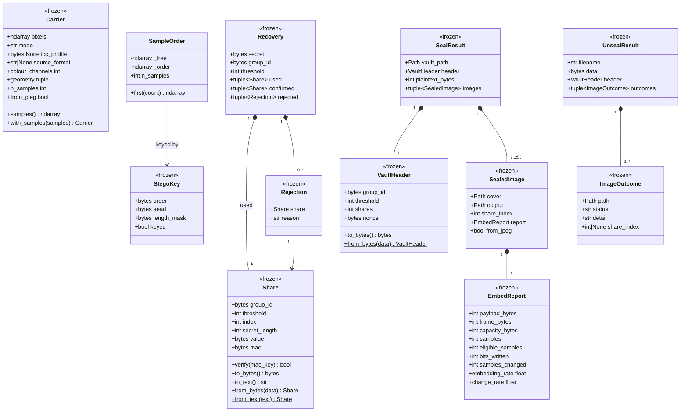
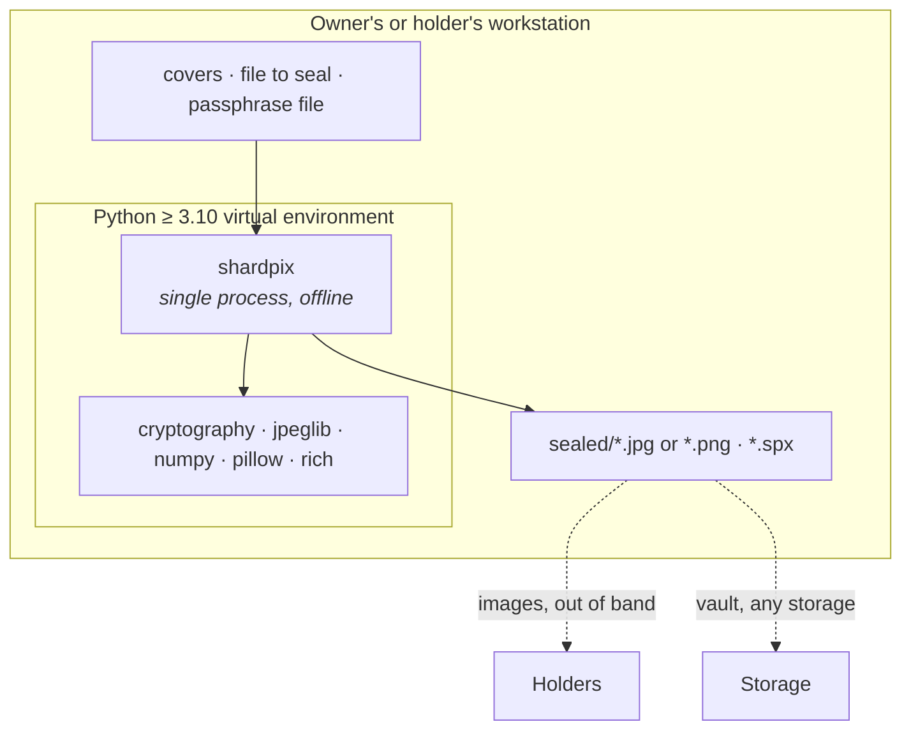

# 1. System architecture

| | |
| --- | --- |
| Document | SDD-01 — Architectural view |
| System | shardpix 2.0.0 |
| Status | Approved |
| Last revised | 2026-10-07 |

## 1.1 Purpose

This document describes the static structure of shardpix: the division into
packages, the dependencies between components, the data model, the on-disk
formats, and the architectural decisions that constrain the implementation.
Runtime behaviour is covered in [04-runtime-behaviour.md](04-runtime-behaviour.md);
the function-by-function detail in [03-function-reference.md](03-function-reference.md);
the reasoning about attackers in [05-security-analysis.md](05-security-analysis.md).

## 1.2 Context view

shardpix is a single-process command line application. It opens no network
connections, runs no services, persists nothing between runs except the
files it is asked to write, and needs no privileges.

The vault file and the images travel separately and through channels shardpix
does not control. That is the point of the design: the vault file can be
stored anywhere because it is ciphertext, and each image can be handed out
because, on its own, it is an ordinary photograph that reveals nothing.

## 1.3 Package view

**Dependency rule.** Dependencies point from the CLI towards the foundation,
never back: nothing in the core knows about the vault, the CLI or the
analysis layer, and the vault knows nothing about the CLI. Each core module is
usable as a library on its own — `shamir` without images, `stego` without
shares.

The analysis layer sits beside the stack rather than inside it. The attacks
are not used to embed anything; they measure the core from the outside, the
way an adversary would, and the benchmark drives the core (and reads the
vault's share size) to produce its experiments.

### 1.3.1 Responsibilities per file

| File | Responsibility | Depends on |
| --- | --- | --- |
| [`shardpix/__init__.py`](../shardpix/__init__.py) | Exposes `__version__` | — |
| [`shardpix/__main__.py`](../shardpix/__main__.py) | Entry point for `python -m shardpix` | `cli` |
| [`shardpix/cli.py`](../shardpix/cli.py) | Argument parsing, passphrase input, overwrite protection, terminal output, exit codes | `vault`, `stego`, `shamir`, `images`, `analysis` |
| [`shardpix/vault.py`](../shardpix/vault.py) | Encrypts a file, splits its key, distributes the shares over images, and reverses it | `stego`, `shamir`, `images` |
| [`shardpix/stego.py`](../shardpix/stego.py) | Key derivation, keyed walk, framing, adaptive (format 4) and LSB matching/replacement (format 3) embedding, extraction of both formats | `images`, `stc`, `costs` |
| [`shardpix/media.py`](../shardpix/media.py) | Opens a cover in the domain its file uses (JPEG coefficients or pixels), hides and reveals through the matching format | `jpeg`, `stego`, `images` |
| [`shardpix/jpeg.py`](../shardpix/jpeg.py) | Format 5: payload in non-zero AC luminance coefficients, read and written without decoding | `stego`, `costs` |
| [`shardpix/stc.py`](../shardpix/stc.py) | Syndrome-trellis codes: least-cost embedding with the Viterbi algorithm, syndrome extraction | — |
| [`shardpix/costs.py`](../shardpix/costs.py) | HiLL cost of a ±1 change at every sample; UERD cost of a ±1 change at every JPEG coefficient | — |
| [`shardpix/shamir.py`](../shardpix/shamir.py) | Shamir splitting, share format, MACs, robust recovery | `gf256` |
| [`shardpix/gf256.py`](../shardpix/gf256.py) | GF(2^8) arithmetic, polynomial evaluation, Lagrange interpolation | — |
| [`shardpix/images.py`](../shardpix/images.py) | Loading any image as an 8-bit carrier, writing lossless PNG | — |
| [`shardpix/errors.py`](../shardpix/errors.py) | Exception hierarchy rooted at `ShardpixError` | — |
| [`shardpix/analysis/chi_square.py`](../shardpix/analysis/chi_square.py) | Westfeld–Pfitzmann chi-square attack, chi-square survival function | — |
| [`shardpix/analysis/rs.py`](../shardpix/analysis/rs.py) | Fridrich–Goljan–Du RS analysis | — |
| [`shardpix/analysis/benchmark.py`](../shardpix/analysis/benchmark.py) | Detectability experiments, charts and tables for 05 | `stego`, `vault`, `chi_square`, `rs` |
| [`shardpix/analysis/features.py`](../shardpix/analysis/features.py) | SPAM and SRM-lite steganalysis features | — |
| [`shardpix/analysis/ensemble.py`](../shardpix/analysis/ensemble.py) | Kodovský–Fridrich–Holub ensemble classifier, detection metrics | — |
| [`shardpix/analysis/cnn.py`](../shardpix/analysis/cnn.py) | Convolutional steganalysis network (optional, PyTorch) | `features` |
| [`shardpix/analysis/ml_benchmark.py`](../shardpix/analysis/ml_benchmark.py) | Trained-detector experiments on BOSSbase, charts and tables for 05 §5.5.5–5.5.6 | `stego`, `vault`, `benchmark`, `features`, `ensemble`, `cnn` |
| [`shardpix/analysis/pooled.py`](../shardpix/analysis/pooled.py) | Pooled steganalysis over several images of one vault (05 §5.5.7) | `ensemble`, `benchmark` |

## 1.4 Data model

All value types are frozen dataclasses: they are created once and never
mutated, which makes them safe to put in sets (share de-duplication relies on
it) and easy to reason about in tests.

`SampleOrder` is the only stateful class: it caches the part of the walk it
has already computed, so asking for the first 32 positions and then the first
1,000 costs no more than asking for 1,000.

## 1.5 On-disk formats

Three formats are versioned independently; each carries its own magic and
version so that a future change can be detected rather than misread.

### 1.5.1 Payload inside an image (stego formats v4 and v3)

Both formats carry the same fields; they differ in how the bits reach the
samples. shardpix writes format 4 by default and reads both.

| Field | Size | Content |
| --- | --- | --- |
| salt | 16 B | Random per embedding |
| cost | 1 B | log2 of scrypt's N (17 today; 10–18 accepted when reading); bit 7 set in format 4 |
| length | 4 B | Size of nonce + body, XOR-masked with a key-derived mask |
| nonce | 12 B | AES-256-GCM nonce |
| body | n + 16 B | AES-256-GCM ciphertext and tag; AAD = domain, format version, length |

**Format 4 (adaptive, ADR-12).** Each part is the syndrome of the LSBs of a
block of candidate samples under a syndrome-trellis code of height 10
(`stc.py`):

| Part | Candidates | Code width | Code matrix |
| --- | --- | --- | --- |
| salt + cost (136 bits) | First 136 × w₀ samples of the public walk | w₀ = min(64, eligible / 1344) | Public: SHAKE-256 of a fixed label |
| length (32 bits) | First 32 × w₀ samples of the keyed walk | w₀ | SHAKE-256 of a key-derived seed |
| nonce + body (8·length bits) | The next w × 8·length samples of the keyed walk | w = min(128, free / bits, 2^20 / bits) | SHAKE-256 of a second key-derived seed |

Payloads over 8,192 bits are coded in consecutive trellises of that size.
Keys come from the domain `shardpix/stego/v4`, so formats 3 and 4 never
share a key. The extractor tries format 4 first, then format 3; a cost
byte that does not match the format being tried ends that attempt.

**Format 5 (JPEG, ADR-13).** The same three codes as format 4, over the
luminance coefficients of the JPEG instead of pixel samples: the eligible
set is the non-zero AC coefficients, costs are UERD, and a coefficient at
±1 always moves away from zero so the eligible set never changes. Keys come
from the domain `shardpix/jpeg/v1`. The output is a JPEG with the cover's
quantisation tables and metadata.

**Format 3 (matching, replacement).** One bit per sample, salt and cost on
the public walk, the rest on the keyed walk; domain `shardpix/stego/v3`.
Kept in the library as the benchmarks' baseline; the CLI no longer writes
it.

In both formats bits are written most significant first, only samples with
values 2–253 are used (ADR-06), and the public and keyed walks never share
a sample.

### 1.5.2 Share (share format v1)

| Field | Size | Content |
| --- | --- | --- |
| magic | 4 B | `SPXS` |
| version | 1 B | `1` |
| group id | 16 B | Random, common to all shares of one split |
| threshold | 1 B | k, 2–255 |
| index | 1 B | x coordinate, 1–255 |
| length | 2 B | Secret length L |
| value | L + 32 B | f(index) for every byte of secret ‖ MAC key |
| mac | 16 B | HMAC-SHA256(MAC key, `shardpix/share/v1` ‖ all fields above), truncated |
| checksum | 4 B | SHA-256(all fields above, mac included), truncated |

The printable form is `spx1-` followed by lowercase, unpadded base32. A share
of a 32-byte vault key is 109 bytes.

### 1.5.3 Vault file (vault format v1)

| Field | Size | Content |
| --- | --- | --- |
| magic | 4 B | `SPXV` |
| version | 1 B | `1` |
| group id | 16 B | Same as the shares |
| threshold | 1 B | k |
| shares | 1 B | n |
| nonce | 12 B | AES-256-GCM nonce |
| ciphertext | * | AES-256-GCM(key, nonce, plaintext, AAD = the 35 bytes above) |

`plaintext = name length (2 B) ‖ original file name (UTF-8) ‖ file contents`.
The file name is inside the ciphertext, so the vault does not reveal it.

## 1.6 Architectural decisions

### ADR-01 — Split the key, not the file

**Context.** Shamir's scheme can split data of any length, but every share is
as long as the secret.

**Decision.** The file is encrypted with AES-256-GCM under a random 256-bit
key, and only the key is split. The ciphertext goes into a separate vault file.

**Consequences.** Each image carries about 160 bytes whatever the size of the
file, which keeps the embedding rate around 0.05–0.5% (see 05 §5.5) instead of
growing with the file. The cost is a second artefact to keep: the vault file.
Since it is ciphertext it needs no protection beyond availability.

### ADR-02 — Standard primitives, own code only where it is the subject

**Context.** "Don't roll your own crypto" applies to ciphers, MACs and KDFs. It
does not apply to the parts this project exists to explore.

**Decision.** AES-GCM, ChaCha20, HMAC, HKDF and scrypt come from the
`cryptography` package and the standard library. GF(256) arithmetic, Shamir's
scheme, the embedding and both steganalysis attacks are implemented here,
each tested against an independent reference (shift-and-add multiplication,
FIPS-197 worked examples, SciPy, the formulas of the original papers).

**Consequences.** No custom cipher anywhere. The project-specific code is pure
arithmetic over public parameters, where the risks are bugs rather than
cryptanalysis, and bugs are what the test suite is for.

### ADR-03 — LSB matching by default

**Context.** LSB replacement only ever swaps a value with its pair partner
(2k ↔ 2k+1). That asymmetry is exactly what the chi-square and RS attacks
measure.

**Decision.** Embedding changes a mismatching sample by +1 or −1 at random
(LSB matching). Replacement remains available (`--method replacement`) so
the benchmark can show the difference.

**Consequences.** Both classical attacks lose their signal (05 §5.5). The
distortion per changed sample is the same (±1). Trained detectors still see
it in small covers (05 §5.5.5), which led to ADR-12; matching remains the
way format 3 is written.

### ADR-04 — Positions from a rejection-sampled ChaCha20 walk

**Context.** Positions must be unpredictable without the key, reproducible
with it, and cheap for small payloads in large photos. A first version
ranked every sample with a 64-bit keystream word and sorted: correct, but
memory grew with the image (about 1 GiB for a 12 MP photo to place 141 bytes).

**Decision.** The walk reads 64-bit words from ChaCha20, reduces each to an
index with rejection of the biased tail, and keeps each eligible index the
first time it appears.

**Consequences.** Cost is proportional to the payload. The walk is a single
fixed sequence, independent of how the keystream is read in batches, and every
prefix is stable — which extraction relies on, since it reads the length
before it knows how far to walk. The known-answer tests pin it.

### ADR-05 — A per-image salt at public positions

**Context.** The extractor needs the key to find the payload, so the salt
cannot be hidden by the key. A first version used the image dimensions as
salt: every image with the same passphrase and size then shared its
positions and keys, and scrypt work could be precomputed for common sizes.

**Decision.** Each embedding draws a 128-bit salt and writes it first, at
positions given by a public walk; the keyed walk excludes those positions.

**Consequences.** Two images sealed with one passphrase are unrelated. The
salt positions are known to everyone, but the salt is random and indistinguishable
from the cover's own least significant bits, so knowing where it sits reveals
nothing. Cost: 136 extra changed-or-not samples per image (the salt and the scrypt cost, which is stored so it can be raised later without breaking old images).

### ADR-06 — Skip near-saturated samples

**Context.** LSB matching is only symmetric if a sample can move either way.
A sample at 0 can only go up and one at 255 only down. In photos with clipped
regions those forced moves behave like replacement, and the benchmark showed
RS estimating 22% on `astronaut` (11% of its samples are pure black) when 50%
of the samples carried naive LSB matching.

**Decision.** Only samples in 2–253 carry data, and LSB matching never leaves
that range (2 always moves up, 253 always down). The range is made of
complete LSB pairs, so replacement also stays inside it.

**Consequences.** The eligible set is identical before and after embedding;
the extractor recomputes it from the stego image with no side information.
RS on `astronaut` drops to 4.5% at the same rate. Capacity shrinks by the
fraction of clipped samples. Forced moves remain only for samples at exactly
2 or 253.

### ADR-07 — Encrypt the stego payload even though shares are authenticated

**Context.** A share already carries a MAC and a checksum.

**Decision.** The stego layer still seals its payload with AES-256-GCM.

**Consequences.** The bits written into the image are uniformly random, so
the structure of a share (its magic, its group id) never appears in the image;
a wrong passphrase is reported as such instead of producing garbage; and the
stego layer can carry any payload, not only shares.

### ADR-08 — Share MACs keyed by a shared MAC key

**Context.** Plain Shamir has no integrity: one bad share silently yields a
wrong secret. The obvious fix, a MAC keyed with the secret, hands anyone who
holds one share an offline oracle for guessing a low-entropy secret.

**Decision.** A random 32-byte MAC key is appended to the secret before
splitting, so it is shared exactly like the secret, and each share carries a
16-byte HMAC under that key.

**Consequences.** Fewer than k shares are still information-theoretically
independent of the secret (05 SP-03). Once k shares are combined, every share
can be verified, and bad ones identified. Cost: 32 + 16 bytes per share.

### ADR-09 — Recover clusters, let the vault tag decide

**Context.** Taking the first k shares that authenticate each other is not
enough: the group id is public, so anyone can fabricate k shares that verify
under their own MAC key. A search in plain combination order can also stall
on a bad share listed first.

**Decision.** Recovery searches for clusters of mutually authenticating
shares — disjoint blocks first, then index combinations with one share per
index, within a budget of 10,000 attempts. Clusters never overlap. `combine`
returns the largest and refuses ties; `unseal` tries every cluster against the
vault's AES-GCM tag.

**Consequences.** One damaged share among twenty costs two attempts, not
thousands. A forged set is never accepted by `unseal`, and is reported as
such. The budget bounds the worst case at the price of a clear error in
adversarial inputs far beyond realistic use.

### ADR-10 — Lossless output for pixel covers (JPEG covers: see ADR-13)

**Context.** JPEG re-quantises pixels and destroys LSB payloads. Pixels that
come from a decoded JPEG also carry the 8×8 block structure of the original;
±1 changes break it in a way JPEG-compatibility steganalysis can detect.

**Decision.** `save_png` refuses any other extension. Covers decoded from
JPEG are accepted but trigger a warning recommending covers that were never
JPEG-compressed.

**Consequences.** Users cannot destroy a payload by choosing the wrong
extension. Superseded for JPEG covers by ADR-13: a JPEG is no longer decoded
to pixels but embedded in its own coefficients; the warning remains only
for files Pillow decodes as JPEG without them being baseline JPEG files.

### ADR-11 — Use at most half of the eligible samples

**Context.** The keyed walk becomes slow when it has to find almost every
sample (a coupon-collector problem), and an image filled to capacity is easy
prey for steganalysis anyway.

**Decision.** Capacity is computed on half of the eligible samples.

**Consequences.** Embedding stays fast at any size the CLI accepts. A 512 × 512
RGB photo still holds about 40 KiB, far more than the 160 bytes a vault share
needs.

### ADR-12 — Adaptive embedding with syndrome-trellis codes (format 4)

**Context.** LSB matching at random positions makes every change at a random
place: one change per two payload bits, as many in a clear sky as in
foliage. Trained detectors measured on BOSSbase found a share in a 512x512
photo with 42.5% error (05 §5.5.5).

**Decision.** Format 4 writes every part of the frame as a syndrome-trellis
code (Filler, Judas and Fridrich) over keyed candidate samples, choosing the
changes with the Viterbi algorithm to minimise the total HiLL cost (Li et
al.). Code matrices are derived from SHAKE-256, not from a NumPy generator,
so images do not depend on the NumPy version. The width is capped at 128
candidates per bit and the trellis at 2^20 samples per payload, which keeps
embedding under a few seconds for a share; payloads are coded in trellises
of 8,192 bits to bound memory.

**Consequences.** One share changes about a third as many samples as
format 3 (208 against 633 on BOSSbase), placed in texture. The receiver
needs no cost map. Embedding is slower (about one second per share, pure
numpy) and format-4 images cannot be read by shardpix 1.1. The measured
effect on detectability is in 05 §5.5.6.

### ADR-13 — Embed JPEG covers in their own coefficients (format 5)

**Context.** Phone cameras save JPEG, and the project should work with the
photos people actually have. Embedding in the decoded pixels of a JPEG is
detectable at any rate (JPEG-compatibility steganalysis) and turns a phone
photo into an unusual PNG.

**Decision.** A cover whose file starts with the JPEG marker is read as
quantised DCT coefficients with `jpeglib` and never decoded. The payload
goes into the non-zero AC coefficients of the luminance with the same
syndrome-trellis codes as format 4 and UERD costs (Guo et al.); zeros and
DC coefficients are never changed, and ±1 always moves away from zero. The
JPEG is written back with its quantisation tables and markers (EXIF, ICC).
`media.py` makes the choice from the file's first bytes, so neither the
vault nor the CLI has a `--method` any more.

**Consequences.** Phone photos are used as taken and the stego file is a
JPEG of the same quality. One new dependency (`jpeglib`, which bundles
libjpeg). The file is rewritten by libjpeg, so Huffman tables and marker
layout may differ from the camera's own encoder (07 §7.6). The measured
detectability is in 05 §5.5.8.

## 1.7 Deployment view

There are no network calls, databases or background services. The optional
`bench` extra adds matplotlib and scikit-image for the benchmarks, and the
`ml` extra PyTorch for the CNN.

## 1.8 Non-functional requirements

| Requirement | How it is met | Verification |
| --- | --- | --- |
| Images sealed today must open with future versions | Versioned formats; known-answer tests pin positions, shares, pixels and vault bytes | `tests/test_known_answers.py` |
| A wrong passphrase or modified image must never yield wrong data | AES-GCM on the stego payload, MACs and checksums on shares, AES-GCM on the vault | `TestAuthentication` (stego, shamir), `TestFailures` |
| Fewer than k images must reveal nothing about the file | Shamir over GF(256) with the MAC key shared alongside | `TestSecrecy` |
| One bad image must not prevent recovery when k good ones remain | Cluster search with disjoint blocks first | `TestRobustSearch`, `TestForgedSets` |
| Every expected failure ends with a one-line error, never a traceback | `ShardpixError` hierarchy, `OSError` caught in `main` | `TestCleanErrors` |
| No input file is ever overwritten | Path identity checks in CLI and vault, case-folded | `TestOutputCollisions`, `test_refuses_to_overwrite_the_cover` |
| Memory and time grow with the payload, not the image | Rejection-sampled walk (ADR-04) | 04 §4.9 |
| The test suite runs offline in seconds | Synthetic covers, reduced scrypt cost in tests | 310 tests, ~9 s |
| Portability | Python 3.10–3.13, five dependencies (cryptography, jpeglib, numpy, Pillow, rich) | CI matrix |
