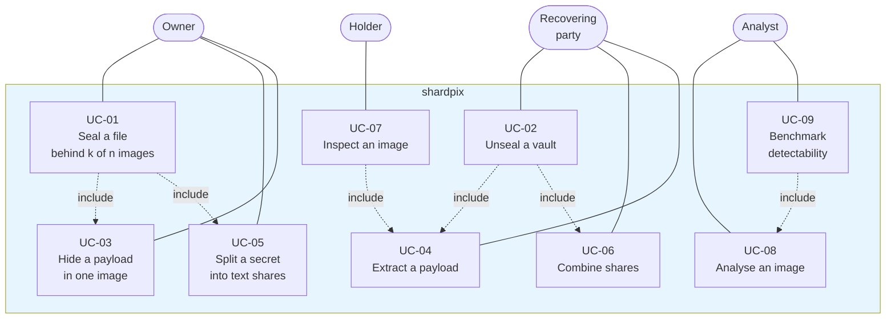

# 2. Use cases

| | |
| --- | --- |
| Document | SDD-02 — Use case specification |
| System | shardpix 1.1.0 |
| Status | Approved |
| Last revised | 2026-10-06 |

## 2.1 Actors

| Actor | Type | Description |
| --- | --- | --- |
| Owner | Primary, human | Holds a file that must stay confidential but recoverable without them. Seals it and hands out the images. |
| Holder | Primary, human | Receives one image and keeps it as an ordinary photo. Takes part in a recovery when asked. |
| Recovering party | Primary, human | Gathers k images and the vault file and unseals it. Often one of the holders. |
| Analyst | Primary, human | Examines images for hidden data, or measures how detectable an embedding strategy is. |
| Adversary | Secondary, hostile | Obtains some images, the vault file, or both; may modify or fabricate images. Not a user of the system, but every use case is specified against it (05). |

## 2.2 Use case diagram

`include` relationships denote behaviour always executed as part of the base
case: sealing always splits a key and embeds shares, unsealing always
extracts and combines them. UC-03 to UC-06 are also exposed on their own, so
the layers can be used and demonstrated independently.

## 2.3 Traceability matrix

| Use case | Realised by | CLI command | Tests |
| --- | --- | --- | --- |
| UC-01 | `vault.seal` | `seal` | `test_vault.py::TestRoundTrip`, `TestSealValidation`, `TestOutputCollisions` |
| UC-02 | `vault.unseal` | `unseal` | `test_vault.py::TestRoundTrip`, `TestFailures`, `TestForgedSets` |
| UC-03 | `stego.embed` | `embed` | `test_stego.py::TestRoundTrip`, `TestDistortion`, `TestSaturation` |
| UC-04 | `stego.extract` | `extract` | `test_stego.py::TestRoundTrip`, `TestAuthentication` |
| UC-05 | `shamir.split` | `split` | `test_shamir.py::TestSplitCombine`, `TestSecrecy`, `TestEncoding` |
| UC-06 | `shamir.combine`, `shamir.recover_all` | `combine` | `test_shamir.py::TestAuthentication`, `TestRobustSearch`, `TestMixedSplits` |
| UC-07 | `stego.extract`, `Share.from_bytes` | `inspect` | `test_cli.py::TestVaultCommands` |
| UC-08 | `chi_square.pair_test`, `chi_square.sequential_attack`, `rs.estimate` | `analyze` | `test_chi_square.py`, `test_rs.py`, `test_cli.py::TestOtherCommands` |
| UC-09 | `analysis.benchmark.run` | `python -m shardpix.analysis.benchmark` | Manual; results in [data/benchmark.json](data/benchmark.json) |

---

## 2.4 Detailed specifications

### UC-01 — Seal a file behind k of n images

| | |
| --- | --- |
| **Primary actor** | Owner |
| **Preconditions** | The owner has the file, at least two cover images they own, and has chosen k and a passphrase. |
| **Postconditions** | A vault file and n stego images exist in the output directory; the covers and the file are untouched. |
| **Trigger** | `shardpix seal notes.pdf photos/*.png -k 3 -p` |

#### Main flow

1. The owner invokes the command with the file, the covers and the threshold.
2. The system asks for the passphrase twice.
3. The system validates n (2–255), k (2–n) and that covers are distinct files.
4. The system computes every output path and checks that none collides with
   another, with an input, or with an existing file.
5. The system loads every cover and checks it can hold a share.
6. The system draws a random key, group id and nonce, and encrypts the file
   with its name into the vault.
7. The system splits the key into n shares (UC-05) and embeds share *i* into
   cover *i* (UC-03), writing each as PNG.
8. The system writes the vault file and prints, per image, the share index,
   the embedding rate and the number of samples changed.

#### Alternative flows

| Id | Condition | Behaviour |
| --- | --- | --- |
| A1 | k or n out of range, duplicate covers | Error before any file is read. |
| A2 | Two covers would produce the same output name (also ignoring case), or `--name` equals an image name | Error before anything is written. |
| A3 | An output would overwrite a cover or the file | Error, even with `--force`. |
| A4 | An output exists | Error unless `--force`. |
| A5 | A cover is too small or too saturated for a share | Error naming the cover; nothing is written. |
| A6 | A cover was decoded from JPEG | Sealing proceeds; a warning explains the JPEG-compatibility risk. |
| A7 | No passphrase option given | Sealing proceeds; a warning says anyone with shardpix can read each share, though k are still needed. |
| A8 | The file is larger than 2 GiB | Error: AES-GCM as exposed by `cryptography` is limited to 2 GiB per call. |

---

### UC-02 — Unseal a vault

| | |
| --- | --- |
| **Primary actor** | Recovering party |
| **Preconditions** | The vault file and at least k of its images are available; the passphrase is known. |
| **Postconditions** | The original file is restored under its original (sanitised) name or the name given with `-o`. |
| **Trigger** | `shardpix unseal notes.pdf.spx a.png b.png c.png -p` |

#### Main flow

1. The recovering party invokes the command with the vault and the images.
2. The system reads and checks the vault header.
3. For every image, the system extracts the payload (UC-04) and parses the
   share; shares of other vaults and duplicates are set aside.
4. The system searches for clusters of mutually authenticating shares (UC-06).
5. The system tries each cluster's key against the vault's AES-GCM tag and
   keeps the first that verifies.
6. The system prints one row per image — used, verified, rejected, duplicate,
   no payload, other vault, unreadable — and writes the file.

#### Alternative flows

| Id | Condition | Behaviour |
| --- | --- | --- |
| A1 | Fewer than k valid shares | Error with the per-image table; valid shares are shown as *unverified*. |
| A2 | Wrong passphrase | Every image reports *no payload*; error. |
| A3 | Some images corrupted, at least k good ones remain | Recovery succeeds; corrupted images are reported as *rejected* with the reason. |
| A4 | A fabricated set of mutually consistent shares is present | Its key fails the vault tag; recovery succeeds with the genuine set; forged images are *rejected*. |
| A5 | The vault file was modified | Every cluster fails the tag; error. |
| A6 | The stored file name contains a path, control characters or a reserved device name | The name is reduced to a safe base name, or `unsealed.bin`. |
| A7 | The output exists | Error unless `--force`; an input is never overwritten. |

---

### UC-03 — Hide a payload in one image

| | |
| --- | --- |
| **Primary actor** | Owner |
| **Preconditions** | A cover image and a payload no larger than its capacity. |
| **Postconditions** | A PNG that looks like the cover and carries the sealed payload. |
| **Trigger** | `shardpix embed photo.png -o out.png -t "meet at noon" -p` |

#### Main flow

1. The system loads the cover and computes the eligible samples (2–253).
2. The system checks the capacity.
3. The system draws a salt, derives the keys from passphrase and salt, and
   seals the payload into a frame.
4. The system computes the HiLL cost of every sample and writes the salt
   (along the public walk), the length and the sealed body (along the keyed
   walk) as syndrome-trellis codes, changing the cheapest samples by ±1
   (format 4, 01 ADR-12).
5. The system writes the PNG and reports the rate and the samples changed.

#### Alternative flows

| Id | Condition | Behaviour |
| --- | --- | --- |
| A1 | Output is not `.png` | Error: lossy formats destroy the payload. |
| A2 | Payload larger than capacity | Error with the capacity in bytes. |
| A3 | Cover decoded from JPEG | Warning (as UC-01 A6). |
| A4 | `--method matching` | Format 3: one bit per sample by LSB matching, readable by shardpix 1.1. |
| A5 | `--method replacement` | Format 3 with LSB replacement; intended for comparisons only, and warned about. |

---

### UC-04 — Extract a payload

| | |
| --- | --- |
| **Primary actor** | Recovering party |
| **Preconditions** | A stego image and its passphrase. |
| **Postconditions** | The payload, authenticated, on stdout or in a file. |
| **Trigger** | `shardpix extract out.png -p` |

#### Main flow

1. The system recomputes the eligible samples and reads the salt along the
   public walk.
2. The system derives the keys and reads the masked length along the keyed walk.
3. The system reads the nonce and body and decrypts them; the tag is checked.

#### Alternative flows

| Id | Condition | Behaviour |
| --- | --- | --- |
| A1 | Wrong passphrase, no payload, or modified image | `PayloadNotFoundError`: one message for all three, by design (05 §5.3). |
| A2 | Length out of range | Same error, without attempting decryption. |

---

### UC-05 — Split a secret into text shares

| | |
| --- | --- |
| **Primary actor** | Owner |
| **Preconditions** | A secret of 1–65,535 bytes. |
| **Postconditions** | n printable shares, any k of which recover the secret. |
| **Trigger** | `shardpix split -t "safe code 4815" -k 3 -n 5 -d shares/` |

#### Main flow

1. The system appends a random 32-byte MAC key to the secret.
2. The system draws k − 1 random coefficient rows and evaluates the
   polynomials at x = 1 … n over GF(256).
3. The system computes each share's MAC and checksum and prints the shares,
   or writes one file per share.

#### Alternative flows

| Id | Condition | Behaviour |
| --- | --- | --- |
| A1 | Secret larger than 65,535 bytes | Error pointing to `seal`. |
| A2 | n > 255 or k outside 2–n | Error. |

---

### UC-06 — Combine shares

| | |
| --- | --- |
| **Primary actor** | Recovering party |
| **Preconditions** | At least k shares of one split. |
| **Postconditions** | The secret on stdout or in a file, with a report of every share. |
| **Trigger** | `shardpix combine share-1.txt share-3.txt share-4.txt` |

#### Main flow

1. The system parses every non-empty, non-comment line; malformed lines are
   reported and skipped.
2. The system groups shares by split and searches each group for clusters
   (04 §4.6).
3. The system returns the largest cluster's secret and reports which shares
   were used, which were additionally verified and which were rejected.

#### Alternative flows

| Id | Condition | Behaviour |
| --- | --- | --- |
| A1 | Fewer than k distinct indices | Error. |
| A2 | Two clusters of equal size | Error: one set is forged and there is no way to tell which. |
| A3 | Two different splits can each be recovered | Error: combine them separately. |
| A4 | Search budget exhausted | Error; occurs only with adversarial input far beyond realistic use. |

---

### UC-07 — Inspect an image

| | |
| --- | --- |
| **Primary actor** | Holder |
| **Preconditions** | An image and, if one was used, the passphrase. |
| **Postconditions** | The holder knows whether the image carries a share and of which vault. |
| **Trigger** | `shardpix inspect my-photo.png -p` |

#### Main flow

1. The system extracts the payload (UC-04).
2. If it parses as a share, the system shows the vault id, the share index,
   the threshold and the secret length; otherwise the payload size.

---

### UC-08 — Analyse an image

| | |
| --- | --- |
| **Primary actor** | Analyst |
| **Preconditions** | Any 8-bit image. |
| **Postconditions** | Chi-square and RS results and a verdict. |
| **Trigger** | `shardpix analyze suspicious.png` |

#### Main flow

1. The system runs the pairs-of-values chi-square test on the whole image and
   over growing prefixes.
2. The system runs RS analysis on every colour channel.
3. The system reports the evidence and flags LSB replacement when the RS
   estimate reaches 10% or the chi-square signature covers at least 10% of
   the image.

#### Alternative flows

| Id | Condition | Behaviour |
| --- | --- | --- |
| A1 | Image narrower than 4 pixels | RS is reported as not applicable. |
| A2 | Nothing flagged | The output states that a negative result is not proof of a clean image. |

---

### UC-09 — Benchmark detectability

| | |
| --- | --- |
| **Primary actor** | Analyst |
| **Preconditions** | The `bench` extra is installed; optionally, a set of covers. |
| **Postconditions** | Charts in `assets/`, raw results in `docs/data/benchmark.json`, Markdown tables on stdout. |
| **Trigger** | `python -m shardpix.analysis.benchmark` |

#### Main flow

1. The system loads ten public-domain photographs (or the given covers).
2. For four strategies and eleven embedding rates it embeds random bits and
   runs RS.
3. It runs the sequential chi-square attack on one cover at 50%.
4. It embeds a real vault share in every cover and measures the change.
5. It renders the charts in light and dark variants and writes the results.

---

## 2.5 Operational scenarios

**Emergency credentials of a small organisation.** The administrator of a
volunteer association seals the file holding the master passwords behind 3 of
5 photos, one per board member. No single member can open it, the loss of two
photos does not lock the association out, and the photos sit in ordinary
photo libraries. The vault file lives on the shared drive.

**Personal recovery kit.** An individual seals a recovery-codes file behind 2
of 3 images: one at home, one with a relative, one in a cloud photo album.
Losing one location is survivable; compromising one is harmless.

**Teaching steganalysis.** An instructor uses `embed --method replacement`,
`embed`, and `analyze` side by side to show why naive LSB tools are caught
and what LSB matching changes; the benchmark charts back the lesson with data.

## 2.6 Legitimacy constraints

shardpix protects data its users are entitled to protect. Use only cover
images you own or have the right to use, comply with the law that applies to
you on the use of encryption and steganography, and never use it to conceal
evidence or exfiltrate data you are not authorised to move. The `analyze`
command and the benchmark operate on images; run them on images you are
allowed to examine.
