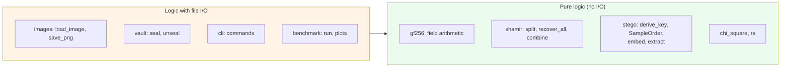

# 3. Function reference

| | |
| --- | --- |
| Document | SDD-03 — Detailed component specification |
| System | shardpix 1.1.0 |
| Status | Approved |
| Last revised | 2026-10-06 |

## 3.1 Purpose and conventions

This document describes every module, function, class and public constant:
what it does, how it behaves at the edges, and which errors it raises.

Conventions used:

- Names beginning with `_` are private to their module and not part of the
  public interface: they are documented because they carry meaningful logic,
  but may change without notice.
- "Raises" lists the expected errors, all subclasses of `ShardpixError`
  unless stated; programming errors (`TypeError`, a `ValueError` from a
  violated precondition) propagate normally.
- `RandomBytes` is the type `Callable[[int], bytes]`. Every function that
  needs randomness takes one, defaulting to `os.urandom`, so tests can make
  the output reproducible.
- The test reference names the class covering that function in `tests/`.

## 3.2 Module map

Embedding, sharing and both attacks operate on arrays and bytes, never on
paths: the file system is touched only by `images`, `vault`, `cli` and the
benchmark. That is what lets most of the 310 tests run without creating a
single file.

---

## 3.3 `shardpix/__init__.py` and `__main__.py`

`__init__` exposes only `__version__` (`"1.1.0"`) and imports no submodule, so
`import shardpix` is fast and free of side effects. `__main__` delegates to
`cli.main` so the tool runs as `python -m shardpix` without installation.

---

## 3.4 `shardpix/errors.py`

| Class | Raised when | Extra attribute |
| --- | --- | --- |
| `ShardpixError` | Base class of every expected failure; the CLI turns it into `error: …` and exit code 1 | — |
| `UnsupportedImageError` | The file is not a readable image, is 16-bit or float, is too large for Pillow's decompression-bomb limit, or the output is not `.png` | — |
| `CapacityError` | The payload does not fit in the carrier | — |
| `PayloadNotFoundError` | Extraction fails: wrong passphrase, no payload or modified image | — |
| `ShareError` | Base class for share problems | `rejected`: `(share, reason)` pairs set aside before the failure |
| `ShareFormatError` | Bad prefix, base32, magic, version, checksum or field | — |
| `InsufficientSharesError` | Fewer distinct indices than the threshold | — |
| `InconsistentSharesError` | Two equal clusters, or two recoverable splits | — |
| `ShareAuthenticationError` | No k shares authenticate each other, or the search budget ran out | — |
| `VaultError` | Sealing or opening a vault fails | `outcomes`: per-image results, for reporting |

---

## 3.5 `shardpix/images.py`

### Constants

| Name | Value | Role |
| --- | --- | --- |
| `LOSSLESS_SUFFIXES` | `{".png"}` | The only output extension accepted. |
| `_KEEP_MODES` | `L`, `LA` → 1 channel; `RGB`, `RGBA` → 3 | Modes kept as they are, with their number of colour channels. |
| `_REJECTED_MODES` | `I`, `I;16*`, `F` | High bit-depth modes, refused rather than silently reduced to 8 bits. |

### `class Carrier` *(frozen)*

An image as an `H × W × C` array of `uint8`, with its Pillow mode, ICC
profile and source format.

| Member | Meaning |
| --- | --- |
| `colour_channels` | 1 for `L`/`LA`, 3 for `RGB`/`RGBA`. Alpha is never a carrier: transparency is too easy to inspect. |
| `geometry` | `(height, width, colour_channels)`. |
| `n_samples` | `height × width × colour_channels`. |
| `from_jpeg` | `True` when `source_format` is `JPEG` or `MPO`. |
| `samples()` | Flat copy of the colour samples, row-major and channel-interleaved. |
| `with_samples(samples)` | New carrier with the colour samples replaced; alpha is copied unchanged. Raises `ValueError` on a size mismatch. |

Test: `test_images.py::TestSamples`.

### `_normalise_mode(image) -> Image` *(private)*

Keeps supported modes, converts `1` to `L`, `P` to `RGB` (or `RGBA` if the
palette has transparency), `PA` to `RGBA`, and anything else (`CMYK`,
`YCbCr`, …) to `RGB`. Raises `UnsupportedImageError` for high bit-depth modes.

### `from_pil(image) -> Carrier`

Builds a carrier from an open Pillow image, remembering its format and ICC
profile before conversion. Test: `TestLoad`.

### `load_image(path) -> Carrier`

Opens, fully decodes and converts an image. Raises `UnsupportedImageError`
for a missing file, a decompression bomb, or anything Pillow cannot decode.

### `to_pil(carrier) -> Image`

Converts back to Pillow, letting it infer the mode from the array shape.

### `write_new(path, data, *, overwrite=False) -> None`

Writes bytes to a new file with exclusive creation (`O_CREAT | O_EXCL`) unless
`overwrite`: checking and creating are one atomic step, and an existing name
— including a dangling symbolic link — is refused rather than followed
(06 SR-03). Raises `ShardpixError`. Every output of the CLI and of `seal` goes
through it. Test: `TestWriteNew`.

### `save_png(carrier, path, *, overwrite=False) -> None`

Encodes a lossless PNG at the default compression level, preserving the ICC
profile, and writes it with `write_new`. Raises `UnsupportedImageError` for
any extension but `.png` — JPEG would re-quantise the pixels and destroy the
payload — and `ShardpixError` if the file exists (without `overwrite`) or
cannot be written. Test: `TestSave`.

---

## 3.6 `shardpix/stego.py`

### Constants

| Name | Value | Role |
| --- | --- | --- |
| `FORMAT_VERSION` | `3` | Part of the AES-GCM associated data; bumped when the layout changes. |
| `SALT_BYTES`, `COST_BYTES`, `PUBLIC_BYTES` / `PUBLIC_BITS` | `16`, `1`, `17` / `136` | Per-image salt and scrypt cost, written along the public walk (ADR-05). |
| `LENGTH_BYTES`, `NONCE_BYTES`, `TAG_BYTES` | `4`, `12`, `16` | Frame fields. |
| `FRAME_OVERHEAD` | `32` | Bytes the keyed frame adds to every payload. |
| `SCRYPT_LOG_N`, `SCRYPT_R`, `SCRYPT_P` | `17`, `8`, `1` | Passphrase hardening for new embeddings: N = 2^17, about 128 MiB and 0.4 s per guess (OWASP's first recommendation). |
| `SCRYPT_LOG_N_ACCEPTED` | `range(10, 19)` | Costs accepted when extracting; the cap keeps a forged image from demanding gigabytes. |
| `ELIGIBLE_MIN`, `ELIGIBLE_MAX` | `2`, `253` | Samples outside this range are never used nor produced (ADR-06). |
| `MAX_FILL` | `2` | At most one eligible sample in two is used (ADR-11). |
| `_DOMAIN` | `b"shardpix/stego/v3"` | Domain separation for every derivation. |
| `_PUBLIC_WALK_KEY` | SHA-256 of the domain and a label | Key of the public walk that places the salt. |

### `class Method(str, Enum)`

`MATCHING` (default): a mismatching sample moves by ±1 at random.
`REPLACEMENT`: its least significant bit is overwritten.

### `class StegoKey` *(frozen)*

`order` (32 B, keyed walk), `aead` (32 B, AES-256-GCM), `length_mask` (4 B),
`keyed` (whether a passphrase was used).

### `class EmbedReport` *(frozen)*

Payload, frame and capacity sizes, total and eligible samples, bits written
(salt included) and samples changed; `embedding_rate` and `change_rate` are
both relative to all colour samples.

### `derive_key(passphrase, salt, log_n=None) -> StegoKey`

With a passphrase: NFC-normalise it, run scrypt with salt
`_DOMAIN ‖ "|" ‖ salt`, then expand three subkeys with HKDF-SHA256 under
distinct labels. Without one: hash the domain and salt instead — the payload
is still scattered and encrypted, but anyone can read it. NFC normalisation
makes "caffè" typed with a combining accent equal to the precomposed form.
`log_n` defaults to `SCRYPT_LOG_N`. Raises `ValueError` if the salt is not 16 bytes or the cost is outside `SCRYPT_LOG_N_ACCEPTED`. Test: `TestKeyDerivation`.

### `eligible_mask(samples) -> ndarray`

`True` for samples in 2–253.

### `class SampleOrder`

The keyed walk (ADR-04).

#### `__init__(key, n_samples, eligible=None)`

Prepares a ChaCha20 keystream (32-byte key, zero nonce: each key is used for
exactly one walk) and a "free" mask. `n_samples` (the attribute) becomes the
number of samples the walk can visit. The rejection limit is the largest
multiple of `n_samples` below 2^64, or none if `n_samples` divides 2^64.
Raises `ValueError` if the mask has the wrong shape.

#### `_extend(count)` *(private)*

Reads batches of 64-bit little-endian words, drops those at or above the
rejection limit, reduces the rest modulo `n_samples`, keeps candidates that
are still free, and of those keeps the first occurrence of each index in
stream order. Accepted indices are marked used. The batch size only affects
speed, never the sequence.

#### `first(count) -> ndarray`

The first `count` positions of the walk; computed lazily and cached. Raises
`ValueError` if `count` is negative or larger than `n_samples`. Tests:
`TestSampleOrder`, `test_known_answers.py::test_sample_order`.

### `max_frame_bytes(n_eligible)`, `capacity(n_eligible)`, `carrier_capacity(carrier)`

`max_frame_bytes` = `(n_eligible − 136) // 2 // 8`; `capacity` subtracts the
32-byte frame overhead and never returns a negative number;
`carrier_capacity` counts the eligible samples of a carrier first. Test:
`TestCapacity`.

### `write_bits(samples, positions, bits, method, random_bytes, *, low=0, high=255)`

Returns a modified copy and the number of changed samples. Samples whose LSB
already equals the bit are not touched. With matching, samples ≤ `low`
always move up and samples ≥ `high` always move down; others move up or down
with one random bit each from `random_bytes`. `embed` passes `low=2,
high=253`; the benchmark uses the defaults to model naive tools. Test:
`TestSaturation::test_boundary_moves_stay_inside_the_range`.

### `read_bits(samples, positions)`

The LSBs at the given positions.

### `build_frame(payload, key, random_bytes) -> bytes`

`masked length ‖ nonce ‖ AES-GCM(payload)`, with associated data
`_DOMAIN ‖ FORMAT_VERSION ‖ length`: a frame cut from one version cannot be
replayed as another, and the length cannot be altered without detection.

### `_salt_positions(n_samples, eligible)`, `_keyed_order(key, eligible, salt_positions)` *(private)*

The first 136 positions of the public walk, and the keyed walk over the
eligible samples minus those positions.

### `embed(carrier, payload, passphrase=None, method=MATCHING, random_bytes=os.urandom)`

Returns `(stego carrier, EmbedReport)`. Raises `CapacityError` if the image
cannot hold even an empty frame, or if the payload exceeds the capacity.
Tests: `TestRoundTrip`, `TestDistortion`, `TestSaturation`, `TestImageModes`.

### `extract(carrier, passphrase=None) -> bytes`

Recomputes the eligible set, reads the salt and the cost (refusing a cost outside the accepted range before any key derivation), derives the keys, reads and
unmasks the length, checks it against the largest possible frame, reads the
frame and decrypts it. Raises `PayloadNotFoundError` with the same message for
a wrong passphrase, a clean image and a modified one: telling them apart
would only help an attacker probe. Test: `TestAuthentication`.

---

## 3.7 `shardpix/gf256.py`

### Constants

| Name | Value | Role |
| --- | --- | --- |
| `POLYNOMIAL` | `0x11B` | x^8 + x^4 + x^3 + x + 1, the AES polynomial. |
| `GENERATOR` | `0x03` | Generates the multiplicative group. |
| `ORDER` | `255` | Size of the multiplicative group. |
| `EXP`, `LOG` | tuples | Antilog table (doubled to 510 entries, so the sum of two logs needs no reduction) and log table. |

### `mul_reference(a, b)`

Shift-and-add multiplication with reduction by `POLYNOMIAL`. Slow; used to
build the tables and, in the tests, to check all 65,536 products.

### `add`, `mul`, `inv`, `div`

Addition is XOR (and is its own inverse). `mul` uses the tables and handles 0.
`inv(0)` and `div(a, 0)` raise `ZeroDivisionError`. Tests: `TestTables`,
`TestFieldAxioms` (including the FIPS-197 worked examples 0x57·0x83 = 0xC1
and 0x53·0xCA = 0x01).

### `mul_bytes(values, scalar)`

Vectorised multiplication of a byte array by a scalar.

### `eval_poly(coefficients, x)`

Horner evaluation of one polynomial per byte position; `coefficients[i]` holds
the degree-i coefficient of every polynomial. Raises `ValueError` if empty.

### `lagrange_at_zero(xs)`, `interpolate_at_zero(xs, ys)`

Lagrange basis coefficients at x = 0, `c_i = Π_{j≠i} x_j / (x_j ⊕ x_i)`, and
the byte-wise interpolation that recovers the constant term. Raise
`ValueError` for repeated x, x = 0 or mismatched inputs. Test:
`TestInterpolation`.

The table lookups are not constant-time. For a local command line tool this
is accepted and stated in 05 §5.6.

---

## 3.8 `shardpix/shamir.py`

### Constants

| Name | Value | Role |
| --- | --- | --- |
| `MAGIC`, `VERSION` | `b"SPXS"`, `1` | Share format identification. |
| `GROUP_ID_BYTES`, `MAC_KEY_BYTES`, `MAC_BYTES`, `CHECKSUM_BYTES` | 16, 32, 16, 4 | Field sizes. |
| `MAX_SECRET_BYTES` | 65,535 | Limit of the 2-byte length field. |
| `MAX_SHARES` | 255 | Distinct non-zero x coordinates in GF(256). |
| `MAX_SUBSETS` | 10,000 | Budget of the cluster search. |
| `TEXT_PREFIX` | `spx1-` | Printable form. |

### `share_size(secret_bytes)`

`25 + L + 32 + 16 + 4`: 109 bytes for a 32-byte key.

### `class Share` *(frozen)*

| Member | Behaviour |
| --- | --- |
| `group` | First 8 hex digits of the group id, for display. |
| `compute_mac(mac_key)` | HMAC-SHA256 over `shardpix/share/v1` and every field but the MAC, truncated to 16 bytes. |
| `verify(mac_key)` | Constant-time comparison (`hmac.compare_digest`). |
| `to_bytes()` / `from_bytes(data)` | Encoding with checksum. Parsing checks, in order: length, magic, version, checksum, then the length field, threshold ≥ 2 and index ≠ 0, so even a share with a valid checksum but impossible fields is refused. Raises `ShareFormatError`. |
| `to_text()` / `from_text(text)` | `spx1-` + lowercase unpadded base32; parsing ignores whitespace and case. |

Tests: `TestEncoding`.

### `class Rejection`, `class Recovery` *(frozen)*

A share set aside with its reason; and a recovered secret with the k shares
interpolated (`used`), further shares that verified (`confirmed`) and every
other share with a reason (`rejected`).

### `split(secret, threshold, count, *, group_id=None, random_bytes=os.urandom)`

Appends a fresh MAC key to the secret, draws `threshold − 1` random
coefficient rows, evaluates at x = 1 … count, and MACs each share. Raises
`ValueError` for an empty or oversized secret, `threshold < 2`,
`threshold > count`, `count > 255`, or a group id of the wrong size. Tests:
`TestSplitCombine`, `TestSecrecy`.

### `_interpolate(shares)` *(private)*

Interpolates value bytes at x = 0 and splits the result into secret and MAC key.

### `_candidate_subsets(pool, k)` *(private)*

Yields k-subsets with distinct indices: disjoint blocks of first-seen shares
first, then every combination of k indices crossed with every choice of one
share per index. Never yields the same subset twice.

### `_find_cluster(pool, k, budget)` *(private)*

The first candidate subset whose shares all verify under its own MAC key, or
`None`. Every candidate costs one unit of the shared budget; running out sets
`budget.exhausted`.

### `recover_all(shares) -> list[Recovery]`

De-duplicates by encoding, groups by `(group id, threshold, secret length)`,
and repeatedly finds a cluster in each group, removing its members from the
pool, until none is left. Returns one `Recovery` per cluster, largest first,
each with reasons for every share outside it: *belongs to a different split*,
*threshold differs*, *secret length differs*, *authenticates a different
secret*, or *failed authentication*. Raises `InsufficientSharesError` or
`ShareAuthenticationError` (via `_raise_no_cluster`) if no cluster exists.
Tests: `TestRobustSearch`, `TestMixedSplits`.

### `combine(shares) -> Recovery`

`recover_all`, then refuses ambiguity: `InconsistentSharesError` if clusters
come from two splits, or if the two largest clusters are the same size.
Tests: `TestAuthentication`, `TestRobustSearch`.

---

## 3.9 `shardpix/vault.py`

### Constants

| Name | Value | Role |
| --- | --- | --- |
| `MAGIC`, `VERSION` | `b"SPXV"`, `1` | Vault format identification. |
| `KEY_BYTES`, `NONCE_BYTES` | 32, 12 | AES-256-GCM key and nonce. |
| `HEADER_BYTES` | 35 | Size of the authenticated header. |
| `MAX_NAME_BYTES` | 255 | Longest stored file name. |
| `MAX_FILE_BYTES` | 2 GiB minus framing | Limit of one AES-GCM call in `cryptography`. |
| `SHARE_BYTES` | 109 | One share of the vault key. |
| `PAYLOAD_FRAME_BYTES` | 158 | Bytes written into each image: salt and cost + sealed share. |
| `FALLBACK_NAME` | `unsealed.bin` | Name used when the stored one is unusable. |

### `class VaultHeader` *(frozen)*

Group id, threshold, number of shares and nonce; `to_bytes()` is also the
AES-GCM associated data. `from_bytes` raises `VaultError` for a short file,
a wrong magic or an unknown version.

### `class SealedImage`, `class SealResult`, `class ImageOutcome`, `class UnsealResult`

Results of `seal` and `unseal` (see the class diagram in 01 §1.4).
`Status` holds the outcome labels: `used`, `verified`, `unverified`,
`rejected`, `duplicate`, `no payload`, `other vault`, `unreadable`.

### `_identity(path)`, `_check_new_file(path, force, protected)`, `_write(path, write)` *(private)*

Path identity is resolved and case-folded, so outputs that would collide on a
case-insensitive file system are refused everywhere. `_check_new_file`
refuses inputs always and existing files without `force`; `_write` turns an
`OSError` into `VaultError`.

### `seal(source, covers, threshold, out_dir, passphrase=None, *, method, vault_name, force, random_bytes)`

Validation runs before anything is written: cover count and threshold, distinct
covers, output directory, file size, file name length, output collisions
(including `vault_name` against image names), overwrites, and that every cover
can hold `SHARE_BYTES`. Then the key, group id and nonce are drawn, the file
is encrypted, the key is split and each share embedded. Raises `VaultError`,
`UnsupportedImageError` or `CapacityError`. Tests: `TestRoundTrip`,
`TestSealValidation`, `TestOutputCollisions`.

### `read_vault(path)`

Returns header and ciphertext; raises `VaultError` if the file cannot be read.

### `safe_filename(name)`

Keeps the base name only (handling `/` and `\`), removes control and format
characters (Unicode categories Cc and Cf: NUL, terminal escapes, bidi
overrides), strips trailing dots and spaces, and replaces empty names, `.`,
`..` and Windows device names (`CON`, `NUL`, `COM1`, …) with
`FALLBACK_NAME`. Tests: `TestSafeFilename`, `TestRestoredNames`.

### `_read_share(path, passphrase)` *(private)*

Returns a `Share`, or an `ImageOutcome` explaining why there is none
(unreadable, no payload, malformed share).

### `unseal(vault_path, images, passphrase=None) -> UnsealResult`

Removes repeated paths, reads a share from every image, sets aside shares of
other vaults and duplicates, runs `shamir.recover_all`, and tries each
cluster's key against the vault tag. Raises `VaultError` carrying the
per-image outcomes when no cluster exists or none opens the vault. Tests:
`TestFailures`, `TestForgedSets`, `test_known_answers.py`.

---

## 3.10 `shardpix/analysis/chi_square.py`

### `chi2_sf(statistic, dof)`

Chi-square survival function through the regularised incomplete gamma
function: power series for P(a, x) when x < a + 1, Lentz's continued fraction
for Q(a, x) otherwise. Raises `ValueError` for non-positive degrees of
freedom. Checked against SciPy over the range used and against textbook
critical values. Test: `TestChi2Sf`.

### `class ChiSquareResult`, `pair_test(samples)`

Histogram of the samples; for each pair (2k, 2k+1) with expected count ≥ 5,
`(n_2k − mean)² / mean` is summed; `p_value` is the survival function at
`pairs − 1` degrees of freedom. Close to 1 means "looks embedded". Fewer than
two usable pairs returns `p = 0`. Test: `TestPairTest`.

### `class ChiSquareCurve`, `sequential_attack(samples, steps=100)`

`pair_test` over the first 1/steps, 2/steps, … of the samples.
`detected_prefix(threshold=0.5)` is the fraction of the image, from the
start, over which p stays above the threshold. Raises `ValueError` for
`steps < 1`. Test: `TestSequentialAttack`.

---

## 3.11 `shardpix/analysis/rs.py`

| Function | Behaviour |
| --- | --- |
| `_groups(channel)` | Non-overlapping horizontal groups of 4 pixels. |
| `_smoothness(groups)` | Sum of absolute differences between neighbours. |
| `_flip_positive`, `_flip_negative` | F1 (0↔1, 2↔3, …) and F−1 (−1↔0, 1↔2, …). |
| `rs_counts(groups)` | Share of regular and singular groups under the mask `[0, 1, 1, 0]` and its negation. |
| `_solve(c0, c1)` | Solves `2(d1 + d0)z² + (d−0 − d−1 − d1 − 3d0)z + d0 − d−0 = 0`, takes the root of smaller magnitude, returns `z / (z − ½)`. |
| `estimate_channel(channel)` | Counts on the image and on the image with every LSB inverted, then solves. Raises `ValueError` for non-2-D input or width < 4. |
| `estimate(pixels, channels=None)` | One `RSResult` per colour channel. |
| `mean_rate(results)` | Average over channels. |

Tests: `test_rs.py::TestFlips`, `TestEstimate`.

---

## 3.12 `shardpix/analysis/benchmark.py`

| Name | Behaviour |
| --- | --- |
| `RATES`, `CHI_SQUARE_RATE`, `SAMPLE_COVERS` | Embedding rates swept, rate used for the chi-square curves, and the ten scikit-image photographs used by default (public domain or CC0). |
| `Scenario`, `SCENARIOS` | The four strategies: shardpix, LSB replacement (scattered), LSB matching (naive), LSB replacement (sequential). |
| `load_covers(paths)` | Given paths, or the sample photographs; exits with a hint if the `bench` extra is missing. |
| `embed_random(carrier, rate, scenario, rng)` | Writes random bits — the payload is ciphertext in shardpix — following the scenario. |
| `operating_point(name, carrier)` | Embeds a real vault-share-sized payload and measures RS and chi-square before and after. |
| `run(covers, seed)` | All experiments; returns plain data, saved as JSON. |
| `plot_rs`, `plot_rs_clipped`, `plot_chi_square`, `plot_lsb_planes` | The charts in `assets/`, light and dark (the LSB figure is light only). |
| `sweep_table`, `per_cover_table`, `markdown_table` | Markdown tables used in 05. |
| `main(argv)` | Command line entry point. |

---

## 3.13 `shardpix/cli.py`

### Constants

| Name | Role |
| --- | --- |
| `CHI_SQUARE_ALERT` | 0.10: detected prefix at which `analyze` reports the chi-square signature. |
| `RS_ALERT` | 0.10: RS estimate at which `analyze` reports LSB replacement. Clean photographs measured −2.5% to +8.3% in the benchmark. |
| `JPEG_WARNING` | Text shown when a cover was decoded from JPEG. |
| `REPLACEMENT_WARNING` | Text shown when `--method replacement` is used for `embed` or `seal` (06 SR-05). |

### Helpers

| Function | Behaviour |
| --- | --- |
| `make_console(stderr=False)` | Rich console without syntax highlighting; word-wrapped in a terminal, unwrapped when piped. |
| `read_passphrase(args, confirm)` | From `--passphrase-file` (first line, UTF-8 with optional BOM) or a prompt (confirmed when creating). Never from the command line itself, which would leak into shell history and the process list. |
| `check_output(path, force, inputs)` | Refuses directories, inputs (always) and existing files (without `--force`). |
| `format_bytes(size)` | `1536` → `1.5 KiB`. |
| `positive_int(value)` | argparse type for integers ≥ 1. |
| `read_secret(args)` | Bytes from `--input` or `--text`. |
| `read_shares(sources)` | Shares from files or stdin, one per line; malformed lines are returned as problems rather than aborting. |

### Commands

| Function | Command | Notes |
| --- | --- | --- |
| `cmd_capacity` | `capacity IMAGE` | Dimensions, mode, samples, usable samples, capacity. |
| `cmd_embed` | `embed COVER -o OUT (-t TEXT \| -i FILE)` | Warns without passphrase and for JPEG covers. |
| `cmd_extract` | `extract IMAGE [-o FILE]` | Raw bytes to stdout unless `-o`. |
| `cmd_analyze` | `analyze IMAGE [--steps N]` | Chi-square and RS; RS skipped below 4 pixels of width. |
| `cmd_seal` | `seal FILE COVER... -k K [-d DIR] [--name N]` | Per-image table, warnings, guidance. |
| `cmd_unseal` | `unseal VAULT IMAGE... [-o FILE]` | Per-image table; output checked before and after decryption. |
| `cmd_inspect` | `inspect IMAGE` | Share metadata or payload size. |
| `cmd_split` | `split (-t \| -i) -k K -n N [-d DIR]` | One line per share, or one file per share. |
| `cmd_combine` | `combine FILE... [-o FILE]` | Report on stderr when the secret goes to stdout. |

Every command accepts `-p/--passphrase` or `--passphrase-file` where a
passphrase applies, and `-f/--force` where it writes a file.

### `build_parser()` and `main(argv=None) -> int`

`main` dispatches to the handler and maps outcomes to exit codes: 0 on
success, 1 for any `ShardpixError` (printing the per-image or per-share
details it carries) or `OSError`, 2 for usage errors (argparse), 130 on
Ctrl-C. Tests: `test_cli.py`, in particular `TestCleanErrors`.
