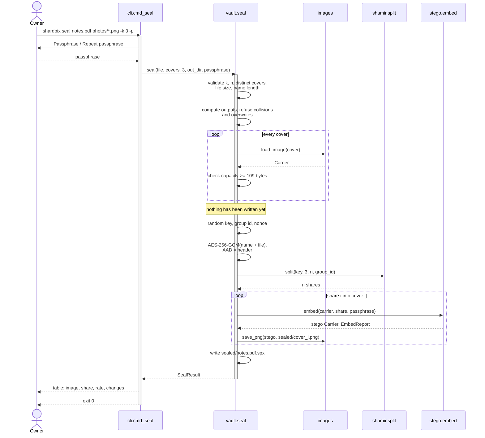
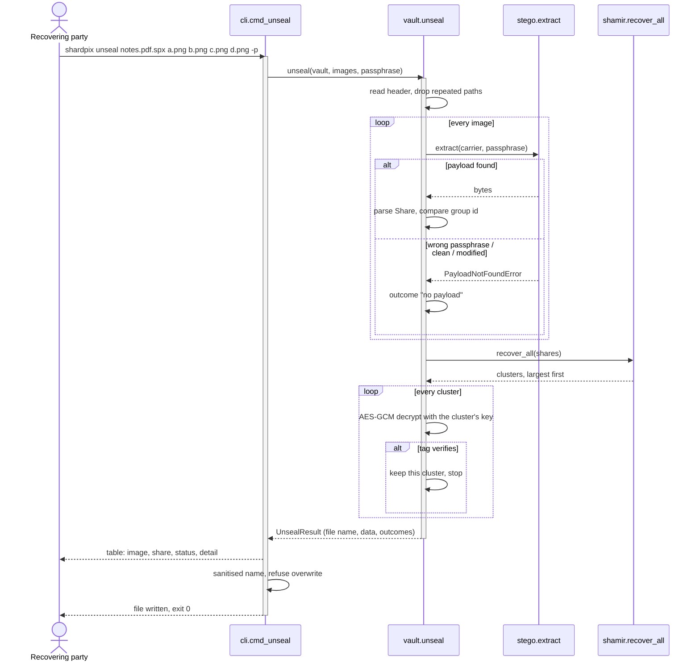
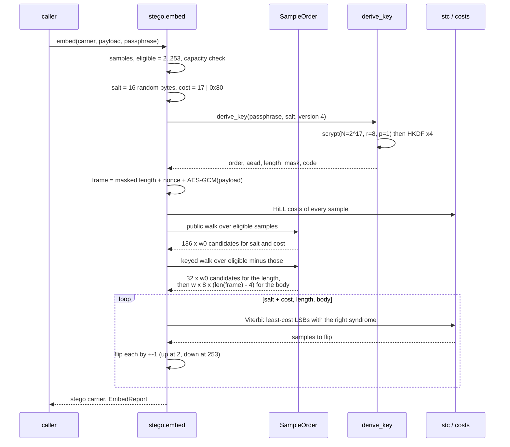
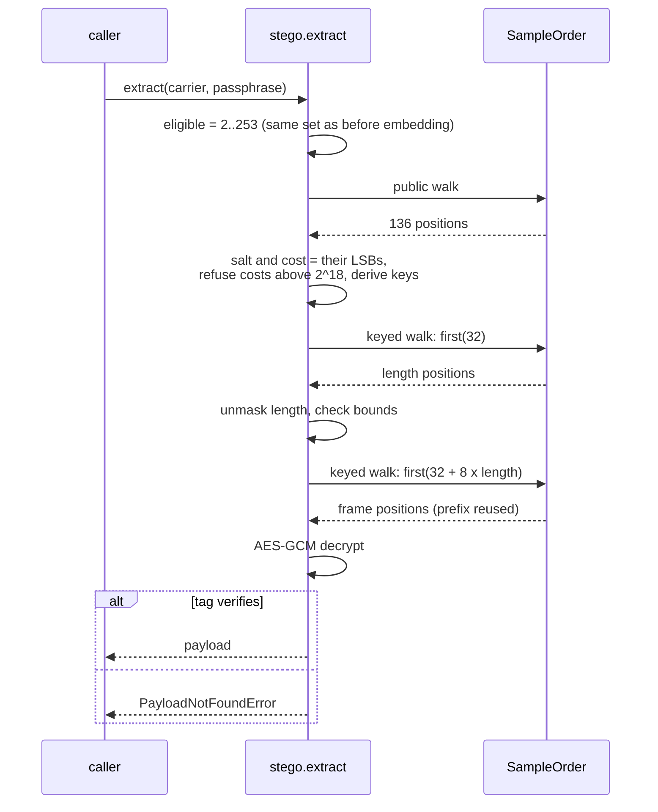
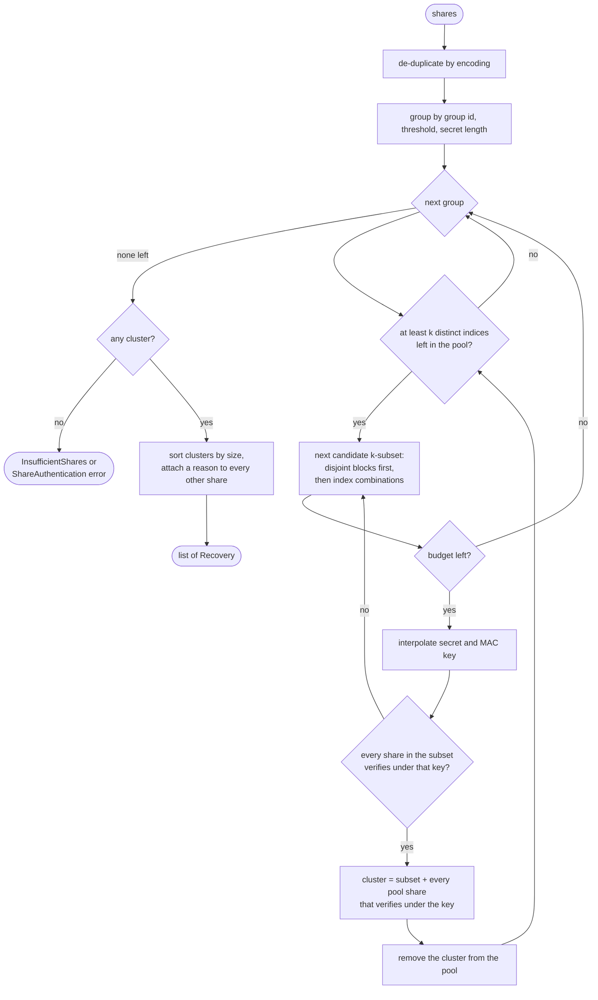
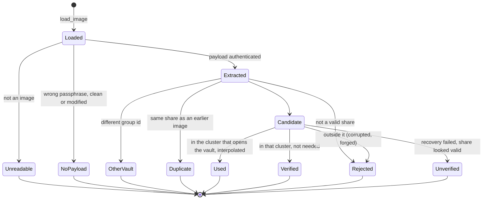
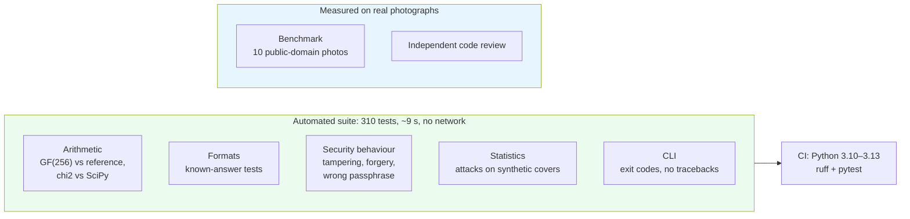

# 4. Runtime behaviour

| | |
| --- | --- |
| Document | SDD-04 — Dynamic view |
| System | shardpix 1.1.0 |
| Status | Approved |
| Last revised | 2026-10-06 |

## 4.1 Purpose

This document describes what happens at runtime: the interactions between
components for each main command, the share recovery algorithm, how errors
propagate to exit codes, and how long things take. The corresponding static
structure is in [01-architecture.md](01-architecture.md).

## 4.2 Sealing a file

Every check that can fail runs before the first write, so a typo in a cover
name or a cover that is too small leaves the output directory exactly as it
was. The only failures that can leave partial output are those of the file
system itself (disk full, permissions) halfway through writing.

## 4.3 Unsealing a vault

The vault's authentication tag is the arbiter of last resort. Shares can only
prove that they agree with each other; only the vault can prove that they
are *its* shares. This is what defeats a fabricated set of shares that
happens to be larger than the genuine one (05 SP-06).

## 4.4 Embedding a payload

With `--method matching` or `replacement` (format 3) there are no costs and
no codes: the salt and the frame are written one bit per sample at the
first 136 public and 8 × len(frame) keyed positions.

## 4.5 Extracting a payload

Extraction mirrors embedding. It first tries format 4 and, if that finds
nothing, format 3; a cost byte belonging to the other format, or a cost
out of range, ends an attempt before any key derivation, so reading a
format-3 image almost never costs a second scrypt. In format 4 every read
below is a syndrome over `w0` or `w` candidates per bit instead of a single
LSB; the diagram shows format 3. In both, the walk is read twice. The
extractor first needs 32 positions to read the length, and only then knows
how many more to read. `SampleOrder.first` caches what it has computed, so the
second call extends the first instead of starting over, and because every
prefix of the walk is stable (ADR-04), the first 32 positions are the same in
both calls.

## 4.6 Share recovery: cluster search

`shamir.recover_all` has to cope with any mix of good, damaged, duplicated,
foreign and fabricated shares, within a bounded amount of work.

Two properties make this cheap in practice and correct under attack.

**Clusters never overlap.** A share's MAC verifies under one MAC key only, so
a genuine share can never join a fabricated cluster and vice versa. Removing
a found cluster from the pool therefore loses nothing.

**Disjoint blocks come first.** If fewer shares are bad than there are blocks
of k, one block is entirely good. With one damaged share among twenty in a
6-of-20 split the second candidate succeeds; in plain combination order the
first C(19, 5) = 11,628 candidates would all contain the damaged share.
Index combinations crossed with one share per index then guarantee that a
flood of impostors reusing one index costs one attempt per impostor, not an
explosion of combinations.

`combine` takes the first (largest) recovery and refuses ties; `unseal` tries
them all against the vault tag.

## 4.7 Life of one image during unseal

Every image ends in exactly one state, and the CLI prints one row per image
whether unsealing succeeds or fails: the person who has to chase a missing
holder needs to know which image was the problem.

## 4.8 Error propagation

| Level | Mechanism | Example |
| --- | --- | --- |
| Pure functions | Raise a specific `ShardpixError` subclass, or `ValueError` for a violated precondition | `CapacityError`, `ShareFormatError` |
| Per-image work in `unseal` | Caught and recorded as an `ImageOutcome`; the loop continues | An unreadable image does not stop the others from being read |
| Per-line work in `combine` | Malformed lines collected as problems, reported, skipped | A truncated share in a file of five |
| Vault and share failures | Raised with the details attached (`outcomes`, `rejected`) | `VaultError` carries the full per-image table |
| `cli.main` | `ShardpixError` and `OSError` → one-line message, exit 1; argparse → exit 2; Ctrl-C → exit 130 | `error: s.jpg: output must be a .png file …` |

| Exit code | Meaning |
| --- | --- |
| 0 | Success |
| 1 | Expected failure: bad input, wrong passphrase, not enough shares, I/O error |
| 2 | Usage error (unknown option, missing argument) |
| 130 | Interrupted |

Validation happens as early as possible: the threshold, the covers and every
output path are checked before the passphrase is used for anything, and
before a single file is written.

## 4.9 Indicative timing profile

Measured on a cloud VM (Python 3.13, one core), as an order of magnitude.
The format-4 rows were measured while another job shared the CPU, so they
are upper bounds.

| Operation | Duration |
| --- | --- |
| Key derivation (scrypt, N = 2^17) | ~0.42 s per image |
| `embed` / `extract`, 512 × 512 RGB, vault-share payload, format 3 | ~0.45 s each, mostly scrypt |
| `embed`, 1920 × 1080 RGB, vault-share payload, format 3 | ~0.5 s |
| `embed`, vault-share payload, format 4: 512 × 512 / 1920 × 1080 / 12 MP RGB | ~1.7 s / ~2.3 s / ~8.4 s: scrypt, HiLL over the whole image, Viterbi |
| `extract`, vault-share payload, format 4, any of the sizes above | ~0.5 s, mostly scrypt |
| `seal`, 1 MB file, 5 covers of 512 × 512 | ~2.4 s |
| `seal`, 1 MB file, 5 covers of 1920 × 1080 | ~5.3 s: PNG compression and scrypt |
| `unseal`, 3 images of 512 × 512 or 1920 × 1080 | ~1.3 s, mostly scrypt |
| `analyze`, 1920 × 1080 RGB | ~1.2 s (RS 0.3 s, sequential chi-square 0.9 s) |
| Full benchmark (10 covers, 4 strategies, 11 rates) | ~40 s |
| Test suite (369 tests) | ~60 s with the trained-detector and adaptive tests |

In format 3 the cost of placing a payload does not depend on the image size
(ADR-04); what grows with the image is decoding, the eligibility mask and
PNG encoding. Format 4 adds the HiLL cost map, which is computed over the
whole image and dominates for large photos, and a Viterbi pass whose length
depends on the payload only.
The file size barely matters: AES-GCM runs at memory speed.

## 4.10 Verification strategy

| Test file | Tests | Focus |
| --- | --- | --- |
| `test_gf256.py` | 18 | All 65,536 products against shift-and-add; FIPS-197 examples; field axioms |
| `test_shamir.py` | 62 | Every k-subset; information-theoretic secrecy by enumeration; tampering; forged clusters; search robustness |
| `test_stego.py` | 54 | Round trips in every mode; authentication; distortion bounds; saturation invariance; walk properties; key derivation |
| `test_images.py` | 19 | Mode conversion, alpha preservation, lossless output, exclusive file creation |
| `test_chi_square.py` | 17 | Survival function vs SciPy; detection on combed histograms |
| `test_rs.py` | 13 | Flip operations; estimates track replacement; naive vs saturation-aware matching |
| `test_vault.py` | 59 | Every subset opens; failures; forged sets; collisions; restored names |
| `test_cli.py` | 47 | Every command end to end; clean errors |
| `test_known_answers.py` | 5 | Walk positions, share bytes, stego pixels (with and without passphrase) and vault bytes pinned |
| `test_properties.py` | 16 | Property-based tests and parser fuzzing (Hypothesis); `HYPOTHESIS_PROFILE=fuzz` for 3,000 cases each |

Two choices keep the suite fast and deterministic. Covers are synthesised
from smooth functions plus mild noise rather than loaded from disk, and
shaped for what each test measures — a "combed" histogram for the
chi-square tests, a contrast-stretched one for clean-image tests. And the
scrypt cost is lowered for tests by an autouse fixture, while a dedicated
test checks the production parameters and the known-answer tests run with
them.
