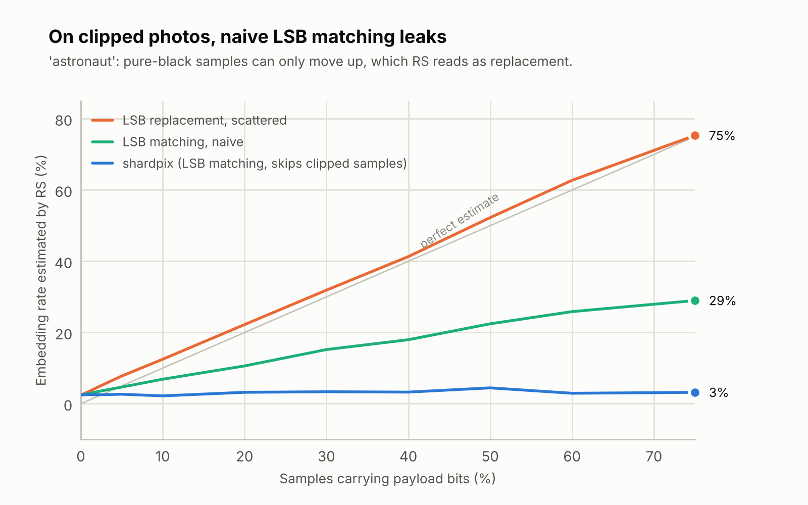
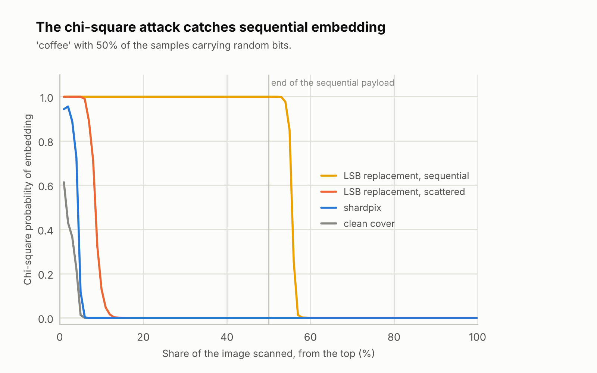

# 5. Security analysis

| | |
| --- | --- |
| Document | SDD-05 — Security analysis |
| System | shardpix 1.0.0 |
| Status | Approved |
| Last revised | 2026-10-06 |

## 5.1 Purpose and scope

This document states what shardpix protects, against whom, on which
arguments, and where it stops. It also reports the steganalysis measurements
that back the claims about detectability.

shardpix is a portfolio and learning project. Its cryptography comes from
audited libraries (ADR-02), and its own code is tested against independent
references and was reviewed, but **the system as a whole has not been
audited**. For secrets whose loss would really hurt, prefer established tools
— for example [age](https://age-encryption.org) for file encryption and
[SLIP-0039](https://github.com/satoshilabs/slips/blob/master/slip-0039.md)
implementations for secret sharing — and treat shardpix as a well-documented
way to understand how such tools are built.

## 5.2 Threat model

### 5.2.1 Assets

| Asset | Description |
| --- | --- |
| A-1 File contents | The sealed file. |
| A-2 Key | The 256-bit key that encrypts it. |
| A-3 Existence | The fact that a given image carries hidden data at all. |
| A-4 Availability | The ability of k honest holders to recover the file. |

### 5.2.2 Adversaries

| Id | Adversary | Capabilities |
| --- | --- | --- |
| ADV-1 | Curious holder or coalition | Holds up to k − 1 images, may know the passphrase, may hold the vault file. |
| ADV-2 | Passive finder | Has some images (a stolen phone, a shared album), not the passphrase. |
| ADV-3 | Steganalyst | Wants to tell stego images from ordinary photos; has the tool and its source. |
| ADV-4 | Active forger | Can modify images, fabricate shares (knows the public group id) and modify the vault file. |

### 5.2.3 Assumptions

1. The machine running shardpix is not compromised while sealing or unsealing.
2. The original covers are not available to the adversary (see §5.6).
3. The passphrase, when used, is not guessable within the scrypt budget.
4. Images travel as files; nobody re-compresses or resizes them on the way.
5. The adversary knows everything about the design (Kerckhoffs's principle):
   every argument below assumes the source code is public, because it is.

## 5.3 Security properties

| Id | Property | Against | Argument | Verified by |
| --- | --- | --- | --- | --- |
| SP-01 | The file is confidential without k shares | ADV-1, ADV-2 | AES-256-GCM under a uniformly random key that exists only as Shamir shares (and briefly in memory). | `test_vault.py::TestFailures` |
| SP-02 | The file and its metadata are authentic | ADV-4 | GCM tag over the ciphertext; the header (group id, k, n, nonce) is the associated data; the file name is inside the ciphertext. | `test_tampered_vault_file`, `test_tampered_header_is_detected` |
| SP-03 | k − 1 shares reveal nothing about the key | ADV-1 | Each byte of key ‖ MAC key has its own random polynomial of degree k − 1, so any k − 1 values are uniform whatever the key. The MACs depend only on the MAC key, which is shared the same way, so they add nothing — even for a low-entropy secret (ADR-08). Only the secret's length leaks. | `TestSecrecy` (exhaustive over all coefficients), `test_mac_is_not_keyed_with_the_secret` |
| SP-04 | Damaged or altered shares are detected and identified | ADV-4 | The checksum catches accidental damage without a key; once k good shares reconstruct the MAC key, every other share is checked and reported. | `TestAuthentication`, `TestRobustSearch` |
| SP-05 | An image reveals neither its payload nor which samples hold it | ADV-2, ADV-3 | Payload sealed with AES-256-GCM; positions from a ChaCha20 walk keyed by scrypt(passphrase, per-image salt); length masked. Without the passphrase the written bits are indistinguishable from random. | `TestAuthentication`, `TestKeyDerivation` |
| SP-06 | A fabricated set of shares is never accepted as the vault key | ADV-4 | Clusters are disjoint; each candidate key is tested against the vault's GCM tag, which a forger cannot satisfy without the real key. | `TestForgedSets` |
| SP-07 | Passphrase guessing is expensive and per image | ADV-2 | scrypt N = 2^15, r = 8 (≈ 32 MiB, ≈ 0.1 s per guess), salted per image, so no table can be precomputed for an image size and no guess carries over to another image. | `test_production_scrypt_cost`, `test_same_passphrase_scatters_differently_in_every_image` |
| SP-08 | One error message for every extraction failure | ADV-3, ADV-4 | Wrong passphrase, clean image and modified image all raise the same `PayloadNotFoundError`, so the tool is no oracle for "is there something here?". | `TestAuthentication` |
| SP-09 | Classical steganalysis does not detect a vault share | ADV-3 | LSB matching (ADR-03), no forced moves at 0/255 (ADR-06), and an embedding rate of 0.05–0.5%. Measured in §5.5. | Benchmark |
| SP-10 | Restoring a file cannot escape the output directory or abuse the terminal | ADV-4 | `safe_filename` keeps the base name, strips control and format characters and replaces reserved names. | `TestRestoredNames`, `TestSafeFilename` |
| SP-11 | No input is ever overwritten | User error | Case-folded path identity checks in the CLI and in `seal`. | `TestOutputCollisions`, `test_combine_never_overwrites_its_input` |

What shardpix deliberately does **not** claim: that a determined adversary
with modern machine-learning steganalysis cannot detect it (§5.6), or that
the vault file itself is inconspicuous — it is recognisable ciphertext.

## 5.4 Cryptographic parameters

| Purpose | Primitive | Parameters | Source |
| --- | --- | --- | --- |
| File encryption | AES-256-GCM | 256-bit random key, 96-bit random nonce, 35-byte AAD | `cryptography` |
| Stego payload encryption | AES-256-GCM | 256-bit derived key, 96-bit random nonce, AAD = domain ‖ version ‖ length | `cryptography` |
| Passphrase hardening | scrypt | N = 2^15, r = 8, p = 1, 128-bit salt per image | `hashlib` |
| Key separation | HKDF-SHA256 | Labels `order`, `aead`, `length` | `cryptography` |
| Sample positions | ChaCha20 keystream | 256-bit key, rejection-sampled modular reduction | `cryptography` |
| Share authentication | HMAC-SHA256 | 256-bit shared MAC key, tag truncated to 128 bits | `hmac` |
| Share checksum | SHA-256 | Truncated to 32 bits (accidental damage only) | `hashlib` |
| Secret sharing | Shamir over GF(2^8) | Polynomial 0x11B, generator 0x03, k ≤ n ≤ 255 | this project |
| Randomness | `os.urandom` | — | OS CSPRNG |

Nonce reuse is not a concern: every AES-GCM key is used to encrypt exactly
once (the vault key is fresh per vault; the stego key is fresh per image
because the salt is), and the ChaCha20 keys are only ever used to generate a
single keystream.

## 5.5 Steganalysis results

The benchmark embeds random bits — what an encrypted payload looks like — in
ten public-domain photographs from scikit-image (six RGB, four greyscale) at
eleven rates from 0 to 75% of the samples, with four strategies, and runs the
two classical attacks. Run it with `python -m shardpix.analysis.benchmark`;
the raw numbers are in [data/benchmark.json](data/benchmark.json).

### 5.5.1 RS analysis

<picture>
  <source media="(prefers-color-scheme: dark)" srcset="../assets/rs-estimate-dark.png">
  
</picture>

Mean RS estimate over the ten photographs:

| Strategy | 0% | 5% | 10% | 20% | 50% | 75% |
| --- | ---: | ---: | ---: | ---: | ---: | ---: |
| LSB replacement, scattered | +2.0% | +7.3% | +12.9% | +21.2% | +50.9% | +76.8% |
| LSB matching, naive | +2.0% | +2.6% | +2.4% | +1.3% | +2.7% | +3.6% |
| shardpix | +2.0% | +2.2% | +1.4% | +2.3% | +2.2% | +1.4% |

RS measures LSB replacement almost exactly, and sees neither variant of LSB
matching on average. The average hides one case, which is what motivated
ADR-06:

<picture>
  <source media="(prefers-color-scheme: dark)" srcset="../assets/rs-clipped-dark.png">
  
</picture>

RS estimate per photograph with 50% of the samples carrying data:

| Cover | Clean | LSB replacement | LSB matching, naive | shardpix |
| --- | ---: | ---: | ---: | ---: |
| astronaut | +2.4% | +52.3% | +22.4% | +4.5% |
| chelsea | +0.0% | +49.8% | -0.4% | -1.0% |
| coffee | +2.1% | +52.3% | +1.7% | +3.3% |
| rocket | +0.9% | +51.2% | +0.8% | +0.7% |
| hubble_deep_field | +8.3% | +54.2% | +2.8% | +5.9% |
| immunohistochemistry | -2.5% | +47.9% | -2.2% | +3.2% |
| camera | +1.2% | +52.4% | +1.0% | -0.0% |
| brick | +0.3% | +51.9% | -1.0% | -1.0% |
| grass | +0.7% | +46.3% | -6.0% | +8.2% |
| gravel | +6.9% | +51.1% | +7.8% | -1.9% |

`astronaut` has 11% of its samples at pure black. Under naive LSB matching
those can only move up, from 0 to 1 — exactly the move LSB replacement makes
— and RS reads 22%. Skipping samples outside 2–253 brings it to 4.5%. On the
fine greyscale textures (`grass`, `gravel`) RS scatters by several points
between runs whatever is embedded: a single channel gives it fewer groups to
average over.

### 5.5.2 The operating point: one vault share

The figures above go up to 75% to show the shape of each curve. A vault puts
157 bytes into each image:

| Cover | Size | Share embedding rate | RS, clean | RS, with share | Change |
| --- | --- | ---: | ---: | ---: | ---: |
| astronaut | 512x512 RGB | 0.160% | +2.45% | +2.43% | -0.02% |
| chelsea | 451x300 RGB | 0.309% | +0.05% | +0.06% | +0.02% |
| coffee | 600x400 RGB | 0.174% | +2.12% | +2.12% | +0.01% |
| rocket | 640x427 RGB | 0.153% | +0.92% | +0.94% | +0.03% |
| hubble_deep_field | 1000x872 RGB | 0.048% | +8.31% | +8.28% | -0.03% |
| immunohistochemistry | 512x512 RGB | 0.160% | -2.46% | -2.49% | -0.04% |
| camera | 512x512 grey | 0.479% | +1.24% | +1.04% | -0.20% |
| brick | 512x512 grey | 0.479% | +0.29% | +0.15% | -0.14% |
| grass | 512x512 grey | 0.479% | +0.68% | +0.99% | +0.31% |
| gravel | 512x512 grey | 0.479% | +6.89% | +8.18% | +1.29% |

The median change is 0.03 points, against clean photographs that already
range from −2.5% to +8.3%. The two largest changes are on the greyscale
textures, inside the scatter described above. At this rate, RS cannot tell a
sealed image from the photo it came from.

### 5.5.3 Chi-square attack

<picture>
  <source media="(prefers-color-scheme: dark)" srcset="../assets/chi-square-dark.png">
  
</picture>

The chi-square attack is decisive against what naive tools do — write the
payload from the first pixel with LSB replacement — and reads the payload
length off the curve (it ends a little after the true 50%, because the test
statistic is cumulative). Scattered replacement at the same rate keeps it
high only over the first few percent, and shardpix behaves like the clean
cover.

The attack is also prone to false positives: on four of the ten clean
photographs (`chelsea`, `immunohistochemistry`, `grass`, `gravel`), whose
histograms are naturally smooth, it reports a signature over 46% to 100% of
the image. `analyze` reports it as evidence, not as a verdict.

### 5.5.4 The visual attack

The least significant bit plane of a photograph is not pure noise: smooth
regions leave structure in it, as the sky bands at the top of `camera` show.
A naive tool replacing the first half of the image erases that structure, and
the boundary is visible to the eye. A vault share changes a few hundred
samples out of 262,144 and is invisible.

## 5.6 Known limitations

**Not audited.** See §5.1.

**Only classical steganalysis was evaluated.** Chi-square and RS target LSB
replacement. LSB matching has dedicated detectors — histogram characteristic
function methods (Harmsen and Pearlman; Ker) — and modern steganalysis uses
rich models with ensemble classifiers (Fridrich and Kodovský) or deep
networks such as SRNet. These are trained detectors and were not run here.
At 0.05–0.5% of the samples a vault share sits far below the rates at which
such detectors are usually reported to work well, but that is an expectation,
not a measurement.

**JPEG covers.** Pixels decoded from a JPEG obey the block quantisation of
the original file. Changing any of them by ±1 breaks that structure, which
JPEG-compatibility steganalysis (Fridrich, Goljan and Du) can detect at any
embedding rate. A PNG that came from a JPEG is also unusual in itself. The
CLI warns when a cover was decoded from JPEG; use photos that were never
JPEG-compressed (RAW exports, PNG screenshots).

**Cover availability.** If the adversary has the original cover, a pixel
comparison reveals every changed sample. Never publish the covers, and do
not use images found online: a reverse image search finds the original.

**Transport.** Messaging apps and social networks re-compress or resize
images, which destroys the payload. Images must travel as files.

**Metadata.** Output PNGs keep the ICC profile but not EXIF data. A
smartphone photo that arrives as a metadata-less PNG may itself be unusual
in some contexts.

**The vault file is not hidden.** Its magic, group id, threshold and number
of shares are in clear (authenticated, not encrypted). Anyone who finds it
knows it is a shardpix vault and how many images open it — but not its file
name, contents or which images belong to it.

**One passphrase per vault.** All images of a vault use the same passphrase,
so every holder who must be able to take part in a recovery knows it. The
passphrase protects the images against outsiders (ADV-2); confidentiality
among holders rests on the threshold (SP-03), not on the passphrase.

**Python is not constant-time.** GF(256) table lookups and other operations
on secret data have data-dependent timing, and Python cannot reliably wipe
secrets from memory. Acceptable for a local tool run on a trusted machine
(assumption 1); not acceptable for a service.

**Search budget.** An adversary who controls many of the shares offered to
`combine` can exhaust the 10,000-subset budget, turning a recovery into an
error. They cannot turn it into a wrong answer.

**Residual forced moves.** Samples at exactly 2 or 253 still move in a fixed
direction when they carry a mismatching bit. They are far rarer than clipped
samples and did not register in the benchmark.

**Format v2.** The stego format changed before 1.0 (ADR-04, ADR-05); images
produced by the 0.x pre-releases cannot be read by 1.0.

## 5.7 References

1. A. Shamir, "How to share a secret", *Communications of the ACM*, 1979.
2. A. Westfeld and A. Pfitzmann, "Attacks on steganographic systems",
   *Information Hiding*, 1999 (chi-square attack, visual attack).
3. J. Fridrich, M. Goljan and R. Du, "Reliable detection of LSB steganography
   in color and grayscale images", *ACM Workshop on Multimedia and Security*,
   2001 (RS analysis).
4. J. Fridrich, M. Goljan and R. Du, "Steganalysis based on JPEG
   compatibility", *SPIE Multimedia Systems and Applications*, 2001.
5. J. Harmsen and W. Pearlman, "Steganalysis of additive noise modelable
   information hiding", *SPIE Electronic Imaging*, 2003.
6. A. Ker, "Steganalysis of LSB matching in grayscale images", *IEEE Signal
   Processing Letters*, 2005.
7. J. Fridrich and J. Kodovský, "Rich models for steganalysis of digital
   images", *IEEE Transactions on Information Forensics and Security*, 2012.
8. M. Boroumand, M. Chen and J. Fridrich, "Deep residual network for
   steganalysis of digital images" (SRNet), *IEEE Transactions on Information
   Forensics and Security*, 2019.
9. C. Percival, "Stronger key derivation via sequential memory-hard
   functions" (scrypt), 2009.
10. NIST SP 800-38D, *Recommendation for Block Cipher Modes of Operation:
    Galois/Counter Mode (GCM) and GMAC*, 2007.
11. SatoshiLabs, *SLIP-0039: Shamir's Secret-Sharing for Mnemonic Codes*.
