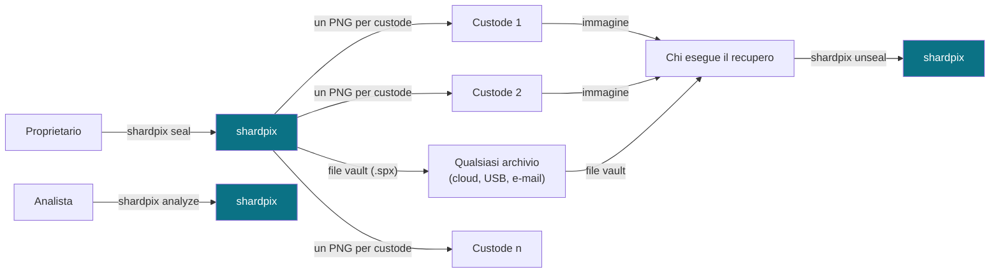
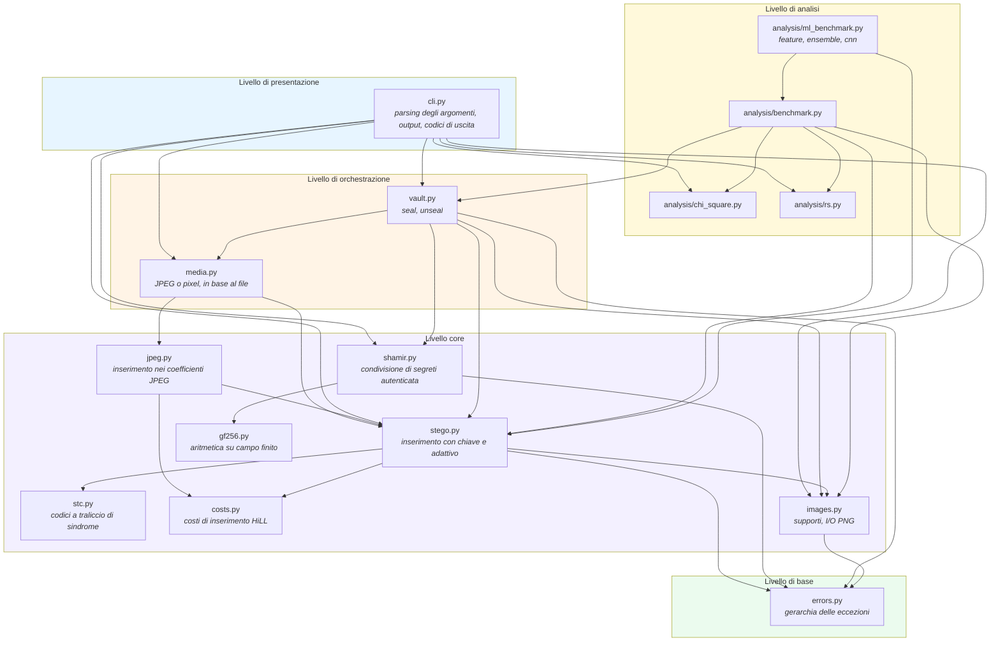
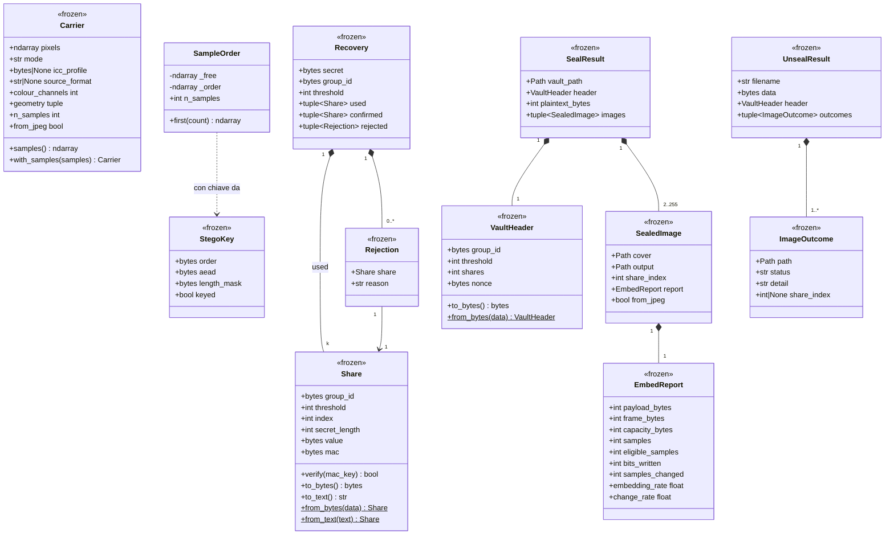
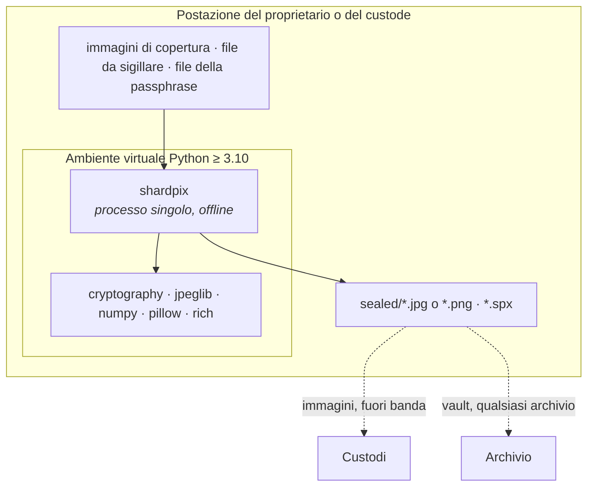

# 1. Architettura del sistema

| | |
| --- | --- |
| Documento | SDD-01 — Vista architetturale |
| Sistema | shardpix 2.0.0 |
| Stato | Approvato |
| Ultima revisione | 2026-10-07 |
| Lingua | Italiano (traduzione di [docs/01-architecture.md](../docs/01-architecture.md); in caso di differenze fa fede l'inglese) |

## 1.1 Scopo

Questo documento descrive la struttura statica di shardpix: la suddivisione in
package, le dipendenze tra i componenti, il modello dei dati, i formati su
disco e le decisioni architetturali che vincolano l'implementazione.
Il comportamento a runtime è trattato in [04-runtime-behaviour.md](04-runtime-behaviour.md);
il dettaglio funzione per funzione in [03-function-reference.md](03-function-reference.md);
il ragionamento sugli attaccanti in [05-security-analysis.md](05-security-analysis.md).

## 1.2 Vista di contesto

shardpix è un'applicazione a riga di comando a processo singolo. Non apre
connessioni di rete, non esegue servizi, non conserva nulla tra un'esecuzione
e l'altra a parte i file che le viene chiesto di scrivere, e non richiede
privilegi.

Il file vault e le immagini viaggiano separatamente e attraverso canali che
shardpix non controlla. È proprio questo il senso del progetto: il file vault
può essere conservato ovunque perché è testo cifrato, e ogni immagine può
essere consegnata perché, da sola, è una normale fotografia che non rivela
nulla.

## 1.3 Vista dei package

**Regola delle dipendenze.** Le dipendenze puntano dalla CLI verso il livello
di base, mai all'indietro: nulla nel core conosce il vault, la CLI o il
livello di analisi, e il vault non sa nulla della CLI. Ogni modulo del core è
utilizzabile da solo come libreria — `shamir` senza immagini, `stego` senza
quote.

Il livello di analisi sta accanto alla pila anziché al suo interno. Gli
attacchi non servono a inserire nulla; misurano il core dall'esterno, come
farebbe un avversario, e il benchmark pilota il core (e legge la dimensione
delle quote del vault) per produrre i suoi esperimenti.

### 1.3.1 Responsabilità per file

| File | Responsabilità | Dipende da |
| --- | --- | --- |
| [`shardpix/__init__.py`](../shardpix/__init__.py) | Espone `__version__` | — |
| [`shardpix/__main__.py`](../shardpix/__main__.py) | Punto di ingresso per `python -m shardpix` | `cli` |
| [`shardpix/cli.py`](../shardpix/cli.py) | Parsing degli argomenti, inserimento della passphrase, protezione dalla sovrascrittura, output sul terminale, codici di uscita | `vault`, `stego`, `shamir`, `images`, `analysis` |
| [`shardpix/vault.py`](../shardpix/vault.py) | Cifra un file, ne divide la chiave, distribuisce le quote sulle immagini, ed esegue il procedimento inverso | `stego`, `shamir`, `images` |
| [`shardpix/stego.py`](../shardpix/stego.py) | Derivazione delle chiavi, percorso con chiave, framing, inserimento adattivo (formato 4) e LSB matching/replacement (formato 3), estrazione di entrambi i formati | `images`, `stc`, `costs` |
| [`shardpix/media.py`](../shardpix/media.py) | Apre un'immagine di copertura nel dominio usato dal suo file (coefficienti JPEG o pixel), nasconde e rivela tramite il formato corrispondente | `jpeg`, `stego`, `images` |
| [`shardpix/jpeg.py`](../shardpix/jpeg.py) | Formato 5: carico nei coefficienti AC di luminanza non nulli, letti e scritti senza decodifica | `stego`, `costs` |
| [`shardpix/stc.py`](../shardpix/stc.py) | Codici a traliccio di sindrome: inserimento a costo minimo con l'algoritmo di Viterbi, estrazione della sindrome | — |
| [`shardpix/costs.py`](../shardpix/costs.py) | Costo HiLL di una modifica di ±1 su ogni campione; costo UERD di una modifica di ±1 su ogni coefficiente JPEG | — |
| [`shardpix/shamir.py`](../shardpix/shamir.py) | Suddivisione di Shamir, formato delle quote, MAC, recupero robusto | `gf256` |
| [`shardpix/gf256.py`](../shardpix/gf256.py) | Aritmetica in GF(2^8), valutazione di polinomi, interpolazione di Lagrange | — |
| [`shardpix/images.py`](../shardpix/images.py) | Caricamento di qualsiasi immagine come supporto a 8 bit, scrittura di PNG senza perdita | — |
| [`shardpix/errors.py`](../shardpix/errors.py) | Gerarchia delle eccezioni con radice in `ShardpixError` | — |
| [`shardpix/analysis/chi_square.py`](../shardpix/analysis/chi_square.py) | Attacco chi-quadro di Westfeld–Pfitzmann, funzione di sopravvivenza del chi-quadro | — |
| [`shardpix/analysis/rs.py`](../shardpix/analysis/rs.py) | Analisi RS di Fridrich–Goljan–Du | — |
| [`shardpix/analysis/benchmark.py`](../shardpix/analysis/benchmark.py) | Esperimenti di rilevabilità, grafici e tabelle per il 05 | `stego`, `vault`, `chi_square`, `rs` |
| [`shardpix/analysis/features.py`](../shardpix/analysis/features.py) | Feature di steganalisi SPAM e SRM-lite | — |
| [`shardpix/analysis/ensemble.py`](../shardpix/analysis/ensemble.py) | Classificatore ensemble di Kodovský–Fridrich–Holub, metriche di rilevamento | — |
| [`shardpix/analysis/cnn.py`](../shardpix/analysis/cnn.py) | Rete convoluzionale per la steganalisi (opzionale, PyTorch) | `features` |
| [`shardpix/analysis/ml_benchmark.py`](../shardpix/analysis/ml_benchmark.py) | Esperimenti con rilevatori addestrati su BOSSbase, grafici e tabelle per il 05 §5.5.5–5.5.6 | `stego`, `vault`, `benchmark`, `features`, `ensemble`, `cnn` |

## 1.4 Modello dei dati

Tutti i tipi valore sono dataclass congelate (frozen): vengono creati una
volta sola e mai modificati, il che li rende sicuri da inserire in insiemi (la
deduplicazione delle quote si basa su questo) e facili da ragionare nei test.

`SampleOrder` è l'unica classe con stato: mantiene in cache la parte del
percorso già calcolata, così chiedere le prime 32 posizioni e poi le prime
1.000 non costa più che chiederne direttamente 1.000.

## 1.5 Formati su disco

Tre formati hanno versioni indipendenti; ciascuno porta il proprio magic e la
propria versione, in modo che una modifica futura possa essere rilevata invece
che interpretata in modo errato.

### 1.5.1 Carico all'interno di un'immagine (formati stego v4 e v3)

Entrambi i formati contengono gli stessi campi; differiscono nel modo in cui i
bit raggiungono i campioni. shardpix scrive il formato 4 per impostazione
predefinita e legge entrambi.

| Campo | Dimensione | Contenuto |
| --- | --- | --- |
| salt | 16 B | Casuale per ogni inserimento |
| cost | 1 B | log2 del parametro N di scrypt (oggi 17; in lettura si accettano valori 10–18); bit 7 impostato nel formato 4 |
| length | 4 B | Dimensione di nonce + body, mascherata in XOR con una maschera derivata dalla chiave |
| nonce | 12 B | Nonce AES-256-GCM |
| body | n + 16 B | Testo cifrato e tag AES-256-GCM; AAD = dominio, versione del formato, lunghezza |

**Formato 4 (adattivo, ADR-12).** Ogni parte è la sindrome degli LSB di un
blocco di campioni candidati secondo un codice a traliccio di sindrome di
altezza 10 (`stc.py`):

| Parte | Candidati | Larghezza del codice | Matrice del codice |
| --- | --- | --- | --- |
| sale + costo (136 bit) | Primi 136 × w₀ campioni del percorso pubblico | w₀ = min(64, idonei / 1344) | Pubblica: SHAKE-256 di un'etichetta fissa |
| lunghezza (32 bit) | Primi 32 × w₀ campioni del percorso con chiave | w₀ | SHAKE-256 di un seme derivato dalla chiave |
| nonce + body (8·length bit) | I successivi w × 8·length campioni del percorso con chiave | w = min(128, liberi / bit, 2^20 / bit) | SHAKE-256 di un secondo seme derivato dalla chiave |

I carichi oltre 8.192 bit sono codificati in tralicci consecutivi di quella
dimensione. Le chiavi derivano dal dominio `shardpix/stego/v4`, quindi i
formati 3 e 4 non condividono mai una chiave. L'estrattore prova prima il
formato 4, poi il formato 3; un byte di costo che non corrisponde al formato
in prova fa terminare quel tentativo.

**Formato 5 (JPEG, ADR-13).** Gli stessi tre codici del formato 4, applicati
ai coefficienti di luminanza del JPEG anziché ai campioni dei pixel:
l'insieme idoneo è formato dai coefficienti AC non nulli, i costi sono UERD,
e un coefficiente a ±1 si allontana sempre da zero, così l'insieme idoneo
non cambia mai. Le chiavi derivano dal dominio `shardpix/jpeg/v1`. L'output
è un JPEG con le tabelle di quantizzazione e i metadati dell'immagine di
copertura.

**Formato 3 (matching, replacement).** Un bit per campione, sale e costo sul
percorso pubblico, il resto sul percorso con chiave; dominio
`shardpix/stego/v3`. Mantenuto nella libreria come riferimento di base per i
benchmark; la CLI non lo scrive più.

In entrambi i formati i bit sono scritti a partire dal più significativo,
vengono usati solo i campioni con valori 2–253 (ADR-06), e il percorso
pubblico e quello con chiave non condividono mai un campione.

### 1.5.2 Quota (formato delle quote v1)

| Campo | Dimensione | Contenuto |
| --- | --- | --- |
| magic | 4 B | `SPXS` |
| version | 1 B | `1` |
| group id | 16 B | Casuale, comune a tutte le quote di una stessa suddivisione |
| threshold | 1 B | k, 2–255 |
| index | 1 B | Coordinata x, 1–255 |
| length | 2 B | Lunghezza del segreto L |
| value | L + 32 B | f(index) per ogni byte di segreto ‖ chiave MAC |
| mac | 16 B | HMAC-SHA256(chiave MAC, `shardpix/share/v1` ‖ tutti i campi precedenti), troncato |
| checksum | 4 B | SHA-256(tutti i campi precedenti, mac incluso), troncato |

La forma stampabile è `spx1-` seguito da base32 minuscolo senza padding. Una
quota di una chiave di vault da 32 byte occupa 109 byte.

### 1.5.3 File vault (formato vault v1)

| Campo | Dimensione | Contenuto |
| --- | --- | --- |
| magic | 4 B | `SPXV` |
| version | 1 B | `1` |
| group id | 16 B | Lo stesso delle quote |
| threshold | 1 B | k |
| shares | 1 B | n |
| nonce | 12 B | Nonce AES-256-GCM |
| ciphertext | * | AES-256-GCM(chiave, nonce, testo in chiaro, AAD = i 35 byte precedenti) |

`plaintext = name length (2 B) ‖ original file name (UTF-8) ‖ file contents`.
Il nome del file è all'interno del testo cifrato, quindi il vault non lo
rivela.

## 1.6 Decisioni architetturali

### ADR-01 — Dividere la chiave, non il file

**Contesto.** Lo schema di Shamir può dividere dati di qualsiasi lunghezza, ma
ogni quota è lunga quanto il segreto.

**Decisione.** Il file viene cifrato con AES-256-GCM sotto una chiave casuale
a 256 bit, e viene divisa solo la chiave. Il testo cifrato va in un file vault
separato.

**Conseguenze.** Ogni immagine trasporta circa 160 byte qualunque sia la
dimensione del file, il che mantiene il tasso di inserimento intorno allo
0,05–0,5% (vedi 05 §5.5) invece di farlo crescere con il file. Il prezzo è un
secondo artefatto da conservare: il file vault. Poiché è testo cifrato, non
richiede altra protezione oltre alla disponibilità.

### ADR-02 — Primitive standard, codice proprio solo dove è l'oggetto di studio

**Contesto.** "Non scriverti la crittografia da solo" vale per cifrari, MAC e
KDF. Non vale per le parti che questo progetto esiste per esplorare.

**Decisione.** AES-GCM, ChaCha20, HMAC, HKDF e scrypt provengono dal package
`cryptography` e dalla libreria standard. L'aritmetica in GF(256), lo schema
di Shamir, l'inserimento ed entrambi gli attacchi di steganalisi sono
implementati qui, ciascuno verificato rispetto a un riferimento indipendente
(moltiplicazione shift-and-add, esempi svolti di FIPS-197, SciPy, le formule
degli articoli originali).

**Conseguenze.** Nessun cifrario personalizzato da nessuna parte. Il codice
specifico del progetto è pura aritmetica su parametri pubblici, dove i rischi
sono i bug piuttosto che la crittanalisi, e i bug sono ciò a cui serve la
suite di test.

### ADR-03 — LSB matching come predefinito

**Contesto.** LSB replacement scambia sempre e solo un valore con il suo
partner di coppia (2k ↔ 2k+1). Questa asimmetria è esattamente ciò che
misurano gli attacchi chi-quadro e RS.

**Decisione.** L'inserimento modifica un campione non corrispondente di +1 o
−1 a caso (LSB matching). Il replacement resta disponibile
(`--method replacement`) affinché il benchmark possa mostrare la differenza.

**Conseguenze.** Entrambi gli attacchi classici perdono il loro segnale
(05 §5.5). La distorsione per campione modificato è la stessa (±1). I
rilevatori addestrati la vedono ancora nelle immagini di copertura piccole
(05 §5.5.5), il che ha portato all'ADR-12; il matching resta il modo in cui
viene scritto il formato 3.

### ADR-04 — Posizioni da un percorso ChaCha20 con campionamento per rifiuto

**Contesto.** Le posizioni devono essere imprevedibili senza la chiave,
riproducibili con essa, ed economiche per carichi piccoli in foto grandi. Una
prima versione ordinava ogni campione in base a una parola di keystream a 64
bit: corretto, ma la memoria cresceva con l'immagine (circa 1 GiB per una foto
da 12 MP per collocare 141 byte).

**Decisione.** Il percorso legge parole a 64 bit da ChaCha20, riduce ciascuna
a un indice rifiutando la coda distorta, e tiene ogni indice idoneo la prima
volta che compare.

**Conseguenze.** Il costo è proporzionale al carico. Il percorso è un'unica
sequenza fissa, indipendente da come il keystream viene letto a blocchi, e
ogni prefisso è stabile — cosa su cui si basa l'estrazione, poiché legge la
lunghezza prima di sapere fin dove percorrere. I test a risposta nota lo
fissano.

### ADR-05 — Un sale per immagine in posizioni pubbliche

**Contesto.** L'estrattore ha bisogno della chiave per trovare il carico,
quindi il sale non può essere nascosto dalla chiave. Una prima versione usava
le dimensioni dell'immagine come sale: tutte le immagini con la stessa
passphrase e la stessa dimensione condividevano allora posizioni e chiavi, e
il lavoro di scrypt poteva essere precalcolato per le dimensioni comuni.

**Decisione.** Ogni inserimento estrae un sale a 128 bit e lo scrive per
primo, in posizioni date da un percorso pubblico; il percorso con chiave
esclude quelle posizioni.

**Conseguenze.** Due immagini sigillate con la stessa passphrase non hanno
alcuna relazione. Le posizioni del sale sono note a tutti, ma il sale è
casuale e indistinguibile dai bit meno significativi propri dell'immagine di
copertura, quindi sapere dove si trova non rivela nulla. Costo: 136 campioni
aggiuntivi, modificati o meno, per immagine (il sale e il costo di scrypt, che
viene memorizzato così da poterlo aumentare in futuro senza rendere illeggibili
le immagini precedenti).

### ADR-06 — Saltare i campioni quasi saturi

**Contesto.** LSB matching è simmetrico solo se un campione può spostarsi in
entrambe le direzioni. Un campione a 0 può solo salire e uno a 255 solo
scendere. Nelle foto con regioni clippate questi spostamenti forzati si
comportano come il replacement, e il benchmark ha mostrato RS stimare il 22%
su `astronaut` (l'11% dei cui campioni è nero puro) quando il 50% dei campioni
conteneva LSB matching ingenuo.

**Decisione.** Solo i campioni in 2–253 trasportano dati, e LSB matching non
esce mai da quell'intervallo (2 sale sempre, 253 scende sempre). L'intervallo
è formato da coppie LSB complete, quindi anche il replacement vi rimane
all'interno.

**Conseguenze.** L'insieme dei campioni idonei è identico prima e dopo
l'inserimento; l'estrattore lo ricalcola dall'immagine stego senza
informazioni aggiuntive. RS su `astronaut` scende al 4,5% allo stesso tasso.
La capacità si riduce della frazione di campioni clippati. Gli spostamenti
forzati restano solo per i campioni esattamente a 2 o 253.

### ADR-07 — Cifrare il carico stego anche se le quote sono autenticate

**Contesto.** Una quota contiene già un MAC e un checksum.

**Decisione.** Il livello stego sigilla comunque il proprio carico con
AES-256-GCM.

**Conseguenze.** I bit scritti nell'immagine sono uniformemente casuali,
quindi la struttura di una quota (il suo magic, il suo group id) non compare
mai nell'immagine; una passphrase errata viene segnalata come tale invece di
produrre dati senza senso; e il livello stego può trasportare qualsiasi
carico, non solo quote.

### ADR-08 — MAC delle quote con una chiave MAC condivisa

**Contesto.** Shamir semplice non offre integrità: una sola quota errata
produce silenziosamente un segreto sbagliato. La soluzione ovvia, un MAC con
il segreto come chiave, fornisce a chiunque possieda una quota un oracolo
offline per indovinare un segreto a bassa entropia.

**Decisione.** Una chiave MAC casuale di 32 byte viene accodata al segreto
prima della suddivisione, così viene condivisa esattamente come il segreto, e
ogni quota contiene un HMAC di 16 byte sotto quella chiave.

**Conseguenze.** Meno di k quote restano indipendenti dal segreto in senso
teorico-informativo (05 SP-03). Una volta combinate k quote, ogni quota può
essere verificata e quelle errate identificate. Costo: 32 + 16 byte per quota.

### ADR-09 — Recuperare cluster, lasciar decidere al tag del vault

**Contesto.** Prendere le prime k quote che si autenticano a vicenda non
basta: il group id è pubblico, quindi chiunque può fabbricare k quote che si
verificano sotto la propria chiave MAC. Una ricerca nel semplice ordine delle
combinazioni può inoltre bloccarsi su una quota errata elencata per prima.

**Decisione.** Il recupero cerca cluster di quote che si autenticano a
vicenda — prima blocchi disgiunti, poi combinazioni di indici con una quota
per indice, entro un budget di 10.000 tentativi. I cluster non si
sovrappongono mai. `combine` restituisce il più grande e rifiuta i pareggi;
`unseal` prova ogni cluster contro il tag AES-GCM del vault.

**Conseguenze.** Una quota danneggiata su venti costa due tentativi, non
migliaia. Un insieme contraffatto non viene mai accettato da `unseal`, e viene
segnalato come tale. Il budget limita il caso peggiore al prezzo di un errore
chiaro con input avversariali ben oltre l'uso realistico.

### ADR-10 — Output senza perdita per le immagini di copertura in pixel (immagini di copertura JPEG: vedi ADR-13)

**Contesto.** JPEG riquantizza i pixel e distrugge i carichi LSB. I pixel che
provengono da un JPEG decodificato portano anche la struttura a blocchi 8×8
dell'originale; le modifiche di ±1 la rompono in un modo che la steganalisi
di compatibilità JPEG può rilevare.

**Decisione.** `save_png` rifiuta qualsiasi altra estensione. Le immagini di
copertura decodificate da JPEG sono accettate ma provocano un avviso che
raccomanda immagini di copertura mai compresse in JPEG.

**Conseguenze.** Gli utenti non possono distruggere un carico scegliendo
l'estensione sbagliata. Superata dall'ADR-13 per le immagini di copertura
JPEG: un JPEG non viene più decodificato in pixel ma riceve l'inserimento
nei propri coefficienti; l'avviso resta solo per i file che Pillow decodifica
come JPEG senza che siano file JPEG baseline.

### ADR-11 — Usare al massimo metà dei campioni idonei

**Contesto.** Il percorso con chiave diventa lento quando deve trovare quasi
ogni campione (un problema del collezionista di figurine), e un'immagine
riempita fino alla capacità è comunque facile preda della steganalisi.

**Decisione.** La capacità è calcolata sulla metà dei campioni idonei.

**Conseguenze.** L'inserimento resta veloce a qualsiasi dimensione accettata
dalla CLI. Una foto RGB 512 × 512 contiene comunque circa 40 KiB, molto più
dei 160 byte necessari a una quota del vault.

### ADR-12 — Inserimento adattivo con codici a traliccio di sindrome (formato 4)

**Contesto.** LSB matching in posizioni casuali effettua ogni modifica in un
punto casuale: una modifica ogni due bit di carico, tante in un cielo limpido
quante nel fogliame. I rilevatori addestrati misurati su BOSSbase hanno
trovato una quota in una foto 512x512 con un errore del 42,5% (05 §5.5.5).

**Decisione.** Il formato 4 scrive ogni parte del frame come codice a
traliccio di sindrome (Filler, Judas e Fridrich) su campioni candidati con
chiave, scegliendo le modifiche con l'algoritmo di Viterbi in modo da
minimizzare il costo HiLL totale (Li et al.). Le matrici del codice sono
derivate da SHAKE-256, non da un generatore NumPy, così le immagini non
dipendono dalla versione di NumPy. La larghezza è limitata a 128 candidati per
bit e il traliccio a 2^20 campioni per carico, il che mantiene l'inserimento
sotto pochi secondi per una quota; i carichi sono codificati in tralicci di
8.192 bit per limitare la memoria.

**Conseguenze.** Una quota modifica circa un terzo dei campioni rispetto al
formato 3 (208 contro 633 su BOSSbase), collocati nelle zone di texture. Il
ricevente non ha bisogno di alcuna mappa dei costi. L'inserimento è più lento
(circa un secondo per quota, numpy puro) e le immagini in formato 4 non
possono essere lette da shardpix 1.1. L'effetto misurato sulla rilevabilità è
riportato in 05 §5.5.6.

### ADR-13 — Inserimento delle immagini di copertura JPEG nei loro coefficienti (formato 5)

**Contesto.** Le fotocamere dei telefoni salvano in JPEG, e il progetto deve
funzionare con le foto che le persone hanno davvero. L'inserimento nei pixel
decodificati di un JPEG è rilevabile a qualsiasi tasso (steganalisi di
compatibilità JPEG) e trasforma una foto del telefono in un PNG insolito.

**Decisione.** Un'immagine di copertura il cui file inizia con il marcatore
JPEG viene letta come coefficienti DCT quantizzati con `jpeglib` e mai
decodificata. Il carico va nei coefficienti AC non nulli della luminanza con
gli stessi codici a traliccio di sindrome del formato 4 e costi UERD (Guo et
al.); gli zeri e i coefficienti DC non vengono mai modificati, e ±1 si
allontana sempre da zero. Il JPEG viene riscritto con le sue tabelle di
quantizzazione e i suoi marcatori (EXIF, ICC). `media.py` effettua la scelta
in base ai primi byte del file, quindi né il vault né la CLI hanno più un
`--method`.

**Conseguenze.** Le foto del telefono vengono usate così come sono state
scattate e il file stego è un JPEG della stessa qualità. Una nuova dipendenza
(`jpeglib`, che include libjpeg). Il file viene riscritto da libjpeg, quindi
le tabelle di Huffman e la disposizione dei marcatori possono differire da
quelle dell'encoder della fotocamera (07 §7.6). La rilevabilità misurata è
riportata in 05 §5.5.8.

## 1.7 Vista di deployment

Non ci sono chiamate di rete, database né servizi in background. L'extra
opzionale `bench` aggiunge matplotlib e scikit-image per i benchmark, e
l'extra `ml` PyTorch per la CNN.

## 1.8 Requisiti non funzionali

| Requisito | Come viene soddisfatto | Verifica |
| --- | --- | --- |
| Le immagini sigillate oggi devono aprirsi con le versioni future | Formati con versione; i test a risposta nota fissano posizioni, quote, pixel e byte del vault | `tests/test_known_answers.py` |
| Una passphrase errata o un'immagine modificata non devono mai produrre dati errati | AES-GCM sul carico stego, MAC e checksum sulle quote, AES-GCM sul vault | `TestAuthentication` (stego, shamir), `TestFailures` |
| Meno di k immagini non devono rivelare nulla sul file | Shamir su GF(256) con la chiave MAC condivisa insieme al segreto | `TestSecrecy` |
| Un'immagine errata non deve impedire il recupero quando ne restano k valide | Ricerca di cluster con prima i blocchi disgiunti | `TestRobustSearch`, `TestForgedSets` |
| Ogni errore previsto termina con un messaggio di una riga, mai con un traceback | Gerarchia `ShardpixError`, `OSError` intercettato in `main` | `TestCleanErrors` |
| Nessun file di input viene mai sovrascritto | Controlli di identità dei percorsi nella CLI e nel vault, senza distinzione tra maiuscole e minuscole | `TestOutputCollisions`, `test_refuses_to_overwrite_the_cover` |
| Memoria e tempo crescono con il carico, non con l'immagine | Percorso con campionamento per rifiuto (ADR-04) | 04 §4.9 |
| La suite di test gira offline in pochi secondi | Immagini di copertura sintetiche, costo di scrypt ridotto nei test | 310 test, ~9 s |
| Portabilità | Python 3.10–3.13, cinque dipendenze (cryptography, jpeglib, numpy, Pillow, rich) | Matrice CI |
