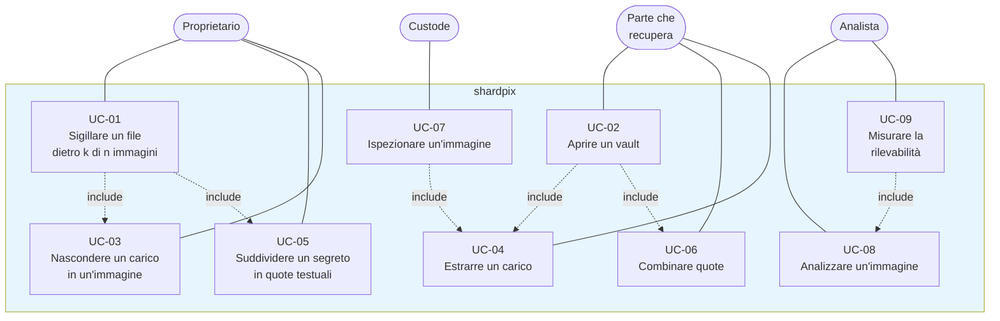

# 2. Casi d'uso

| | |
| --- | --- |
| Documento | SDD-02 — Specifica dei casi d'uso |
| Sistema | shardpix 2.0.0 |
| Stato | Approvato |
| Ultima revisione | 2026-10-07 |
| Lingua | Italiano (traduzione di [docs/02-use-cases.md](../docs/02-use-cases.md); in caso di differenze fa fede l'inglese) |

## 2.1 Attori

| Attore | Tipo | Descrizione |
| --- | --- | --- |
| Proprietario | Primario, umano | Possiede un file che deve restare riservato ma recuperabile anche senza di lui. Lo sigilla e distribuisce le immagini. |
| Custode | Primario, umano | Riceve un'immagine e la conserva come una normale foto. Partecipa a un recupero quando gli viene chiesto. |
| Parte che recupera | Primario, umano | Raccoglie k immagini e il file vault e lo apre. Spesso è uno dei custodi. |
| Analista | Primario, umano | Esamina immagini alla ricerca di dati nascosti, oppure misura quanto sia rilevabile una strategia di inserimento. |
| Avversario | Secondario, ostile | Ottiene alcune immagini, il file vault o entrambi; può modificare o fabbricare immagini. Non è un utente del sistema, ma ogni caso d'uso è specificato tenendone conto (05). |

## 2.2 Diagramma dei casi d'uso

Le relazioni `include` indicano un comportamento sempre eseguito come parte del
caso base: la sigillatura suddivide sempre una chiave e inserisce le quote,
l'apertura le estrae e le combina sempre. Da UC-03 a UC-06 i casi sono esposti
anche singolarmente, così che i livelli possano essere usati e dimostrati in
modo indipendente.

## 2.3 Matrice di tracciabilità

| Caso d'uso | Realizzato da | Comando CLI | Test |
| --- | --- | --- | --- |
| UC-01 | `vault.seal` | `seal` | `test_vault.py::TestRoundTrip`, `TestSealValidation`, `TestOutputCollisions` |
| UC-02 | `vault.unseal` | `unseal` | `test_vault.py::TestRoundTrip`, `TestFailures`, `TestForgedSets` |
| UC-03 | `stego.embed` | `embed` | `test_stego.py::TestRoundTrip`, `TestDistortion`, `TestSaturation` |
| UC-04 | `stego.extract` | `extract` | `test_stego.py::TestRoundTrip`, `TestAuthentication` |
| UC-05 | `shamir.split` | `split` | `test_shamir.py::TestSplitCombine`, `TestSecrecy`, `TestEncoding` |
| UC-06 | `shamir.combine`, `shamir.recover_all` | `combine` | `test_shamir.py::TestAuthentication`, `TestRobustSearch`, `TestMixedSplits` |
| UC-07 | `stego.extract`, `Share.from_bytes` | `inspect` | `test_cli.py::TestVaultCommands` |
| UC-08 | `chi_square.pair_test`, `chi_square.sequential_attack`, `rs.estimate` | `analyze` | `test_chi_square.py`, `test_rs.py`, `test_cli.py::TestOtherCommands` |
| UC-09 | `analysis.benchmark.run` | `python -m shardpix.analysis.benchmark` | Manuale; risultati in [data/benchmark.json](../docs/data/benchmark.json) |

---

## 2.4 Specifiche dettagliate

### UC-01 — Sigillare un file dietro k di n immagini

| | |
| --- | --- |
| **Attore primario** | Proprietario |
| **Precondizioni** | Il proprietario dispone del file, di almeno due immagini di copertura di sua proprietà, e ha scelto k e una passphrase. |
| **Postcondizioni** | Nella directory di output esistono un file vault e n immagini stego; le immagini di copertura e il file restano intatti. |
| **Evento scatenante** | `shardpix seal notes.pdf photos/*.png -k 3 -p` |

#### Flusso principale

1. Il proprietario invoca il comando con il file, le immagini di copertura e la soglia.
2. Il sistema chiede la passphrase due volte.
3. Il sistema verifica n (2–255), k (2–n) e che le immagini di copertura siano
   file distinti.
4. Il sistema calcola ogni percorso di output e verifica che nessuno collida con
   un altro, con un input o con un file esistente.
5. Il sistema carica ogni immagine di copertura e verifica che possa contenere
   una quota.
6. Il sistema genera una chiave, un id di gruppo e un nonce casuali, e cifra il
   file insieme al suo nome nel vault.
7. Il sistema suddivide la chiave in n quote (UC-05) e inserisce la quota *i*
   nell'immagine di copertura *i* (UC-03), scrivendo ciascuna in PNG.
8. Il sistema scrive il file vault e stampa, per ogni immagine, l'indice della
   quota, il tasso di inserimento e il numero di campioni modificati.

#### Flussi alternativi

| Id | Condizione | Comportamento |
| --- | --- | --- |
| A1 | k o n fuori intervallo, immagini di copertura duplicate | Errore prima che venga letto qualsiasi file. |
| A2 | Due immagini di copertura produrrebbero lo stesso nome di output (anche ignorando maiuscole/minuscole), oppure `--name` coincide con il nome di un'immagine | Errore prima che venga scritto alcunché. |
| A3 | Un output sovrascriverebbe un'immagine di copertura o il file | Errore, anche con `--force`. |
| A4 | Un output esiste già | Errore, salvo con `--force`. |
| A5 | Un'immagine di copertura è troppo piccola o troppo satura per una quota | Errore che indica l'immagine di copertura; non viene scritto nulla. |
| A6 | Un'immagine di copertura è un JPEG (una foto del telefono) | La sua quota va nei suoi coefficienti (formato 5) e l'output è un `.jpg` con le stesse tabelle e gli stessi metadati. |
| A7 | Nessuna opzione di passphrase fornita | La sigillatura procede; un avviso segnala che chiunque abbia shardpix può leggere ogni quota, anche se ne servono comunque k. |
| A8 | Il file è più grande di 2 GiB | Errore: AES-GCM, così come esposto da `cryptography`, è limitato a 2 GiB per chiamata. |

---

### UC-02 — Aprire un vault

| | |
| --- | --- |
| **Attore primario** | Parte che recupera |
| **Precondizioni** | Sono disponibili il file vault e almeno k delle sue immagini; la passphrase è nota. |
| **Postcondizioni** | Il file originale è ripristinato con il suo nome originale (sanificato) o con il nome indicato tramite `-o`. |
| **Evento scatenante** | `shardpix unseal notes.pdf.spx a.png b.png c.png -p` |

#### Flusso principale

1. La parte che recupera invoca il comando con il vault e le immagini.
2. Il sistema legge e verifica l'intestazione del vault.
3. Per ogni immagine, il sistema estrae il carico (UC-04) e interpreta la
   quota; le quote di altri vault e i duplicati vengono messi da parte.
4. Il sistema cerca gruppi di quote che si autenticano a vicenda (UC-06).
5. Il sistema prova la chiave di ciascun gruppo contro il tag AES-GCM del vault
   e tiene la prima che risulta verificata.
6. Il sistema stampa una riga per immagine — usata, verificata, rifiutata,
   duplicata, nessun carico, altro vault, illeggibile — e scrive il file.

#### Flussi alternativi

| Id | Condizione | Comportamento |
| --- | --- | --- |
| A1 | Meno di k quote valide | Errore con la tabella per immagine; le quote valide sono mostrate come *non verificate*. |
| A2 | Passphrase errata | Ogni immagine riporta *nessun carico*; errore. |
| A3 | Alcune immagini sono corrotte, ne restano almeno k integre | Il recupero riesce; le immagini corrotte sono riportate come *rifiutate* con il motivo. |
| A4 | È presente un insieme fabbricato di quote coerenti tra loro | La sua chiave non supera il tag del vault; il recupero riesce con l'insieme autentico; le immagini contraffatte sono *rifiutate*. |
| A5 | Il file vault è stato modificato | Ogni gruppo fallisce la verifica del tag; errore. |
| A6 | Il nome di file memorizzato contiene un percorso, caratteri di controllo o un nome di dispositivo riservato | Il nome viene ridotto a un nome base sicuro, oppure a `unsealed.bin`. |
| A7 | L'output esiste già | Errore, salvo con `--force`; un input non viene mai sovrascritto. |

---

### UC-03 — Nascondere un carico in un'immagine

| | |
| --- | --- |
| **Attore primario** | Proprietario |
| **Precondizioni** | Un'immagine di copertura e un carico non più grande della sua capacità. |
| **Postcondizioni** | Un PNG che appare come l'immagine di copertura e trasporta il carico sigillato. |
| **Evento scatenante** | `shardpix embed photo.png -o out.png -t "meet at noon" -p` |

#### Flusso principale

1. Il sistema carica l'immagine di copertura e calcola i campioni idonei (2–253).
2. Il sistema verifica la capacità.
3. Il sistema genera un sale, deriva le chiavi da passphrase e sale, e sigilla
   il carico in un frame.
4. Il sistema legge l'immagine di copertura nel dominio del suo file: un JPEG
   come coefficienti quantizzati (formato 5, 01 ADR-13), qualsiasi altro file
   come pixel (formato 4, ADR-12). Calcola il costo di ogni candidato (UERD o
   HiLL) e scrive il sale, la lunghezza e il corpo sigillato come codici a
   traliccio di sindrome (STC), modificando di ±1 i candidati meno costosi.
5. Il sistema scrive un JPEG o un PNG, in base all'immagine di copertura, e
   riporta il tasso e le modifiche.

#### Flussi alternativi

| Id | Condizione | Comportamento |
| --- | --- | --- |
| A1 | L'estensione dell'output non corrisponde all'immagine di copertura (`.jpg` per un JPEG, `.png` altrimenti) | Errore che indica l'estensione attesa. |
| A2 | Carico più grande della capacità | Errore con la capacità in byte. |
| A3 | L'immagine di copertura è un JPEG | Formato 5, output `.jpg` (come UC-01 A6). |

---

### UC-04 — Estrarre un carico

| | |
| --- | --- |
| **Attore primario** | Parte che recupera |
| **Precondizioni** | Un'immagine stego e la sua passphrase. |
| **Postcondizioni** | Il carico, autenticato, su stdout o in un file. |
| **Evento scatenante** | `shardpix extract out.png -p` |

#### Flusso principale

1. Il sistema ricalcola i campioni idonei e legge il sale lungo il percorso
   pubblico.
2. Il sistema deriva le chiavi e legge la lunghezza mascherata lungo il percorso
   con chiave.
3. Il sistema legge il nonce e il corpo e li decifra; il tag viene verificato.

#### Flussi alternativi

| Id | Condizione | Comportamento |
| --- | --- | --- |
| A1 | Passphrase errata, nessun carico o immagine modificata | `PayloadNotFoundError`: un unico messaggio per tutti e tre i casi, per scelta progettuale (05 §5.3). |
| A2 | Lunghezza fuori intervallo | Stesso errore, senza tentare la decifratura. |

---

### UC-05 — Suddividere un segreto in quote testuali

| | |
| --- | --- |
| **Attore primario** | Proprietario |
| **Precondizioni** | Un segreto di 1–65.535 byte. |
| **Postcondizioni** | n quote stampabili, k qualsiasi delle quali permettono di recuperare il segreto. |
| **Evento scatenante** | `shardpix split -t "safe code 4815" -k 3 -n 5 -d shares/` |

#### Flusso principale

1. Il sistema aggiunge al segreto una chiave MAC casuale di 32 byte.
2. Il sistema genera k − 1 righe di coefficienti casuali e valuta i polinomi in
   x = 1 … n su GF(256).
3. Il sistema calcola il MAC e il checksum di ogni quota e stampa le quote,
   oppure scrive un file per quota.

#### Flussi alternativi

| Id | Condizione | Comportamento |
| --- | --- | --- |
| A1 | Segreto più grande di 65.535 byte | Errore che rimanda a `seal`. |
| A2 | n > 255 oppure k fuori da 2–n | Errore. |

---

### UC-06 — Combinare quote

| | |
| --- | --- |
| **Attore primario** | Parte che recupera |
| **Precondizioni** | Almeno k quote di una stessa suddivisione. |
| **Postcondizioni** | Il segreto su stdout o in un file, con un resoconto di ogni quota. |
| **Evento scatenante** | `shardpix combine share-1.txt share-3.txt share-4.txt` |

#### Flusso principale

1. Il sistema interpreta ogni riga non vuota e non di commento; le righe
   malformate vengono segnalate e ignorate.
2. Il sistema raggruppa le quote per suddivisione e cerca gruppi coerenti in
   ciascun insieme (04 §4.6).
3. Il sistema restituisce il segreto del gruppo più grande e riporta quali quote
   sono state usate, quali sono state ulteriormente verificate e quali sono
   state rifiutate.

#### Flussi alternativi

| Id | Condizione | Comportamento |
| --- | --- | --- |
| A1 | Meno di k indici distinti | Errore. |
| A2 | Due gruppi di uguale dimensione | Errore: uno dei due insiemi è contraffatto e non c'è modo di stabilire quale. |
| A3 | Due suddivisioni diverse possono essere recuperate ciascuna | Errore: combinarle separatamente. |
| A4 | Budget di ricerca esaurito | Errore; si verifica solo con input avversariali ben oltre l'uso realistico. |

---

### UC-07 — Ispezionare un'immagine

| | |
| --- | --- |
| **Attore primario** | Custode |
| **Precondizioni** | Un'immagine e, se ne è stata usata una, la passphrase. |
| **Postcondizioni** | Il custode sa se l'immagine trasporta una quota e di quale vault. |
| **Evento scatenante** | `shardpix inspect my-photo.png -p` |

#### Flusso principale

1. Il sistema estrae il carico (UC-04).
2. Se viene interpretato come una quota, il sistema mostra l'id del vault,
   l'indice della quota, la soglia e la lunghezza del segreto; altrimenti la
   dimensione del carico.

---

### UC-08 — Analizzare un'immagine

| | |
| --- | --- |
| **Attore primario** | Analista |
| **Precondizioni** | Una qualsiasi immagine a 8 bit. |
| **Postcondizioni** | Risultati chi-quadro e RS e un verdetto. |
| **Evento scatenante** | `shardpix analyze suspicious.png` |

#### Flusso principale

1. Il sistema esegue il test chi-quadro sulle coppie di valori sull'intera
   immagine e su prefissi crescenti.
2. Il sistema esegue l'analisi RS su ogni canale di colore.
3. Il sistema riporta le evidenze e segnala LSB replacement quando la stima RS
   raggiunge il 10% o la firma chi-quadro copre almeno il 10% dell'immagine.

#### Flussi alternativi

| Id | Condizione | Comportamento |
| --- | --- | --- |
| A1 | Immagine larga meno di 4 pixel | RS viene riportata come non applicabile. |
| A2 | Nessuna segnalazione | L'output precisa che un risultato negativo non prova che l'immagine sia pulita. |

---

### UC-09 — Misurare la rilevabilità

| | |
| --- | --- |
| **Attore primario** | Analista |
| **Precondizioni** | L'extra `bench` è installato; facoltativamente, un insieme di immagini di copertura. |
| **Postcondizioni** | Grafici in `assets/`, risultati grezzi in `docs/data/benchmark.json`, tabelle Markdown su stdout. |
| **Evento scatenante** | `python -m shardpix.analysis.benchmark` |

#### Flusso principale

1. Il sistema carica dieci fotografie di pubblico dominio (o le immagini di
   copertura indicate).
2. Per quattro strategie e undici tassi di inserimento inserisce bit casuali ed
   esegue RS.
3. Esegue l'attacco chi-quadro sequenziale su un'immagine di copertura al 50%.
4. Inserisce una vera quota di vault in ogni immagine di copertura e misura la
   modifica.
5. Genera i grafici nelle varianti chiara e scura e scrive i risultati.

---

## 2.5 Scenari operativi

**Credenziali di emergenza di una piccola organizzazione.** L'amministratore di
un'associazione di volontariato sigilla il file che contiene le password
principali dietro 3 di 5 foto, una per ciascun membro del consiglio direttivo.
Nessun singolo membro può aprirlo, la perdita di due foto non lascia
l'associazione chiusa fuori, e le foto stanno in normali raccolte fotografiche.
Il file vault risiede sull'unità condivisa.

**Kit di recupero personale.** Una persona sigilla un file di codici di recupero
dietro 2 di 3 immagini: una a casa, una presso un familiare, una in un album
fotografico nel cloud. La perdita di un luogo è sopportabile; la compromissione
di uno è innocua.

**Insegnare la steganalisi.** Un docente esegue i benchmark
(`python -m shardpix.analysis.benchmark`, `ml_benchmark`, `pooled`) e
`analyze` per mostrare perché i tool LSB ingenui vengono scoperti, cosa
cambiano la LSB matching e l'inserimento adattivo, e perché contano più
immagini della stessa cassaforte; i grafici di 05 §5.5 supportano la lezione
con i dati.

## 2.6 Vincoli di legittimità

shardpix protegge dati che i suoi utenti hanno il diritto di proteggere. Usate
solo immagini di copertura di vostra proprietà o che avete il diritto di usare,
rispettate la legge che vi si applica in materia di uso della crittografia e
della steganografia, e non usatelo mai per occultare prove o esfiltrare dati che
non siete autorizzati a spostare. Il comando `analyze` e il benchmark operano su
immagini; eseguiteli su immagini che avete il permesso di esaminare.
