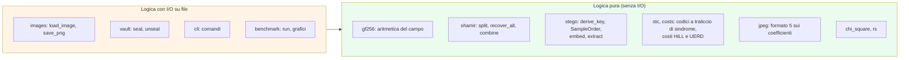

# 3. Riferimento delle funzioni

| | |
| --- | --- |
| Documento | SDD-03 — Specifica dettagliata dei componenti |
| Sistema | shardpix 1.1.0 |
| Stato | Approvato |
| Ultima revisione | 2026-10-06 |
| Lingua | Italiano (traduzione di [docs/03-function-reference.md](../docs/03-function-reference.md); in caso di differenze fa fede l'inglese) |

## 3.1 Scopo e convenzioni

Questo documento descrive ogni modulo, funzione, classe e costante pubblica:
che cosa fa, come si comporta nei casi limite e quali errori solleva.

Convenzioni adottate:

- I nomi che iniziano con `_` sono privati del rispettivo modulo e non fanno
  parte dell'interfaccia pubblica: sono documentati perché contengono logica
  significativa, ma possono cambiare senza preavviso.
- "Solleva" elenca gli errori attesi, tutti sottoclassi di `ShardpixError`
  salvo diversa indicazione; gli errori di programmazione (`TypeError`, un
  `ValueError` dovuto a una precondizione violata) si propagano normalmente.
- `RandomBytes` è il tipo `Callable[[int], bytes]`. Ogni funzione che
  richiede casualità ne riceve una, con `os.urandom` come valore predefinito,
  così che i test possano rendere l'output riproducibile.
- Il riferimento ai test indica la classe in `tests/` che copre quella funzione.

## 3.2 Mappa dei moduli

Inserimento, suddivisione in quote ed entrambi gli attacchi operano su array
e byte, mai su percorsi: il file system è toccato solo da `images`, `vault`,
`cli` e dal benchmark. È ciò che consente alla maggior parte dei 369 test di
essere eseguita senza creare un solo file.

---

## 3.3 `shardpix/__init__.py` e `__main__.py`

`__init__` espone solo `__version__` (`"1.1.0"`) e non importa alcun
sottomodulo, così `import shardpix` è rapido e privo di effetti collaterali.
`__main__` delega a `cli.main`, così lo strumento si esegue come
`python -m shardpix` senza installazione.

---

## 3.4 `shardpix/errors.py`

| Classe | Sollevata quando | Attributo aggiuntivo |
| --- | --- | --- |
| `ShardpixError` | Classe base di ogni errore atteso; la CLI la trasforma in `error: …` e codice di uscita 1 | — |
| `UnsupportedImageError` | Il file non è un'immagine leggibile, è a 16 bit o in virgola mobile, supera il limite di Pillow contro le decompression bomb, oppure l'output non è `.png` | — |
| `CapacityError` | Il carico non entra nell'immagine di copertura | — |
| `PayloadNotFoundError` | L'estrazione fallisce: passphrase errata, nessun carico o immagine modificata | — |
| `ShareError` | Classe base per i problemi delle quote | `rejected`: coppie `(share, reason)` scartate prima del fallimento |
| `ShareFormatError` | Prefisso, base32, magic, versione, checksum o campo non validi | — |
| `InsufficientSharesError` | Meno indici distinti della soglia | — |
| `InconsistentSharesError` | Due cluster di pari dimensione, o due suddivisioni recuperabili | — |
| `ShareAuthenticationError` | Nessun gruppo di k quote si autentica a vicenda, oppure il budget di ricerca è esaurito | — |
| `VaultError` | La sigillatura o l'apertura di un vault fallisce | `outcomes`: risultati per immagine, per il resoconto |

---

## 3.5 `shardpix/images.py`

### Costanti

| Nome | Valore | Ruolo |
| --- | --- | --- |
| `LOSSLESS_SUFFIXES` | `{".png"}` | L'unica estensione di output accettata. |
| `_KEEP_MODES` | `L`, `LA` → 1 canale; `RGB`, `RGBA` → 3 | Modalità mantenute così come sono, con il relativo numero di canali di colore. |
| `_REJECTED_MODES` | `I`, `I;16*`, `F` | Modalità ad alta profondità di bit, rifiutate anziché ridotte silenziosamente a 8 bit. |

### `class Carrier` *(immutabile)*

Un'immagine come array `H × W × C` di `uint8`, con la sua modalità Pillow,
il profilo ICC e il formato di origine.

| Membro | Significato |
| --- | --- |
| `colour_channels` | 1 per `L`/`LA`, 3 per `RGB`/`RGBA`. Il canale alfa non è mai usato come supporto: la trasparenza è troppo facile da ispezionare. |
| `geometry` | `(height, width, colour_channels)`. |
| `n_samples` | `height × width × colour_channels`. |
| `from_jpeg` | `True` quando `source_format` è `JPEG` o `MPO`. |
| `samples()` | Copia piatta dei campioni di colore, per righe e con canali interlacciati. |
| `with_samples(samples)` | Nuovo carrier con i campioni di colore sostituiti; il canale alfa viene copiato invariato. Solleva `ValueError` se le dimensioni non corrispondono. |

Test: `test_images.py::TestSamples`.

### `_normalise_mode(image) -> Image` *(privata)*

Mantiene le modalità supportate, converte `1` in `L`, `P` in `RGB` (o `RGBA`
se la tavolozza ha trasparenza), `PA` in `RGBA` e qualsiasi altra (`CMYK`,
`YCbCr`, …) in `RGB`. Solleva `UnsupportedImageError` per le modalità ad alta
profondità di bit.

### `from_pil(image) -> Carrier`

Costruisce un carrier da un'immagine Pillow aperta, memorizzandone il formato
e il profilo ICC prima della conversione. Test: `TestLoad`.

### `load_image(path) -> Carrier`

Apre, decodifica completamente e converte un'immagine. Solleva
`UnsupportedImageError` per un file mancante, una decompression bomb o
qualsiasi cosa Pillow non riesca a decodificare.

### `to_pil(carrier) -> Image`

Riconverte in Pillow, lasciando che questo deduca la modalità dalla forma
dell'array.

### `write_new(path, data, *, overwrite=False) -> None`

Scrive byte in un nuovo file con creazione esclusiva (`O_CREAT | O_EXCL`),
salvo `overwrite`: verifica e creazione sono un unico passo atomico, e un nome
esistente — compreso un collegamento simbolico pendente — viene rifiutato
anziché seguito (06 SR-03). Solleva `ShardpixError`. Ogni output della CLI e di
`seal` passa da qui. Test: `TestWriteNew`.

### `save_png(carrier, path, *, overwrite=False) -> None`

Codifica un PNG senza perdita al livello di compressione predefinito,
preservando il profilo ICC, e lo scrive con `write_new`. Solleva
`UnsupportedImageError` per qualsiasi estensione diversa da `.png` — JPEG
riquantizzerebbe i pixel distruggendo il carico — e `ShardpixError` se il file
esiste (senza `overwrite`) o non può essere scritto. Test: `TestSave`.

---

## 3.6 `shardpix/stego.py`

### Costanti

| Nome | Valore | Ruolo |
| --- | --- | --- |
| `FORMAT_VERSION`, `LEGACY_VERSION`, `JPEG_VERSION` | `4`, `3`, `5` | Formato scritto da `ADAPTIVE`, dai metodi di base e da `jpeg.py`; fa parte dei dati associati di AES-GCM e del dominio delle chiavi. |
| `SALT_BYTES`, `COST_BYTES`, `PUBLIC_BYTES` / `PUBLIC_BITS` | `16`, `1`, `17` / `136` | Sale per immagine e costo di scrypt, scritti lungo il percorso pubblico (ADR-05). |
| `LENGTH_BYTES`, `NONCE_BYTES`, `TAG_BYTES` | `4`, `12`, `16` | Campi del frame. |
| `FRAME_OVERHEAD` | `32` | Byte che il frame con chiave aggiunge a ogni carico. |
| `SCRYPT_LOG_N`, `SCRYPT_R`, `SCRYPT_P` | `17`, `8`, `1` | Irrobustimento della passphrase per i nuovi inserimenti: N = 2^17, circa 128 MiB e 0,4 s per tentativo (la prima raccomandazione di OWASP). |
| `SCRYPT_LOG_N_ACCEPTED` | `range(10, 19)` | Costi accettati in estrazione; il limite superiore impedisce a un'immagine contraffatta di richiedere gigabyte. |
| `ELIGIBLE_MIN`, `ELIGIBLE_MAX` | `2`, `253` | I campioni fuori da questo intervallo non sono mai usati né prodotti (ADR-06). |
| `MAX_FILL` | `2` | Si usa al massimo un campione idoneo su due (ADR-11). |
| `ADAPTIVE_FLAG` | `0x80` | Impostato nel byte di costo di un'immagine in formato 4. |
| `MAX_WIDTH`, `COLUMN_BUDGET`, `CHUNK_BITS` | `128`, `2^20`, `8192` | Codice del corpo più largo, numero massimo di campioni visitati dal traliccio di un carico, bit di carico per traliccio (ADR-12). |
| `HEADER_WIDTH`, `LENGTH_BITS` | `64`, `32` | Codice più largo per i byte pubblici e la lunghezza del formato 4; campo lunghezza in bit. |
| `_DOMAIN`, `_DOMAIN_V4` | `b"shardpix/stego/v3"`, `b"shardpix/stego/v4"` | Separazione di dominio per ogni derivazione, una per formato. |
| `_PUBLIC_WALK_KEY` | SHA-256 del dominio v3 e di un'etichetta | Chiave del percorso pubblico che colloca il sale (entrambi i formati). |
| `_PUBLIC_CODE_SEED` | SHA-256 del dominio v4 e di un'etichetta | Seme della matrice di codice pubblica per il sale e il costo del formato 4. |

### `class Method(str, Enum)`

`ADAPTIVE` (predefinito): formato 4, modifiche di ±1 scelte dai codici a
traliccio di sindrome (STC) dove il costo HiLL è più basso (ADR-12).
`MATCHING`: formato 3, un campione non corrispondente si sposta di ±1 a caso.
`REPLACEMENT`: formato 3, il suo bit meno significativo viene sovrascritto.

### `class StegoKey` *(immutabile)*

`order` (32 B, percorso con chiave), `aead` (32 B, AES-256-GCM),
`length_mask` (4 B), `keyed` (se è stata usata una passphrase), `code` (32 B,
seme della matrice di codice del corpo; vuoto nel formato 3).

### `class EmbedReport` *(immutabile)*

Dimensioni del carico, del frame e della capacità, campioni totali e idonei,
bit scritti (sale incluso) e campioni modificati; `embedding_rate` e
`change_rate` sono entrambi relativi a tutti i campioni di colore.

### `derive_key(passphrase, salt, log_n=None, version=3) -> StegoKey`

Con una passphrase: la normalizza in NFC, esegue scrypt con sale
`domain ‖ "|" ‖ salt` (il dominio di `version`), quindi espande tre sottochiavi con HKDF-SHA256 sotto
etichette distinte. Senza passphrase: calcola invece l'hash di dominio e sale —
il carico è comunque disperso e cifrato, ma chiunque può leggerlo. La
normalizzazione NFC rende "caffè" digitato con un accento combinante uguale
alla forma precomposta. `log_n` vale per impostazione predefinita
`SCRYPT_LOG_N`. Solleva `ValueError` se il sale non è di 16 byte o se il costo è fuori da `SCRYPT_LOG_N_ACCEPTED`. Test: `TestKeyDerivation`.

### `eligible_mask(samples) -> ndarray`

`True` per i campioni nell'intervallo 2–253.

### `class SampleOrder`

Il percorso con chiave (ADR-04).

#### `__init__(key, n_samples, eligible=None)`

Prepara un keystream ChaCha20 (chiave di 32 byte, nonce nullo: ogni chiave è
usata per un solo percorso) e una maschera dei campioni "liberi". `n_samples`
(l'attributo) diventa il numero di campioni che il percorso può visitare. Il
limite di rifiuto è il più grande multiplo di `n_samples` inferiore a 2^64,
oppure nessuno se `n_samples` divide 2^64. Solleva `ValueError` se la
maschera ha la forma sbagliata.

#### `_extend(count)` *(privata)*

Legge lotti di parole a 64 bit little-endian, scarta quelle pari o superiori
al limite di rifiuto, riduce le restanti modulo `n_samples`, mantiene i
candidati ancora liberi e, fra questi, la prima occorrenza di ciascun indice
nell'ordine del flusso. Gli indici accettati vengono marcati come usati. La
dimensione del lotto influisce solo sulla velocità, mai sulla sequenza.

#### `first(count) -> ndarray`

Le prime `count` posizioni del percorso; calcolate in modo pigro e memorizzate
in cache. Solleva `ValueError` se `count` è negativo o maggiore di
`n_samples`. Test: `TestSampleOrder`,
`test_known_answers.py::test_sample_order`.

### `max_frame_bytes(n_eligible)`, `capacity(n_eligible)`, `carrier_capacity(carrier)`

`max_frame_bytes` = `(n_eligible − 136) // 2 // 8`; `capacity` sottrae i
32 byte di overhead del frame e non restituisce mai un numero negativo;
`carrier_capacity` conta prima i campioni idonei di un carrier. Test:
`TestCapacity`.

### `write_bits(samples, positions, bits, method, random_bytes, *, low=0, high=255)`

Restituisce una copia modificata e il numero di campioni cambiati. I campioni
il cui LSB è già uguale al bit non vengono toccati. Con il matching, i
campioni ≤ `low` si spostano sempre verso l'alto e quelli ≥ `high` sempre
verso il basso; gli altri si spostano in su o in giù con un bit casuale
ciascuno preso da `random_bytes`. `embed` passa `low=2, high=253`; il
benchmark usa i valori predefiniti per modellare gli strumenti ingenui. Test:
`TestSaturation::test_boundary_moves_stay_inside_the_range`.

### `read_bits(samples, positions)`

Gli LSB alle posizioni indicate.

### `build_frame(payload, key, random_bytes, version=3) -> bytes`

`masked length ‖ nonce ‖ AES-GCM(payload)`, con dati associati
`domain ‖ version ‖ length`: un frame ricavato da una versione non può essere
riproposto come un'altra, e la lunghezza non può essere alterata senza che
ciò venga rilevato.

### `_salt_positions(n_samples, eligible, width=1)`, `_keyed_order(key, eligible, salt_positions)` *(privata)*

Le prime 136 × `width` posizioni del percorso pubblico, e il percorso con
chiave sui campioni idonei esclusi quelle posizioni.

### `header_width(n_eligible)`, `code_width(free_samples, message_bits)`

Larghezze dei codici del formato 4, calcolate da chi inserisce e da chi
estrae a partire dagli stessi numeri: `min(64, n_eligible // 1344)` per sale,
costo e lunghezza, e `min(128, free // bits, 2^20 // bits)` per il corpo, mai
inferiori a 1. Test: `test_adaptive.py::TestCodeWidth`.

### `write_adaptive(samples, positions, bits, sample_costs, seed, random_bytes, *, low=2, high=253)`

Scrive `bits` come sindrome degli LSB alle `positions` (`width` candidati per
bit, in ordine), codificando al massimo `CHUNK_BITS` bit per traliccio, e
applica ogni inversione scelta come una modifica di ±1 in direzione casuale
(verso l'alto a `low`, verso il basso a `high`). Restituisce la copia e il
numero di campioni modificati. Solleva `ValueError` se `positions` non è un
multiplo di `bits`.

### `read_adaptive(samples, positions, length, seed)`

I `length` bit scritti da `write_adaptive`: la sindrome degli LSB.

### `choose_flips(samples, positions, bits, sample_costs, seed)`

La parte a traliccio di sindrome dei formati 4 e 5: gli indici tra le
`positions` (`width` candidati per bit) la cui parità deve essere invertita,
scelti in modo da minimizzare il costo totale. Funziona su qualsiasi array di
interi, pixel o coefficienti JPEG; `write_adaptive` e
`jpeg.embed_coefficients` applicano le modifiche di ±1 con le proprie regole.

### `embed(carrier, payload, passphrase=None, method=ADAPTIVE, random_bytes=os.urandom)`

Restituisce `(stego carrier, EmbedReport)`. Il formato 3 scrive i byte
pubblici e il frame un bit per campione. Il formato 4 calcola i costi HiLL
dell'immagine di copertura e scrive tre codici: byte pubblici, lunghezza,
corpo (01 §1.5.1). Solleva `CapacityError` se l'immagine non può contenere
nemmeno un frame vuoto, o se il carico supera la capacità (per il formato 4,
anche quando il corpo non entra dopo i codici d'intestazione). Test:
`TestRoundTrip`, `TestDistortion`, `TestSaturation`, `TestImageModes`,
`test_adaptive.py::TestFormat4`.

### `extract(carrier, passphrase=None) -> bytes`

Prova il formato 4, poi il formato 3. Per ciascuno: legge il sale e il costo
nel modo in cui quel formato li scrive, rifiuta un byte di costo dell'altro
formato o un costo fuori dall'intervallo accettato prima di qualsiasi
derivazione di chiave, deriva le chiavi, legge e smaschera la lunghezza, la
confronta con il frame più grande possibile, legge il corpo e lo decifra.
Solleva `PayloadNotFoundError` con lo stesso messaggio per una passphrase
errata, un'immagine pulita e una modificata: distinguerle aiuterebbe solo un
attaccante a sondare. Test: `TestAuthentication`,
`test_adaptive.py::TestFormat4`.

---

## 3.7 `shardpix/gf256.py`

### Costanti

| Nome | Valore | Ruolo |
| --- | --- | --- |
| `POLYNOMIAL` | `0x11B` | x^8 + x^4 + x^3 + x + 1, il polinomio di AES. |
| `GENERATOR` | `0x03` | Genera il gruppo moltiplicativo. |
| `ORDER` | `255` | Dimensione del gruppo moltiplicativo. |
| `EXP`, `LOG` | tuple | Tabella degli antilogaritmi (raddoppiata a 510 voci, così la somma di due logaritmi non richiede riduzione) e tabella dei logaritmi. |

### `mul_reference(a, b)`

Moltiplicazione per scorrimento e somma con riduzione modulo `POLYNOMIAL`.
Lenta; usata per costruire le tabelle e, nei test, per verificare tutti i
65.536 prodotti.

### `add`, `mul`, `inv`, `div`

L'addizione è lo XOR (ed è la propria inversa). `mul` usa le tabelle e
gestisce lo 0. `inv(0)` e `div(a, 0)` sollevano `ZeroDivisionError`. Test:
`TestTables`, `TestFieldAxioms` (inclusi gli esempi svolti di FIPS-197
0x57·0x83 = 0xC1 e 0x53·0xCA = 0x01).

### `mul_bytes(values, scalar)`

Moltiplicazione vettorializzata di un array di byte per uno scalare.

### `eval_poly(coefficients, x)`

Valutazione con lo schema di Horner di un polinomio per ciascuna posizione di
byte; `coefficients[i]` contiene il coefficiente di grado i di ogni
polinomio. Solleva `ValueError` se vuoto.

### `lagrange_at_zero(xs)`, `interpolate_at_zero(xs, ys)`

Coefficienti della base di Lagrange in x = 0,
`c_i = Π_{j≠i} x_j / (x_j ⊕ x_i)`, e l'interpolazione byte per byte che
recupera il termine noto. Sollevano `ValueError` per x ripetute, x = 0 o
input non corrispondenti. Test: `TestInterpolation`.

Le consultazioni delle tabelle non sono a tempo costante. Per uno strumento a
riga di comando locale ciò è accettato e dichiarato in 05 §5.6.

---

## 3.8 `shardpix/shamir.py`

### Costanti

| Nome | Valore | Ruolo |
| --- | --- | --- |
| `MAGIC`, `VERSION` | `b"SPXS"`, `1` | Identificazione del formato delle quote. |
| `GROUP_ID_BYTES`, `MAC_KEY_BYTES`, `MAC_BYTES`, `CHECKSUM_BYTES` | 16, 32, 16, 4 | Dimensioni dei campi. |
| `MAX_SECRET_BYTES` | 65.535 | Limite del campo lunghezza di 2 byte. |
| `MAX_SHARES` | 255 | Coordinate x distinte e non nulle in GF(256). |
| `MAX_SUBSETS` | 10.000 | Budget della ricerca dei cluster. |
| `TEXT_PREFIX` | `spx1-` | Forma stampabile. |

### `share_size(secret_bytes)`

`25 + L + 32 + 16 + 4`: 109 byte per una chiave di 32 byte.

### `class Share` *(immutabile)*

| Membro | Comportamento |
| --- | --- |
| `group` | Prime 8 cifre esadecimali dell'id di gruppo, per la visualizzazione. |
| `compute_mac(mac_key)` | HMAC-SHA256 su `shardpix/share/v1` e su ogni campo tranne il MAC, troncato a 16 byte. |
| `verify(mac_key)` | Confronto a tempo costante (`hmac.compare_digest`). |
| `to_bytes()` / `from_bytes(data)` | Codifica con checksum. Il parsing verifica, nell'ordine: lunghezza, magic, versione, checksum, poi il campo lunghezza, soglia ≥ 2 e indice ≠ 0, così che anche una quota con checksum valido ma campi impossibili venga rifiutata. Solleva `ShareFormatError`. |
| `to_text()` / `from_text(text)` | `spx1-` + base32 minuscolo senza padding; il parsing ignora spazi e maiuscole/minuscole. |

Test: `TestEncoding`.

### `class Rejection`, `class Recovery` *(immutabile)*

Una quota scartata con il relativo motivo; e un segreto recuperato con le k
quote interpolate (`used`), le ulteriori quote che hanno superato la verifica
(`confirmed`) e ogni altra quota con un motivo (`rejected`).

### `split(secret, threshold, count, *, group_id=None, random_bytes=os.urandom)`

Accoda al segreto una chiave MAC nuova, estrae `threshold − 1` righe di
coefficienti casuali, valuta in x = 1 … count e calcola il MAC di ogni quota.
Solleva `ValueError` per un segreto vuoto o troppo grande, `threshold < 2`,
`threshold > count`, `count > 255`, o un id di gruppo della dimensione
sbagliata. Test: `TestSplitCombine`, `TestSecrecy`.

### `_interpolate(shares)` *(privata)*

Interpola i byte dei valori in x = 0 e divide il risultato in segreto e
chiave MAC.

### `_candidate_subsets(pool, k)` *(privata)*

Produce sottoinsiemi di k elementi con indici distinti: prima blocchi
disgiunti delle quote nell'ordine in cui sono state viste, poi ogni
combinazione di k indici incrociata con ogni scelta di una quota per indice.
Non produce mai due volte lo stesso sottoinsieme.

### `_find_cluster(pool, k, budget)` *(privata)*

Il primo sottoinsieme candidato le cui quote superano tutte la verifica con
la sua stessa chiave MAC, oppure `None`. Ogni candidato costa un'unità del
budget condiviso; esaurirlo imposta `budget.exhausted`.

### `recover_all(shares) -> list[Recovery]`

Elimina i duplicati in base alla codifica, raggruppa per
`(group id, threshold, secret length)` e cerca ripetutamente un cluster in
ciascun gruppo, rimuovendone i membri dall'insieme, finché non ne resta
nessuno. Restituisce un `Recovery` per cluster, dal più grande, ciascuno con i
motivi per ogni quota al di fuori: *appartiene a una suddivisione diversa*,
*la soglia differisce*, *la lunghezza del segreto differisce*, *autentica un
segreto diverso* o *autenticazione fallita*. Solleva
`InsufficientSharesError` o `ShareAuthenticationError` (tramite
`_raise_no_cluster`) se non esiste alcun cluster. Test: `TestRobustSearch`,
`TestMixedSplits`.

### `combine(shares) -> Recovery`

`recover_all`, poi rifiuta l'ambiguità: `InconsistentSharesError` se i
cluster provengono da due suddivisioni, o se i due cluster più grandi hanno
la stessa dimensione. Test: `TestAuthentication`, `TestRobustSearch`.

---

## 3.9 `shardpix/vault.py`

### Costanti

| Nome | Valore | Ruolo |
| --- | --- | --- |
| `MAGIC`, `VERSION` | `b"SPXV"`, `1` | Identificazione del formato del vault. |
| `KEY_BYTES`, `NONCE_BYTES` | 32, 12 | Chiave e nonce AES-256-GCM. |
| `HEADER_BYTES` | 35 | Dimensione dell'intestazione autenticata. |
| `MAX_NAME_BYTES` | 255 | Nome di file memorizzato più lungo. |
| `MAX_FILE_BYTES` | 2 GiB meno l'incapsulamento | Limite di una singola chiamata AES-GCM in `cryptography`. |
| `SHARE_BYTES` | 109 | Una quota della chiave del vault. |
| `PAYLOAD_FRAME_BYTES` | 158 | Byte scritti in ogni immagine: sale e costo + quota sigillata. |
| `FALLBACK_NAME` | `unsealed.bin` | Nome usato quando quello memorizzato è inutilizzabile. |

### `class VaultHeader` *(immutabile)*

Id di gruppo, soglia, numero di quote e nonce; `to_bytes()` costituisce anche
i dati associati di AES-GCM. `from_bytes` solleva `VaultError` per un file
troppo corto, un magic errato o una versione sconosciuta.

### `class SealedImage`, `class SealResult`, `class ImageOutcome`, `class UnsealResult`

Risultati di `seal` e `unseal` (vedi il diagramma delle classi in 01 §1.4).
`Status` contiene le etichette degli esiti: `used`, `verified`, `unverified`,
`rejected`, `duplicate`, `no payload`, `other vault`, `unreadable`.

### `_identity(path)`, `_check_new_file(path, force, protected)`, `_write(path, write)` *(privata)*

L'identità del percorso viene risolta e normalizzata per maiuscole/minuscole
(case-folding), così gli output che entrerebbero in collisione su un file
system insensibile alle maiuscole vengono rifiutati ovunque.
`_check_new_file` rifiuta sempre gli input e i file esistenti senza `force`;
`_write` trasforma un `OSError` in `VaultError`.

### `seal(source, covers, threshold, out_dir, passphrase=None, *, method, vault_name, force, random_bytes)`

La validazione avviene prima di scrivere qualsiasi cosa: numero di immagini di
copertura e soglia, immagini di copertura distinte, directory di output,
dimensione del file, lunghezza del nome del file, collisioni fra output
(incluso `vault_name` rispetto ai nomi delle immagini), sovrascritture, e che
ogni immagine di copertura possa contenere `SHARE_BYTES`. Poi vengono estratti
chiave, id di gruppo e nonce, il file viene cifrato, la chiave suddivisa e
ogni quota inserita. Solleva `VaultError`, `UnsupportedImageError` o
`CapacityError`. Test: `TestRoundTrip`, `TestSealValidation`,
`TestOutputCollisions`.

### `read_vault(path)`

Restituisce intestazione e testo cifrato; solleva `VaultError` se il file non
può essere letto.

### `safe_filename(name)`

Mantiene solo il nome base (gestendo `/` e `\`), rimuove i caratteri di
controllo e di formato (categorie Unicode Cc e Cf: NUL, sequenze di escape del
terminale, override bidirezionali), elimina punti e spazi finali e sostituisce
nomi vuoti, `.`, `..` e nomi di dispositivo Windows (`CON`, `NUL`, `COM1`, …)
con `FALLBACK_NAME`. Test: `TestSafeFilename`, `TestRestoredNames`.

### `_read_share(path, passphrase)` *(privata)*

Restituisce una `Share`, oppure un `ImageOutcome` che spiega perché non ce n'è
una (illeggibile, nessun carico, quota malformata).

### `unseal(vault_path, images, passphrase=None) -> UnsealResult`

Rimuove i percorsi ripetuti, legge una quota da ogni immagine, scarta le quote
di altri vault e i duplicati, esegue `shamir.recover_all` e prova la chiave di
ciascun cluster contro il tag del vault. Solleva `VaultError`, con gli esiti
per immagine, quando non esiste alcun cluster o nessuno apre il vault. Test:
`TestFailures`, `TestForgedSets`, `test_known_answers.py`.

---

## 3.10 `shardpix/analysis/chi_square.py`

### `chi2_sf(statistic, dof)`

Funzione di sopravvivenza del chi quadrato tramite la funzione gamma
incompleta regolarizzata: serie di potenze per P(a, x) quando x < a + 1,
frazione continua di Lentz per Q(a, x) altrimenti. Solleva `ValueError` per
gradi di libertà non positivi. Verificata rispetto a SciPy nell'intervallo
usato e rispetto ai valori critici dei manuali. Test: `TestChi2Sf`.

### `class ChiSquareResult`, `pair_test(samples)`

Istogramma dei campioni; per ogni coppia (2k, 2k+1) con conteggio atteso ≥ 5
si somma `(n_2k − mean)² / mean`; `p_value` è la funzione di sopravvivenza a
`pairs − 1` gradi di libertà. Un valore vicino a 1 significa "sembra
contenere un inserimento". Con meno di due coppie utilizzabili restituisce
`p = 0`. Test: `TestPairTest`.

### `class ChiSquareCurve`, `sequential_attack(samples, steps=100)`

`pair_test` sul primo 1/steps, 2/steps, … dei campioni.
`detected_prefix(threshold=0.5)` è la frazione dell'immagine, dall'inizio,
sulla quale p resta sopra la soglia. Solleva `ValueError` per `steps < 1`.
Test: `TestSequentialAttack`.

---

## 3.11 `shardpix/analysis/rs.py`

| Funzione | Comportamento |
| --- | --- |
| `_groups(channel)` | Gruppi orizzontali non sovrapposti di 4 pixel. |
| `_smoothness(groups)` | Somma delle differenze assolute fra vicini. |
| `_flip_positive`, `_flip_negative` | F1 (0↔1, 2↔3, …) e F−1 (−1↔0, 1↔2, …). |
| `rs_counts(groups)` | Frazione di gruppi regolari e singolari con la maschera `[0, 1, 1, 0]` e la sua negazione. |
| `_solve(c0, c1)` | Risolve `2(d1 + d0)z² + (d−0 − d−1 − d1 − 3d0)z + d0 − d−0 = 0`, prende la radice di modulo minore, restituisce `z / (z − ½)`. |
| `estimate_channel(channel)` | Conteggi sull'immagine e sull'immagine con ogni LSB invertito, quindi risolve. Solleva `ValueError` per input non bidimensionale o larghezza < 4. |
| `estimate(pixels, channels=None)` | Un `RSResult` per canale di colore. |
| `mean_rate(results)` | Media sui canali. |

Test: `test_rs.py::TestFlips`, `TestEstimate`.

---

## 3.12 `shardpix/analysis/benchmark.py`

| Nome | Comportamento |
| --- | --- |
| `RATES`, `CHI_SQUARE_RATE`, `SAMPLE_COVERS` | Tassi di inserimento esplorati, tasso usato per le curve del chi quadrato e le dieci fotografie di scikit-image usate per impostazione predefinita (pubblico dominio o CC0). |
| `Scenario`, `SCENARIOS` | Le quattro strategie: shardpix, LSB replacement (disperso), LSB matching (ingenuo), LSB replacement (sequenziale). |
| `load_covers(paths)` | I percorsi indicati, oppure le fotografie di esempio; termina con un suggerimento se manca l'extra `bench`. |
| `embed_random(carrier, rate, scenario, rng)` | Scrive bit casuali — in shardpix il carico è testo cifrato — secondo lo scenario. |
| `operating_point(name, carrier)` | Inserisce un carico reale delle dimensioni di una quota di vault e misura RS e chi quadrato prima e dopo. |
| `run(covers, seed)` | Tutti gli esperimenti; restituisce dati semplici, salvati come JSON. |
| `plot_rs`, `plot_rs_clipped`, `plot_chi_square`, `plot_lsb_planes` | I grafici in `assets/`, in versione chiara e scura (la figura degli LSB è solo chiara). |
| `sweep_table`, `per_cover_table`, `markdown_table` | Tabelle Markdown usate in 05. |
| `main(argv)` | Punto di ingresso da riga di comando. |

---

## 3.13 `shardpix/cli.py`

### Costanti

| Nome | Ruolo |
| --- | --- |
| `CHI_SQUARE_ALERT` | 0,10: prefisso rilevato a partire dal quale `analyze` segnala la firma del chi quadrato. |
| `RS_ALERT` | 0,10: stima RS a partire dalla quale `analyze` segnala un LSB replacement. Le fotografie pulite hanno misurato da −2,5% a +8,3% nel benchmark. |
| `JPEG_WARNING` | Testo mostrato quando un file non JPEG è stato comunque decodificato come JPEG da Pillow; i file JPEG ricevono l'inserimento in modo nativo (formato 5). |
| `OUTPUT_SUFFIXES` | Estensioni accettate per il file stego: `.jpg`/`.jpeg` per un'immagine di copertura JPEG, `.png` altrimenti. |

### Funzioni di supporto

| Funzione | Comportamento |
| --- | --- |
| `make_console(stderr=False)` | Console Rich senza evidenziazione della sintassi; con a capo automatico in un terminale, senza quando l'output è rediretto in una pipe. |
| `read_passphrase(args, confirm)` | Da `--passphrase-file` (prima riga, UTF-8 con BOM facoltativo) o da un prompt (con conferma in fase di creazione). Mai dalla riga di comando stessa, che finirebbe nella cronologia della shell e nell'elenco dei processi. |
| `check_output(path, force, inputs)` | Rifiuta directory, input (sempre) e file esistenti (senza `--force`). |
| `format_bytes(size)` | `1536` → `1.5 KiB`. |
| `positive_int(value)` | Tipo argparse per interi ≥ 1. |
| `read_secret(args)` | Byte da `--input` o `--text`. |
| `read_shares(sources)` | Quote da file o da stdin, una per riga; le righe malformate vengono restituite come problemi anziché interrompere l'esecuzione. |

### Comandi

| Funzione | Comando | Note |
| --- | --- | --- |
| `cmd_capacity` | `capacity IMAGE` | Dimensioni, formato, campioni o coefficienti utilizzabili, capacità. |
| `cmd_embed` | `embed COVER -o OUT (-t TEXT \| -i FILE)` | Formato determinato dal file dell'immagine di copertura; rifiuta un'estensione di output dell'altro tipo; avvisa in assenza di passphrase. |
| `cmd_extract` | `extract IMAGE [-o FILE]` | Byte grezzi su stdout, salvo `-o`. |
| `cmd_analyze` | `analyze IMAGE [--steps N]` | Chi quadrato e RS; RS saltato sotto i 4 pixel di larghezza. |
| `cmd_seal` | `seal FILE COVER... -k K [-d DIR] [--name N]` | Tabella per immagine, avvisi, indicazioni. |
| `cmd_unseal` | `unseal VAULT IMAGE... [-o FILE]` | Tabella per immagine; output verificato prima e dopo la decifratura. |
| `cmd_inspect` | `inspect IMAGE` | Metadati della quota o dimensione del carico. |
| `cmd_split` | `split (-t \| -i) -k K -n N [-d DIR]` | Una riga per quota, oppure un file per quota. |
| `cmd_combine` | `combine FILE... [-o FILE]` | Resoconto su stderr quando il segreto va su stdout. |

Ogni comando accetta `-p/--passphrase` o `--passphrase-file` dove è prevista
una passphrase, e `-f/--force` dove scrive un file.

### `build_parser()` e `main(argv=None) -> int`

Non esiste un'opzione `--method`: il formato segue l'immagine di copertura
(01 ADR-13).

`main` smista la richiesta al gestore e mappa gli esiti sui codici di uscita:
0 in caso di successo, 1 per qualsiasi `ShardpixError` (stampando i dettagli
per immagine o per quota che porta con sé) o `OSError`, 2 per errori d'uso
(argparse), 130 con Ctrl-C. Test: `test_cli.py`, in particolare
`TestCleanErrors`.

---

## 3.14 `shardpix/stc.py`

| Nome | Valore | Ruolo |
| --- | --- | --- |
| `HEIGHT` | `10` | Altezza del vincolo: 1.024 stati del traliccio. |
| `WET` | `1e13` | Costo che vieta di modificare un elemento. |

### `submatrix(seed, width, height=HEIGHT) -> ndarray`

Una matrice binaria `height × width` ottenuta da SHAKE-256 di
`"shardpix/stc|" ‖ seed`, con la prima e l'ultima riga forzate a uno.
Indipendente dalla versione di NumPy. Test:
`TestSTC::test_submatrix_is_deterministic_and_keyed`,
`test_known_answers.py::test_stc_submatrix`.

### `syndrome(bits, h_hat, length) -> ndarray`

`H x` per un blocco di `length × width` bit: il messaggio che un ricevente
legge. Solleva `ValueError` per un blocco della dimensione sbagliata.

### `embed(bits, costs, message, h_hat) -> (y, total)`

Viterbi sul traliccio: per ogni elemento, ciascuno dei 2^h stati mantiene la
più economica fra "scrivi 0" e "scrivi 1"; alla fine di ogni blocco di
`width` elementi gli stati il cui bit più basso non concorda con il bit del
messaggio vengono scartati e la finestra scorre. I puntatori all'indietro sono
memorizzati con un bit per stato. Restituisce la `y` di costo minimo con
`syndrome(y) == message` e il suo costo. Solleva `ValueError` se nessuna
soluzione evita tutti gli elementi "wet". Test: `test_adaptive.py::TestSTC`.

---

## 3.15 `shardpix/costs.py`

### `box_mean(x, size)`

Media su una finestra `size × size` con padding simmetrico, calcolata tramite
un'immagine integrale.

### `hill(channel) -> ndarray`

Costo HiLL di ogni campione: `1 / (|KB ⊛ X| ⊛ L3)` smussato da una media
15 × 15, dove KB è il kernel passa-alto "square" 3 × 3. Basso nelle zone
testurizzate, alto nelle aree uniformi. Test:
`TestHiLL::test_texture_is_cheaper_than_smooth_regions`.

### `sample_costs(pixels, channels) -> ndarray`

`hill` di ogni canale di colore, appiattito nell'ordine di
`Carrier.samples()`. Test: `TestHiLL::test_costs_are_positive_and_follow_sample_order`.

### `uerd(blocks, quant) -> ndarray`

Costo UERD di ogni coefficiente quantizzato (Guo et al., 2015): il passo di
quantizzazione della sua frequenza (il DC usa la media dei due passi AC più
bassi) diviso per l'energia AC del suo blocco più un quarto delle energie
degli otto blocchi vicini. Test: `test_jpeg.py::TestUERD`.

---

## 3.16 Steganalisi addestrata (`shardpix/analysis/`)

| Modulo | Voci principali | Ruolo |
| --- | --- | --- |
| `features.py` | `spam`, `srm_lite`, `extract` | Feature SPAM (686) e SRM-lite (3.125) di un canale in scala di grigi; per le immagini a colori si calcola la media dei canali. |
| `ensemble.py` | `train`, `Ensemble.votes`, `decision_error`, `detection_error`, `auc` | Ensemble di discriminanti lineari di Fisher su sottospazi casuali, con dimensione del sottospazio scelta in base all'errore out-of-bag; metriche di rilevamento. |
| `cnn.py` | `StegoNet`, `train`, `scores` | Piccola CNN con uno strato passa-alto SRM fisso, addestrata su coppie cover/stego (facoltativa, PyTorch). |
| `ml_benchmark.py` | `main` (`--strategy shardpix|adaptive`, `--detectors`, `--rates`, `--checkpoint`, `--cache`, `--rerun`) | Esperimenti appaiati di addestramento/test su BOSSbase; risultati in `docs/data/ml_benchmark_*.json`, punteggi per immagine di test in `*.scores.npz`. |
| `pooled.py` | `pooled`, `run`, `main` | Un avversario con g immagini della stessa cassaforte: punteggi combinati (media o rapporto di verosimiglianza stimato), calibrazione e valutazione su metà disgiunte, su 40 suddivisioni (05 §5.5.7). |
| `features.py` (JPEG) | `decompress`, `dctr`, `dctr_step` | Decodifica a partire dai coefficienti, e feature DCTR (8.000): 64 residui sulla base DCT, quantizzati, con istogrammi per ciascuna fase 8x8 in 25 classi unite. |
| `jpeg_benchmark.py` | `main` (`--quality`, `--strategy jpeg\|naive`, `--payloads share,…`) | Formato 5 a confronto con un riferimento di base non adattivo sui JPEG di BOSSbase, DCTR + ensemble; risultati in `docs/data/jpeg_benchmark_q*.json`. |

Test: `test_ml.py`.

---

## 3.17 `shardpix/jpeg.py`

| Nome | Valore | Ruolo |
| --- | --- | --- |
| `VERSION` | `5` | `stego.JPEG_VERSION`. |
| `MAX_COEFFICIENT` | `1023` | Modulo massimo di un coefficiente baseline; una modifica non lo supera mai. |
| `SAFE_QUALITY` | `90` | Qualità stimata sotto la quale `embed` e `seal` avvisano che una copertina JPEG sembra ricompressa (05 §5.5.8). |

### `is_jpeg(path)`, `load(path) -> JpegCover`

`is_jpeg` legge i primi tre byte (`FF D8 FF`). `load` legge i coefficienti
quantizzati con `jpeglib` senza decodificarli; solleva
`UnsupportedImageError` per un file non JPEG, un file illeggibile o un JPEG
senza luminanza. `JpegCover` espone `blocks` (`Hb × Wb × 8 × 8`), `quant` (la
tabella della luminanza), `coefficients()` (copia appiattita), `geometry()` e
`quality`.

### `standard_table(quality)`, `estimate_quality(quant) -> int`

`standard_table` è la tabella della luminanza che libjpeg scrive a una data
qualità (la tabella dell'Allegato K scalata di `5000/q` sotto 50, di
`200 − 2q` sopra, limitata a 1–255). `estimate_quality` restituisce la
qualità la cui tabella è più vicina a `quant` in rapporto logaritmico:
esatta per le tabelle standard, la qualità standard più vicina per le
tabelle personalizzate delle fotocamere dei telefoni. Test:
`test_jpeg.py::TestQuality`, `test_cli.py::TestLowQualityJpeg`.

### `eligible_mask(coefficients)`, `capacity(cover)`

Coefficienti AC non nulli; capacità calcolata come per i pixel, su quel
numero.

### `embed(cover, payload, passphrase=None, random_bytes) -> (bytes, EmbedReport)`

`embed_coefficients` sull'immagine di copertura, poi il file JPEG riscritto
con la nuova luminanza e tutto il resto invariato. Solleva `CapacityError`
come `stego.embed`. Test: `test_jpeg.py::TestFormat5`.

### `embed_coefficients(coefficients, shape, quant, payload, passphrase, random_bytes)`

I tre codici a sindrome del formato 4 sui coefficienti idonei, con costi
UERD e chiavi dal dominio JPEG; ogni inversione sposta un coefficiente di ±1,
allontanandolo da zero a ±1 e verso l'interno a ±1023 (`_apply`).
Restituisce i nuovi coefficienti appiattiti e il report. Usata direttamente
dal benchmark.

### `extract(cover, passphrase=None) -> bytes`

Rispecchia `stego.extract` per il formato 5; un unico errore per ogni
fallimento.

---

## 3.18 `shardpix/media.py`

### `class Cover` *(immutabile)*

`path` e in alternativa `pixels` (un `Carrier`) o `coefficients` (un
`JpegCover`); `is_jpeg`, `suffix` (`.jpg`/`.png`), `format_name` e
`capacity()`.

### `kind_suffix(path)`, `open_cover(path)`

L'estensione di output e l'immagine di copertura aperta, entrambe
determinate dai primi byte del file, mai dal suo nome.

### `hide(cover, payload, passphrase, random_bytes, method=ADAPTIVE) -> (bytes, EmbedReport)`

Formato 5 per un JPEG, formato 4 (o un `method` di base) per i pixel,
restituiti come byte del file da scrivere. `reveal(path, passphrase)` è
l'operazione inversa. Test: `test_jpeg.py::TestMedia`, `test_vault.py`.
