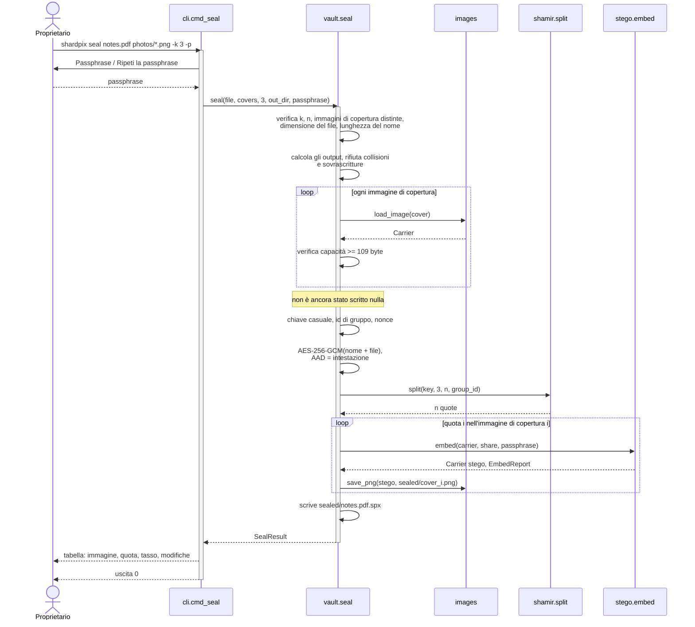
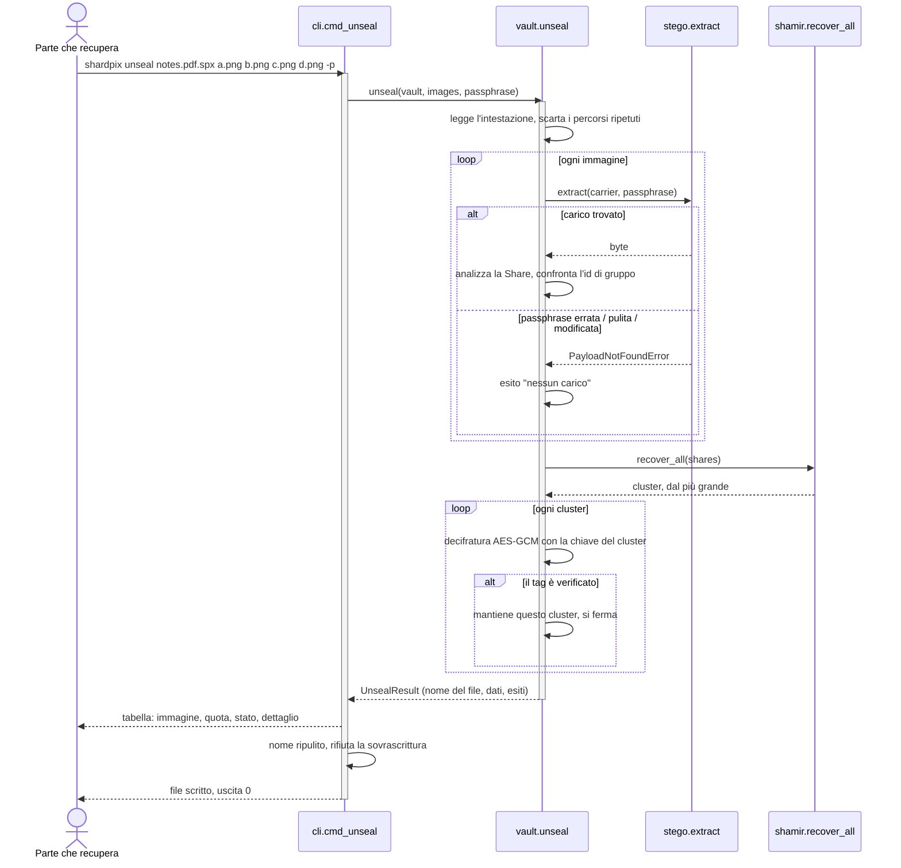
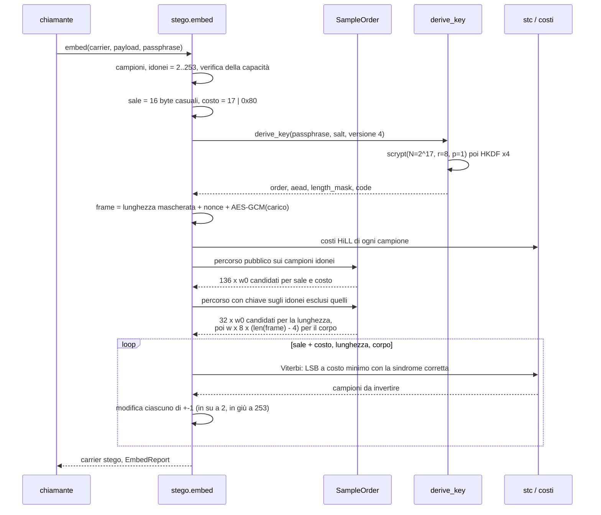
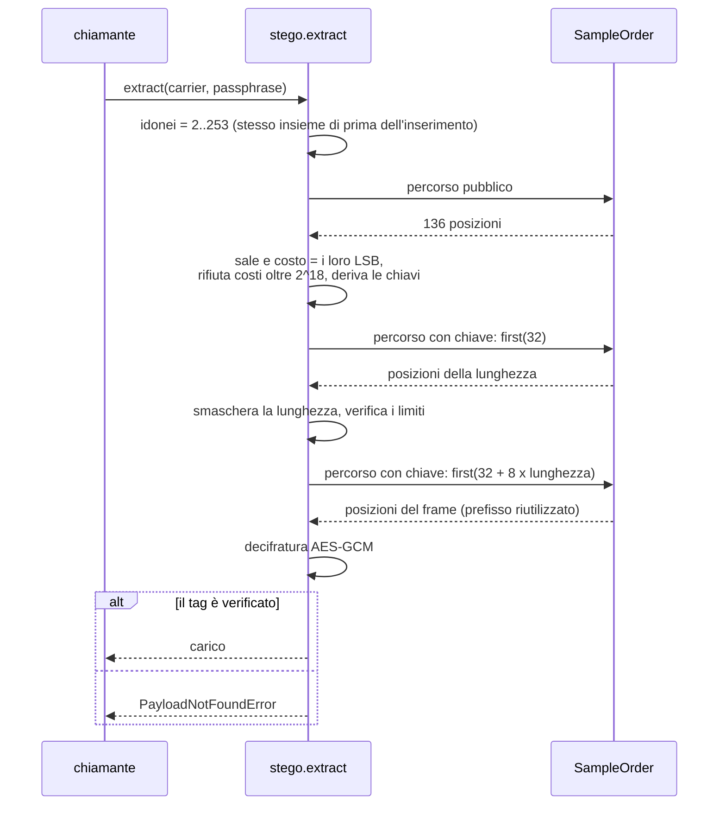
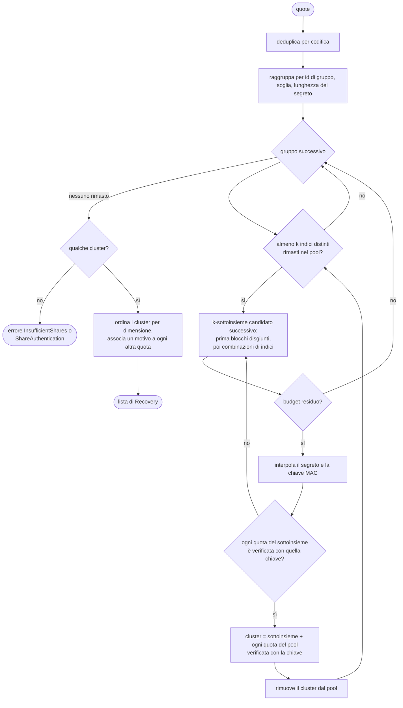
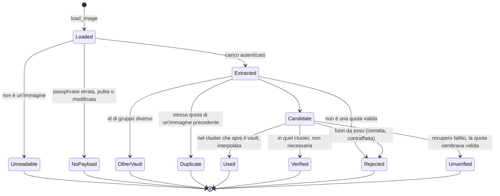
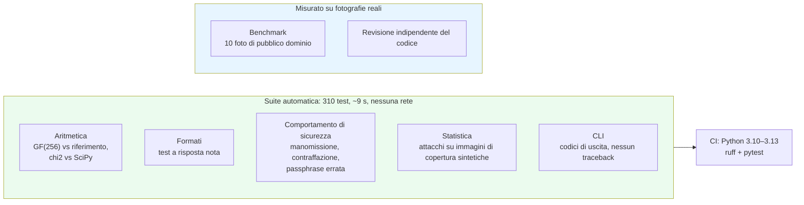

# 4. Comportamento a runtime

| | |
| --- | --- |
| Documento | SDD-04 — Vista dinamica |
| Sistema | shardpix 2.0.0 |
| Stato | Approvato |
| Ultima revisione | 2026-10-07 |
| Lingua | Italiano (traduzione di [docs/04-runtime-behaviour.md](../docs/04-runtime-behaviour.md); in caso di differenze fa fede l'inglese) |

## 4.1 Scopo

Questo documento descrive ciò che accade a runtime: le interazioni tra i
componenti per ciascun comando principale, l'algoritmo di recupero delle quote,
il modo in cui gli errori si propagano fino ai codici di uscita e quanto tempo
richiedono le operazioni. La struttura statica corrispondente si trova in
[01-architecture.md](01-architecture.md).

## 4.2 Sigillare un file

Ogni controllo che può fallire viene eseguito prima della prima scrittura,
quindi un errore di battitura nel nome di un'immagine di copertura o
un'immagine di copertura troppo piccola lasciano la directory di output
esattamente com'era. Gli unici errori che possono lasciare un output parziale
sono quelli del file system stesso (disco pieno, permessi) a metà della
scrittura.

## 4.3 Aprire un vault

Il tag di autenticazione del vault è l'arbitro di ultima istanza. Le quote
possono soltanto dimostrare di essere coerenti tra loro; solo il vault può
dimostrare che sono le *sue* quote. È questo che sventa un insieme di quote
fabbricate che risulti più numeroso di quello autentico (05 SP-06).

## 4.4 Inserimento di un carico

Un'immagine di copertura JPEG segue invece lo stesso percorso tramite
`jpeg.embed` (formato 5): `media.open_cover` ne legge i coefficienti
quantizzati senza decodificarli, i candidati sono i coefficienti AC di
luminanza non nulli, i costi sono UERD, e il risultato viene riscritto come
JPEG con le tabelle e i metadati originali. I metodi di base del formato 3,
usati solo dai benchmark, scrivono un bit per campione senza costi né codici.

## 4.5 Estrazione di un carico

L'estrazione rispecchia l'inserimento. Prova prima il formato 4 e, se non
trova nulla, il formato 3; un byte di costo appartenente all'altro formato, o
un costo fuori intervallo, termina un tentativo prima di qualsiasi derivazione
della chiave, quindi la lettura di un'immagine in formato 3 non costa quasi mai
un secondo scrypt. Nel formato 4 ogni lettura descritta sotto è una sindrome
su `w0` o `w` candidati per bit anziché un singolo LSB; il diagramma mostra il
formato 3. In entrambi i casi il percorso viene letto due volte. L'estrattore
ha prima bisogno di 32 posizioni per leggere la lunghezza, e solo allora sa
quante altre leggerne. `SampleOrder.first` memorizza in cache ciò che ha già
calcolato, così la seconda chiamata estende la prima invece di ricominciare da
capo e, poiché ogni prefisso del percorso è stabile (ADR-04), le prime 32
posizioni sono le stesse in entrambe le chiamate.

## 4.6 Recupero delle quote: ricerca dei cluster

`shamir.recover_all` deve gestire qualsiasi combinazione di quote valide,
danneggiate, duplicate, estranee e fabbricate, con una quantità di lavoro
limitata.

Due proprietà rendono questo procedimento economico nella pratica e corretto
sotto attacco.

**I cluster non si sovrappongono mai.** Il MAC di una quota viene verificato
con una sola chiave MAC, quindi una quota autentica non può mai entrare in un
cluster fabbricato e viceversa. Rimuovere dal pool un cluster trovato non fa
quindi perdere nulla.

**I blocchi disgiunti vengono per primi.** Se le quote non valide sono meno dei
blocchi di k, un blocco è interamente valido. Con una quota danneggiata su
venti in una suddivisione 6-di-20 il secondo candidato ha successo; nel
semplice ordine delle combinazioni i primi C(19, 5) = 11.628 candidati
conterrebbero tutti la quota danneggiata. Le combinazioni di indici incrociate
con una quota per indice garantiscono poi che un'ondata di impostori che
riutilizzano uno stesso indice costi un tentativo per impostore, non
un'esplosione di combinazioni.

`combine` prende il primo recupero (il più grande) e rifiuta i pareggi;
`unseal` li prova tutti contro il tag del vault.

## 4.7 Ciclo di vita di un'immagine durante l'apertura

Ogni immagine termina in esattamente uno stato, e la CLI stampa una riga per
immagine sia che l'apertura riesca sia che fallisca: chi deve rintracciare un
detentore mancante ha bisogno di sapere quale immagine ha causato il problema.

## 4.8 Propagazione degli errori

| Livello | Meccanismo | Esempio |
| --- | --- | --- |
| Funzioni pure | Sollevano una specifica sottoclasse di `ShardpixError`, o `ValueError` per una precondizione violata | `CapacityError`, `ShareFormatError` |
| Lavoro per immagine in `unseal` | Intercettato e registrato come `ImageOutcome`; il ciclo prosegue | Un'immagine illeggibile non impedisce la lettura delle altre |
| Lavoro per riga in `combine` | Righe malformate raccolte come problemi, segnalate, saltate | Una quota troncata in un file di cinque |
| Errori del vault e delle quote | Sollevati con i dettagli allegati (`outcomes`, `rejected`) | `VaultError` contiene l'intera tabella per immagine |
| `cli.main` | `ShardpixError` e `OSError` → messaggio di una riga, uscita 1; argparse → uscita 2; Ctrl-C → uscita 130 | `error: s.jpg: output must be a .png file …` |

| Codice di uscita | Significato |
| --- | --- |
| 0 | Successo |
| 1 | Errore previsto: input non valido, passphrase errata, quote insufficienti, errore di I/O |
| 2 | Errore di utilizzo (opzione sconosciuta, argomento mancante) |
| 130 | Interrotto |

La validazione avviene il prima possibile: la soglia, le immagini di copertura
e ogni percorso di output vengono controllati prima che la passphrase venga
usata per qualsiasi cosa, e prima che venga scritto un solo file.

## 4.9 Profilo dei tempi indicativo

Misurato su una VM cloud (Python 3.13, un core), come ordine di grandezza.
Le righe del formato 4 sono state misurate mentre un altro job condivideva la
CPU, quindi sono limiti superiori.

| Operazione | Durata |
| --- | --- |
| Derivazione della chiave (scrypt, N = 2^17) | ~0,42 s per immagine |
| `embed` / `extract`, 512 × 512 RGB, carico di una quota di vault, formato 3 | ~0,45 s ciascuno, principalmente scrypt |
| `embed`, 1920 × 1080 RGB, carico di una quota di vault, formato 3 | ~0,5 s |
| `embed`, carico di una quota di vault, formato 4: 512 × 512 / 1920 × 1080 / 12 MP RGB | ~1,7 s / ~2,3 s / ~8,4 s: scrypt, HiLL sull'intera immagine, Viterbi |
| `extract`, carico di una quota di vault, formato 4, una qualsiasi delle dimensioni sopra | ~0,5 s, principalmente scrypt |
| `seal`, file da 1 MB, 5 immagini di copertura da 512 × 512 | ~2,4 s |
| `seal`, file da 1 MB, 5 immagini di copertura da 1920 × 1080 | ~5,3 s: compressione PNG e scrypt |
| `unseal`, 3 immagini da 512 × 512 o 1920 × 1080 | ~1,3 s, principalmente scrypt |
| `analyze`, 1920 × 1080 RGB | ~1,2 s (RS 0,3 s, chi quadrato sequenziale 0,9 s) |
| Benchmark completo (10 immagini di copertura, 4 strategie, 11 tassi) | ~40 s |
| Suite di test (369 test) | ~60 s con i test del rilevatore addestrato e quelli adattivi |

Nel formato 3 il costo del posizionamento di un carico non dipende dalla
dimensione dell'immagine (ADR-04); ciò che cresce con l'immagine sono la
decodifica, la maschera di idoneità e la codifica PNG. Il formato 4 aggiunge la
mappa dei costi HiLL, che viene calcolata sull'intera immagine e domina per le
foto di grandi dimensioni, e un passaggio di Viterbi la cui lunghezza dipende
solo dal carico.
La dimensione del file conta poco: AES-GCM gira alla velocità della memoria.

## 4.10 Strategia di verifica

| File di test | Test | Obiettivo |
| --- | --- | --- |
| `test_gf256.py` | 18 | Tutti i 65.536 prodotti confrontati con shift-and-add; esempi FIPS-197; assiomi di campo |
| `test_shamir.py` | 62 | Ogni k-sottoinsieme; segretezza teorica dell'informazione per enumerazione; manomissione; cluster contraffatti; robustezza della ricerca |
| `test_stego.py` | 54 | Andata e ritorno in ogni modalità; autenticazione; limiti di distorsione; invarianza alla saturazione; proprietà del percorso; derivazione della chiave |
| `test_images.py` | 19 | Conversione di modalità, preservazione del canale alfa, output senza perdita, creazione esclusiva dei file |
| `test_chi_square.py` | 17 | Funzione di sopravvivenza vs SciPy; rilevamento su istogrammi "a pettine" |
| `test_rs.py` | 13 | Operazioni di flip; le stime seguono la sostituzione; matching ingenuo vs consapevole della saturazione |
| `test_vault.py` | 59 | Ogni sottoinsieme apre il vault; errori; insiemi contraffatti; collisioni; nomi ripristinati |
| `test_cli.py` | 47 | Ogni comando dall'inizio alla fine; errori puliti |
| `test_known_answers.py` | 5 | Posizioni del percorso, byte delle quote, pixel stego (con e senza passphrase) e byte del vault fissati |
| `test_properties.py` | 16 | Test basati su proprietà e fuzzing del parser (Hypothesis); `HYPOTHESIS_PROFILE=fuzz` per 3.000 casi ciascuno |

Due scelte mantengono la suite veloce e deterministica. Le immagini di
copertura vengono sintetizzate da funzioni regolari più un lieve rumore anziché
caricate da disco, e modellate in base a ciò che ciascun test misura: un
istogramma "a pettine" per i test del chi quadrato, uno con contrasto esteso per
i test sulle immagini pulite. Inoltre il costo di scrypt viene ridotto per i
test da una fixture autouse, mentre un test dedicato verifica i parametri di
produzione e i test a risposta nota vengono eseguiti con essi.
