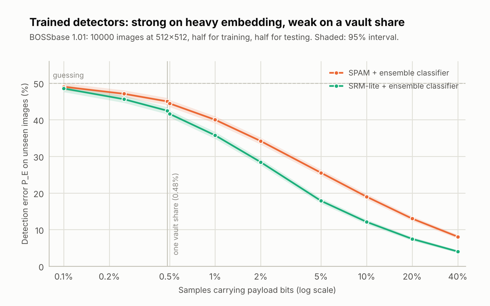
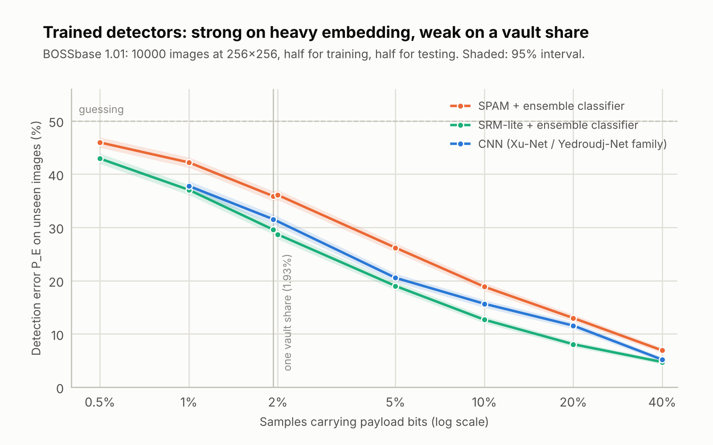

# 5. Analisi di sicurezza

| | |
| --- | --- |
| Documento | SDD-05 — Analisi di sicurezza |
| Sistema | shardpix 1.1.0 |
| Stato | Approvato |
| Ultima revisione | 2026-10-06 |
| Lingua | Italiano (traduzione di [docs/05-security-analysis.md](../docs/05-security-analysis.md); in caso di differenze fa fede l'inglese) |

## 5.1 Scopo e ambito

Questo documento stabilisce che cosa protegge shardpix, contro chi, sulla base
di quali argomentazioni e dove si ferma. Riporta inoltre le misure di
steganalisi su cui si fondano le affermazioni sulla rilevabilità.

shardpix è un progetto da portfolio e di apprendimento. La sua crittografia
proviene da librerie sottoposte ad audit (ADR-02), il suo codice è testato
rispetto a riferimenti indipendenti ed è stato sottoposto alla revisione
interna documentata in [06-security-review.md](06-security-review.md), ma
**il sistema nel suo complesso non è stato sottoposto ad audit da una terza
parte indipendente**. Per segreti la cui perdita farebbe davvero male, è
preferibile usare strumenti consolidati — ad esempio
[age](https://age-encryption.org) per la cifratura dei file e le
implementazioni di
[SLIP-0039](https://github.com/satoshilabs/slips/blob/master/slip-0039.md)
per la condivisione di segreti — e considerare shardpix un modo ben
documentato per capire come sono costruiti strumenti di questo tipo.

## 5.2 Modello delle minacce

### 5.2.1 Beni da proteggere

| Bene | Descrizione |
| --- | --- |
| A-1 Contenuto del file | Il file sigillato. |
| A-2 Chiave | La chiave a 256 bit che lo cifra. |
| A-3 Esistenza | Il fatto stesso che una data immagine contenga dati nascosti. |
| A-4 Disponibilità | La capacità di k custodi onesti di recuperare il file. |

### 5.2.2 Avversari

| Id | Avversario | Capacità |
| --- | --- | --- |
| ADV-1 | Custode curioso o coalizione di custodi | Possiede fino a k − 1 immagini, può conoscere la passphrase, può possedere il file del vault. |
| ADV-2 | Scopritore passivo | Ha alcune immagini (un telefono rubato, un album condiviso), non la passphrase. |
| ADV-3 | Steganalista | Vuole distinguere le immagini stego dalle foto ordinarie; dispone dello strumento e del suo codice sorgente. |
| ADV-4 | Falsificatore attivo | Può modificare immagini, fabbricare quote (conosce l'id pubblico del gruppo) e modificare il file del vault. |

### 5.2.3 Ipotesi

1. La macchina su cui gira shardpix non è compromessa durante la sigillatura
   o l'apertura.
2. Le immagini di copertura originali non sono a disposizione dell'avversario
   (si veda il §5.6).
3. La passphrase, quando usata, non è indovinabile entro il budget di scrypt.
4. Le immagini viaggiano come file; nessuno le ricomprime o le ridimensiona
   lungo il percorso.
5. L'avversario conosce ogni dettaglio del progetto (principio di
   Kerckhoffs): ogni argomentazione che segue presuppone che il codice
   sorgente sia pubblico, perché lo è.

## 5.3 Proprietà di sicurezza

| Id | Proprietà | Contro | Argomentazione | Verificata da |
| --- | --- | --- | --- | --- |
| SP-01 | Il file è riservato senza k quote | ADV-1, ADV-2 | AES-256-GCM con una chiave casuale uniforme che esiste solo sotto forma di quote di Shamir (e, per breve tempo, in memoria). | `test_vault.py::TestFailures` |
| SP-02 | Il file e i suoi metadati sono autentici | ADV-4 | Tag GCM sul testo cifrato; l'intestazione (id del gruppo, k, n, nonce) costituisce i dati associati; il nome del file è all'interno del testo cifrato. | `test_tampered_vault_file`, `test_tampered_header_is_detected` |
| SP-03 | k − 1 quote non rivelano nulla sulla chiave | ADV-1 | Ogni byte di chiave ‖ chiave MAC ha il proprio polinomio casuale di grado k − 1, quindi qualsiasi insieme di k − 1 valori è uniforme qualunque sia la chiave. I MAC dipendono solo dalla chiave MAC, che è condivisa allo stesso modo, quindi non aggiungono nulla — nemmeno per un segreto a bassa entropia (ADR-08). Trapela solo la lunghezza del segreto. | `TestSecrecy` (esaustivo su tutti i coefficienti), `test_mac_is_not_keyed_with_the_secret` |
| SP-04 | Le quote danneggiate o alterate vengono rilevate e identificate | ADV-4 | Il checksum intercetta i danni accidentali senza bisogno di una chiave; una volta che k quote valide ricostruiscono la chiave MAC, ogni altra quota viene verificata e segnalata. | `TestAuthentication`, `TestRobustSearch` |
| SP-05 | Un'immagine non rivela né il suo carico né quali campioni lo contengono | ADV-2, ADV-3 | Carico sigillato con AES-256-GCM; posizioni ottenute da un percorso ChaCha20 con chiave derivata da scrypt(passphrase, sale per immagine); lunghezza mascherata. Senza la passphrase i bit scritti sono indistinguibili da bit casuali. | `TestAuthentication`, `TestKeyDerivation` |
| SP-06 | Un insieme di quote fabbricato non viene mai accettato come chiave del vault | ADV-4 | I cluster sono disgiunti; ogni chiave candidata viene verificata con il tag GCM del vault, che un falsificatore non può soddisfare senza la chiave vera. | `TestForgedSets` |
| SP-07 | Indovinare la passphrase è costoso e va fatto immagine per immagine | ADV-2 | scrypt N = 2^17, r = 8 (≈ 128 MiB, ≈ 0,4 s per tentativo, la prima raccomandazione di OWASP), con sale per immagine, quindi non si può precalcolare alcuna tabella per una dimensione d'immagine e nessun tentativo si riutilizza su un'altra immagine. | `test_production_scrypt_cost`, `test_same_passphrase_scatters_differently_in_every_image` |
| SP-08 | Un unico messaggio di errore per ogni fallimento dell'estrazione | ADV-3, ADV-4 | Passphrase errata, immagine pulita e immagine modificata sollevano tutte lo stesso `PayloadNotFoundError`, quindi lo strumento non fa da oracolo per "c'è qualcosa qui?". | `TestAuthentication` |
| SP-09 | Né la steganalisi classica né quella addestrata (SPAM, SRM-lite) rilevano una quota del vault nel formato 4 | ADV-3 | Inserimento adattivo ±1 con codici a traliccio di sindrome (STC) e costi HiLL (ADR-12), nessuno spostamento forzato a 0/255 (ADR-06) e un carico fisso di 1.264 bit. Al livello del caso su BOSSbase 512x512 (§5.5.6); il formato 3 era debolmente rilevabile (§5.5.5). | Benchmark (§5.5.1–5.5.6) |
| SP-10 | Il ripristino di un file non può uscire dalla directory di output né abusare del terminale | ADV-4 | `safe_filename` conserva il nome base, rimuove i caratteri di controllo e di formato e sostituisce i nomi riservati. | `TestRestoredNames`, `TestSafeFilename` |
| SP-11 | Nessun input viene mai sovrascritto | Errore dell'utente | Controlli di identità dei percorsi, senza distinzione tra maiuscole e minuscole, nella CLI e in `seal`. | `TestOutputCollisions`, `test_combine_never_overwrites_its_input` |

Che cosa shardpix deliberatamente **non** afferma: che una quota sia
invisibile a *qualsiasi* rilevatore addestrato — il formato 4 è al livello del
caso contro SPAM e SRM-lite (§5.5.6), ma rilevatori più potenti non sono stati
eseguiti —, che le quote nel formato 3 siano invisibili in immagini di
copertura piccole (non lo sono, §5.5.5), o che il file del vault in sé passi
inosservato — è un testo cifrato riconoscibile.

## 5.4 Parametri crittografici

| Scopo | Primitiva | Parametri | Fonte |
| --- | --- | --- | --- |
| Cifratura del file | AES-256-GCM | Chiave casuale a 256 bit, nonce casuale a 96 bit, AAD di 35 byte | `cryptography` |
| Cifratura del carico stego | AES-256-GCM | Chiave derivata a 256 bit, nonce casuale a 96 bit, AAD = dominio ‖ versione ‖ lunghezza | `cryptography` |
| Rafforzamento della passphrase | scrypt | N = 2^17, r = 8, p = 1, sale a 128 bit per immagine; costo memorizzato nell'immagine, accettato al massimo 2^18 | `hashlib` |
| Separazione delle chiavi | HKDF-SHA256 | Etichette `order`, `aead`, `length` | `cryptography` |
| Posizioni dei campioni | Keystream ChaCha20 | Chiave a 256 bit, riduzione modulare con campionamento per rifiuto | `cryptography` |
| Autenticazione delle quote | HMAC-SHA256 | Chiave MAC condivisa a 256 bit, tag troncato a 128 bit | `hmac` |
| Checksum delle quote | SHA-256 | Troncato a 32 bit (solo danni accidentali) | `hashlib` |
| Condivisione del segreto | Shamir su GF(2^8) | Polinomio 0x11B, generatore 0x03, k ≤ n ≤ 255 | questo progetto |
| Casualità | `os.urandom` | — | CSPRNG del sistema operativo |

Il riuso del nonce non è un problema: ogni chiave AES-GCM viene usata per
cifrare esattamente una volta (la chiave del vault è nuova per ogni vault; la
chiave stego è nuova per ogni immagine perché lo è il sale), e le chiavi
ChaCha20 vengono usate solo per generare un unico keystream.

## 5.5 Risultati della steganalisi

Il benchmark inserisce bit casuali — l'aspetto che ha un carico cifrato — in
dieci fotografie di pubblico dominio di scikit-image (sei RGB, quattro in
scala di grigi) a undici tassi, da 0 al 75% dei campioni, con quattro
strategie, ed esegue i due attacchi classici. Si esegue con
`python -m shardpix.analysis.benchmark`; i numeri grezzi sono in
[data/benchmark.json](../docs/data/benchmark.json). Il §5.5.5 aggiunge
rilevatori addestrati su un dataset standard di 10.000 fotografie.

### 5.5.1 Analisi RS

<picture>
  <source media="(prefers-color-scheme: dark)" srcset="../assets/rs-estimate-dark.png">
  
</picture>

Stima RS media sulle dieci fotografie:

| Strategia | 0% | 5% | 10% | 20% | 50% | 75% |
| --- | ---: | ---: | ---: | ---: | ---: | ---: |
| LSB replacement, sparso | +2,0% | +7,3% | +12,9% | +21,2% | +50,9% | +76,8% |
| LSB matching, ingenuo | +2,0% | +2,6% | +2,4% | +1,3% | +2,7% | +3,6% |
| shardpix | +2,0% | +2,2% | +1,4% | +2,3% | +2,2% | +1,4% |

RS misura l'LSB replacement in modo quasi esatto e, in media, non vede
nessuna delle due varianti di LSB matching. La media nasconde un caso, che è
quello che ha motivato l'ADR-06:

<picture>
  <source media="(prefers-color-scheme: dark)" srcset="../assets/rs-clipped-dark.png">
  
</picture>

Stima RS per fotografia con il 50% dei campioni che trasportano dati:

| Immagine di copertura | Pulita | LSB replacement | LSB matching, ingenuo | shardpix |
| --- | ---: | ---: | ---: | ---: |
| astronaut | +2,4% | +52,3% | +22,4% | +4,5% |
| chelsea | +0,0% | +49,8% | -0,4% | -1,0% |
| coffee | +2,1% | +52,3% | +1,7% | +3,3% |
| rocket | +0,9% | +51,2% | +0,8% | +0,7% |
| hubble_deep_field | +8,3% | +54,2% | +2,8% | +5,9% |
| immunohistochemistry | -2,5% | +47,9% | -2,2% | +3,2% |
| camera | +1,2% | +52,4% | +1,0% | -0,0% |
| brick | +0,3% | +51,9% | -1,0% | -1,0% |
| grass | +0,7% | +46,3% | -6,0% | +8,2% |
| gravel | +6,9% | +51,1% | +7,8% | -1,9% |

`astronaut` ha l'11% dei suoi campioni a nero puro. Con l'LSB matching
ingenuo questi possono solo salire, da 0 a 1 — esattamente lo spostamento che
fa l'LSB replacement — e RS legge 22%. Saltare i campioni al di fuori
dell'intervallo 2–253 la porta al 4,5%. Sulle texture fini in scala di grigi
(`grass`, `gravel`) RS oscilla di diversi punti tra un'esecuzione e l'altra,
qualunque cosa sia inserita: un singolo canale gli offre meno gruppi su cui
fare la media.

### 5.5.2 Il punto operativo: una quota del vault

I grafici precedenti arrivano fino al 75% per mostrare la forma di ciascuna
curva. Un vault inserisce 158 byte in ogni immagine:

| Immagine di copertura | Dimensioni | Tasso di inserimento della quota | RS, pulita | RS, con quota | Variazione |
| --- | --- | ---: | ---: | ---: | ---: |
| astronaut | 512x512 RGB | 0,161% | +2,45% | +2,47% | +0,02% |
| chelsea | 451x300 RGB | 0,311% | +0,05% | +0,01% | -0,04% |
| coffee | 600x400 RGB | 0,176% | +2,12% | +2,13% | +0,01% |
| rocket | 640x427 RGB | 0,154% | +0,92% | +0,91% | -0,01% |
| hubble_deep_field | 1000x872 RGB | 0,048% | +8,31% | +8,30% | -0,02% |
| immunohistochemistry | 512x512 RGB | 0,161% | -2,46% | -2,35% | +0,11% |
| camera | 512x512 grigi | 0,482% | +1,24% | +1,35% | +0,11% |
| brick | 512x512 grigi | 0,482% | +0,29% | +0,18% | -0,11% |
| grass | 512x512 grigi | 0,482% | +0,68% | -0,02% | -0,70% |
| gravel | 512x512 grigi | 0,482% | +6,89% | +7,01% | +0,12% |

La variazione mediana è di 0,07 punti, a fronte di fotografie pulite che già
vanno da −2,5% a +8,3%. La variazione maggiore, 0,7 punti, si ha su una
texture in scala di grigi, all'interno dell'oscillazione descritta sopra. A
questo tasso, RS non è in grado di distinguere un'immagine sigillata dalla
foto da cui proviene.

### 5.5.3 Attacco chi-quadro

<picture>
  <source media="(prefers-color-scheme: dark)" srcset="../assets/chi-square-dark.png">
  
</picture>

L'attacco chi-quadro è decisivo contro ciò che fanno gli strumenti ingenui —
scrivere il carico a partire dal primo pixel con LSB replacement — e legge la
lunghezza del carico direttamente dalla curva (che termina poco dopo il 50%
reale, perché la statistica del test è cumulativa). La sostituzione sparsa
allo stesso tasso la mantiene alta solo nei primi punti percentuali, e
shardpix si comporta come l'immagine di copertura pulita.

L'attacco è anche soggetto a falsi positivi: su quattro delle dieci
fotografie pulite (`chelsea`, `immunohistochemistry`, `grass`, `gravel`), i
cui istogrammi sono naturalmente regolari, segnala una firma su una porzione
che va dal 46% al 100% dell'immagine. `analyze` lo riporta come indizio, non
come verdetto.

### 5.5.4 L'attacco visivo


Il piano del bit meno significativo di una fotografia non è puro rumore: le
zone uniformi vi lasciano una struttura, come mostrano le bande del cielo in
alto in `camera`. Uno strumento ingenuo che sostituisce la prima metà
dell'immagine cancella quella struttura, e il confine è visibile a occhio
nudo. Una quota del vault modifica qualche centinaio di campioni su 262.144 ed
è invisibile.

### 5.5.5 Rilevatori addestrati

Chi-quadro e RS non richiedono addestramento. La steganalisi moderna sì: un
rilevatore impara la differenza tra immagini di copertura e immagini stego da
migliaia di esempi. Questa sezione mette alla prova shardpix con tre
rilevatori di questo tipo:

| Rilevatore | Caratteristiche | Classificatore |
| --- | --- | --- |
| SPAM | 686 probabilità di transizione markoviana delle differenze tra pixel, progettate contro l'LSB matching (Pevný, Bas e Fridrich) | Ensemble di discriminanti lineari di Fisher su sottospazi casuali (Kodovský, Fridrich e Holub) |
| SRM-lite | 3.125 co-occorrenze di cinque residui del rich model (Fridrich e Kodovský); l'SRM completo ne ha 34.671 | Lo stesso ensemble |
| CNN | Apprese, dopo un banco fisso di 14 filtri passa-alto SRM e un'unità di troncamento | Cinque blocchi convoluzionali della famiglia Xu-Net / Yedroudj-Net, addestrati con curriculum dai tassi alti a quelli bassi |

**Dati.** BOSSbase 1.01, il dataset di riferimento per la steganalisi nel
dominio spaziale: 10.000 fotografie 512x512 in scala di grigi convertite da
RAW, mai compresse in JPEG. In ogni immagine di copertura viene inserito un
carico con la strategia di shardpix (LSB matching sui campioni 2–253,
posizioni derivate dalla chiave, bit casuali) a ciascun tasso. Metà delle
immagini serve ad addestrare il rilevatore, l'altra metà a testarlo;
un'immagine di copertura e la sua immagine stego stanno sempre dalla stessa
parte.

**All'attaccante viene concesso ogni vantaggio.** Il rilevatore viene
addestrato esattamente al tasso su cui viene testato e su immagini della
stessa sorgente delle immagini di test. Sul campo uno steganalista non conosce
né il tasso né la fotocamera e l'elaborazione che hanno prodotto le immagini
di copertura, ed è noto che il *mismatch della sorgente delle immagini* -
addestrare su un tipo di immagini e testare su un altro - costa ai rilevatori
addestrati in accuratezza, spesso in modo sostanziale. I numeri che seguono
sono quindi un limite superiore di ciò che questi rilevatori ottengono, non
una stima di ciò che otterrebbero sulla foto di un custode reale.

**Metrica.** P_E = (falsi allarmi + mancati rilevamenti) / 2 sulle 5.000
coppie di test, alla soglia di decisione propria del rilevatore: 50%
significa tirare a caso, 0% significa non sbagliare mai. L'intervallo è
l'intervallo binomiale al 95% (circa ±1 punto).

<picture>
  <source media="(prefers-color-scheme: dark)" srcset="../assets/ml-detection-512-dark.png">
  
</picture>

BOSSbase alla sua risoluzione nativa 512x512 (numeri grezzi in
[data/ml_benchmark_512.json](../docs/data/ml_benchmark_512.json)):

| Campioni che trasportano bit | Bit | M/√N | SPAM | SRM-lite |
| ---: | ---: | ---: | ---: | ---: |
| 40% | 104.858 | 205 | 8,1% | 4,0% |
| 10% | 26.214 | 51 | 19,0% | 12,1% |
| 2% | 5.243 | 10 | 34,2% | 28,4% |
| 1% | 2.621 | 5,1 | 40,0% | 35,8% |
| **0,48% (una quota)** | **1.264** | **2,5** | **45,0%** [44,0–46,0] | **42,5%** [41,5–43,5] |
| 0,25% | 655 | 1,3 | 47,1% [46,1–48,1] | 45,6% [44,6–46,6] |
| 0,1% | 262 | 0,5 | 49,0% [48,0–50,0] | 48,5% [47,6–49,5] |

Ridimensionata a 256x256, la dimensione su cui viene valutata la maggior
parte della steganalisi basata sul deep learning, una quota occupa l'1,93% dei
campioni (numeri grezzi in
[data/ml_benchmark_256.json](../docs/data/ml_benchmark_256.json)):

<picture>
  <source media="(prefers-color-scheme: dark)" srcset="../assets/ml-detection-256-dark.png">
  
</picture>

| Campioni che trasportano bit | Bit | M/√N | SPAM | SRM-lite | CNN |
| ---: | ---: | ---: | ---: | ---: | ---: |
| 40% | 26.214 | 102 | 6,9% | 4,7% | 5,2% |
| 20% | 13.107 | 51 | 13,0% | 8,1% | 11,6% |
| 10% | 6.554 | 26 | 18,9% | 12,7% | 15,7% |
| 5% | 3.277 | 13 | 26,2% | 19,0% | 20,5% |
| 2% | 1.311 | 5,1 | 36,1% | 28,7% | — |
| **1,93% (una quota)** | **1.264** | **4,9** | **35,9%** [34,9–36,8] | **29,6%** [28,7–30,5] | **31,6%** [30,6–32,5] |
| 1% | 655 | 2,6 | 42,2% | 37,1% | 37,8% |
| 0,5% | 328 | 1,3 | 46,0% | 42,9% | — |

La CNN è stata addestrata una sola volta, dal 40% fino all'1%, con
fine-tuning a ogni tasso a partire dal precedente (20 epoche al 40%, poi 5 per
tasso, su finestre 128x128; circa due ore su quattro core CPU). Non viene
eseguita a 512x512, dove addestramento e test richiederebbero su una CPU un
tempo diverse volte maggiore.

Che cosa mostra tutto questo:

1. **I rilevatori funzionano.** Con il 40% di inserimento il rich model
   sbaglia il 4% delle volte.
2. **Una quota in una foto 512x512 in scala di grigi è rilevabile, ma
   debolmente.** P_E è 42,5% (AUC 0,61) per SRM-lite: ben al di sopra del
   livello del caso con queste dimensioni del campione, ma si tratta di un
   rilevatore che sbaglia 42 decisioni su 100. Con un tasso di base
   realistico - poche delle foto che uno steganalista esamina contengono
   qualcosa - quasi tutti gli allarmi che solleva sarebbero falsi. L'attesa
   dichiarata prima di questa misura, cioè che i rilevatori addestrati non
   avrebbero visto affatto una quota, era sbagliata per immagini di copertura
   così piccole.
3. **Le immagini di copertura più piccole vanno peggio.** A 256x256 gli
   stessi 158 byte sono l'1,93% dei campioni e SRM-lite scende al 29,6%. La
   CNN arriva al 31,6%: una rete di queste dimensioni, addestrata su una CPU,
   eguaglia il rich model invece di superarlo, quindi a questa scala il deep
   learning non cambia il quadro.
4. **Ciò che conta è il carico rispetto alla radice quadrata dell'immagine
   di copertura.** La *legge della radice quadrata* della capacità
   steganografica (Ker et al.) afferma che un carico fisso di M bit in
   un'immagine di copertura di N campioni diventa più difficile da rilevare al
   diminuire di M/√N, non semplicemente di M/N. La quota è fissa a 1.264 bit,
   quindi decide solo la dimensione dell'immagine di copertura. Con
   M/√N ≈ 0,5 SPAM è al livello del caso entro il suo intervallo e SRM-lite
   ne dista 1,5 punti (48,5%, AUC 0,52). Le due dimensioni d'immagine
   concordano con la legge solo approssimativamente (con M/√N = 1,3,
   SRM-lite legge 45,6% a 512 e 42,9% a 256), perché il ridimensionamento
   modifica il rumore su cui si basano i rilevatori.

Che cosa significa per un'immagine di copertura reale: una quota in
un'immagine 512x512 in scala di grigi ha M/√N ≈ 2,5; in una foto a colori da
1 megapixel (3 milioni di campioni) ≈ 0,7; in una foto a colori da 2
megapixel ≈ 0,5, il punto più basso misurato; in una foto da smartphone da 12
megapixel ≈ 0,2, meno della metà di quel valore. **Usare foto a colori di
almeno 2 megapixel** — il consiglio è stato ricavato per il formato 3; il
formato 4 è già al livello del caso a 512x512 (§5.5.6), e più campioni
restano comunque la scelta più sicura. Questa soglia è un'estrapolazione
lungo la legge della radice quadrata a partire da immagini 512x512 in scala
di grigi, non una misura su foto grandi, che BOSSbase non contiene.

Per riprodurre (circa un'ora per i rilevatori basati su caratteristiche a
ciascuna dimensione su quattro core CPU; la CNN circa altre due):

```bash
pip install -e ".[bench,ml]"
python -m shardpix.analysis.ml_benchmark BOSSbase_1.01/ --size 512 --detectors spam,srm_lite
python -m shardpix.analysis.ml_benchmark BOSSbase_1.01/ --size 512 --detectors spam,srm_lite --rates 0.0025,0.001
python -m shardpix.analysis.ml_benchmark BOSSbase_1.01/ --size 256 --rates 0.4,0.2,0.1,0.05,0.02,0.01,0.005 --detectors spam,srm_lite
python -m shardpix.analysis.ml_benchmark BOSSbase_1.01/ --size 256 --rates 0.4,0.2,0.1,0.05,0.01 --detectors cnn --fine-epochs 5 --checkpoint cnn-256
```

### 5.5.6 Inserimento adattivo (formato 4)

Il §5.5.5 ha rilevato che il formato 3 è debolmente visibile ai rilevatori
addestrati nelle immagini di copertura piccole. Il formato 4 (01 ADR-12)
scrive lo stesso carico come codice a traliccio di sindrome le cui modifiche
seguono i costi HiLL: circa un terzo delle modifiche (208 contro 633 per
quota in BOSSbase 512x512, 07 §7.3), tutte nelle texture. Lo stesso
esperimento, con le stesse 10.000 immagini BOSSbase, la stessa suddivisione e
gli stessi rilevatori, è stato eseguito contro di esso; le immagini stego sono
prodotte da `stego.embed` stesso (`ml_benchmark --strategy adaptive`), quindi
ciò che viene misurato è esattamente ciò che lo strumento scrive.

<picture>
  <source media="(prefers-color-scheme: dark)" srcset="../assets/ml-format-comparison-512-dark.png">
  
</picture>

Numeri grezzi in [data/ml_benchmark_512_adaptive.json](../docs/data/ml_benchmark_512_adaptive.json).

| Campioni che trasportano bit | Formato 3, SPAM | Formato 3, SRM-lite | **Formato 4, SPAM** | **Formato 4, SRM-lite** |
| ---: | ---: | ---: | ---: | ---: |
| **0,48% (una quota)** | 45,0% | 42,5% | **49,9%** [48,9–50,9], AUC 0,50 | **49,9%** [48,9–50,8], AUC 0,50 |
| 10% | 19,0% | 12,1% | **46,0%** [45,0–47,0], AUC 0,57 | **42,9%** [42,0–43,9], AUC 0,61 |

Che cosa mostra tutto questo:

1. **Una quota nel formato 4 è al livello del caso.** Entrambi i rilevatori,
   addestrati esattamente a quel tasso su immagini della stessa sorgente delle
   immagini di test, sbagliano il 49,9% delle volte; gli intervalli al 95%
   contengono il 50% e l'AUC è 0,50. Il formato 3 allo stesso tasso dava
   42,5%.
2. **La misura non è cieca.** Al 10% gli stessi rilevatori vedono il
   formato 4 (SRM-lite 42,9%, intervallo ben al di sotto del 50%), quindi
   l'esperimento è in grado di rilevarlo quando c'è qualcosa da rilevare. Un
   risultato nullo senza un controllo positivo non avrebbe dimostrato nulla.
3. **Il guadagno è grande.** Il formato 4 al 10% dei campioni è visibile più
   o meno quanto il formato 3 con una quota (42,9% contro 42,5%), con un
   carico venti volte maggiore. In termini di legge della radice quadrata, la
   stessa immagine di copertura ora trasporta un carico molto più grande con
   lo stesso rischio; per una quota fissa, il punto operativo si sposta ben
   all'interno della regione in cui questi rilevatori falliscono.
4. **Che cosa non mostra.** Rilevatori più potenti (l'SRM completo con i suoi
   residui min-max, SRNet addestrato su una GPU) sono progettati per
   l'inserimento adattivo e potrebbero comunque trovare qualcosa con una
   quota. I tassi intermedi (5%, 2%, 1%) sono in corso di misura con la
   stessa configurazione e verranno aggiunti al file dei dati; una prima
   esecuzione, interrotta prima di essere salvata, ha dato 49,7% (SPAM) e
   50,3% (SRM-lite) all'1%.

Per riprodurre (circa 1,5 ore per tasso su quattro core CPU, dato che il
codificatore a traliccio di sindrome è scritto in puro numpy):

```bash
python -m shardpix.analysis.ml_benchmark BOSSbase_1.01/ --size 512 --strategy adaptive --detectors spam,srm_lite --rates 0.00482177734375
python -m shardpix.analysis.ml_benchmark BOSSbase_1.01/ --size 512 --strategy adaptive --detectors spam,srm_lite --rates 0.1,0.05,0.02,0.01
```


## 5.6 Limiti noti

**Nessun audit indipendente.** Si vedano il §5.1 e lo 06.

**Steganalisi addestrata: misurata contro due rilevatori, non contro tutti.**
Una quota nel formato 4 su BOSSbase 512x512 è al livello del caso per SPAM e
SRM-lite (§5.5.6); il formato 3 era debolmente visibile (42,5% per SRM-lite,
§5.5.5) ed è ancora ciò che scrive `--method matching`. I rilevatori usati
sono SPAM, un sottoinsieme di 3.125 caratteristiche dello spatial rich model
e, per il formato 3, una piccola CNN addestrata su una CPU. L'SRM completo
(34.671 caratteristiche, compresi i residui min-max progettati contro
l'inserimento adattivo) e reti più grandi come SRNet, addestrate su una GPU,
probabilmente farebbero meglio e non sono state eseguite. Tutte le misure
usano un'unica sorgente di immagini (BOSSbase); sul campo, il mismatch della
sorgente delle immagini gioca contro il rilevatore.

**Immagini di copertura JPEG.** I pixel decodificati da un JPEG rispettano la
quantizzazione a blocchi del file originale. Modificarne uno qualsiasi di ±1
rompe questa struttura, cosa che la steganalisi di compatibilità JPEG
(Fridrich, Goljan e Du) può rilevare a qualsiasi tasso di inserimento. Anche
un PNG derivato da un JPEG è di per sé insolito. La CLI avvisa quando
un'immagine di copertura è stata decodificata da un JPEG; usare foto che non
sono mai state compresse in JPEG (esportazioni da RAW, screenshot PNG).

**Disponibilità dell'immagine di copertura.** Se l'avversario possiede
l'immagine di copertura originale, un confronto pixel per pixel rivela ogni
campione modificato. Non pubblicare mai le immagini di copertura e non usare
immagini trovate online: una ricerca inversa per immagini trova l'originale.

**Trasporto.** Le app di messaggistica e i social network ricomprimono o
ridimensionano le immagini, il che distrugge il carico. Le immagini devono
viaggiare come file.

**Metadati.** I PNG prodotti conservano il profilo ICC ma non i dati EXIF.
Una foto da smartphone che arriva come PNG privo di metadati può essere di per
sé insolita in alcuni contesti.

**Il file del vault non è nascosto.** Il suo magic number, l'id del gruppo, la
soglia e il numero di quote sono in chiaro (autenticati, non cifrati).
Chiunque lo trovi sa che è un vault shardpix e quante immagini servono per
aprirlo — ma non il nome del file, il suo contenuto o quali immagini gli
appartengano.

**Una passphrase per vault.** Tutte le immagini di un vault usano la stessa
passphrase, quindi ogni custode che deve poter partecipare a un recupero la
conosce. La passphrase protegge le immagini dagli estranei (ADV-2); la
riservatezza tra i custodi si basa sulla soglia (SP-03), non sulla
passphrase.

**Python non è a tempo costante.** Le consultazioni di tabelle in GF(256) e
altre operazioni su dati segreti hanno tempi di esecuzione dipendenti dai
dati, e Python non può cancellare in modo affidabile i segreti dalla memoria.
Accettabile per uno strumento locale eseguito su una macchina fidata
(ipotesi 1); non accettabile per un servizio.

**Budget di ricerca.** Un avversario che controlla molte delle quote fornite
a `combine` può esaurire il budget di 10.000 sottoinsiemi, trasformando un
recupero in un errore. Non può trasformarlo in una risposta sbagliata.

**Spostamenti forzati residui.** I campioni esattamente a 2 o a 253 si
spostano ancora in una direzione fissa quando trasportano un bit che non
corrisponde. Sono molto più rari dei campioni saturati e non hanno lasciato
traccia nel benchmark.

**Formato v3.** Il formato stego è cambiato due volte (ADR-04, ADR-05, e il
costo di scrypt aumentato nella 1.1, si veda lo 06); le immagini prodotte
dalla 0.x o dalla 1.0 non possono essere lette dalla 1.1. Poiché il costo è
ora memorizzato in ogni immagine, futuri aumenti non romperanno la
compatibilità.

## 5.7 Riferimenti

1. A. Shamir, "How to share a secret", *Communications of the ACM*, 1979.
2. A. Westfeld e A. Pfitzmann, "Attacks on steganographic systems",
   *Information Hiding*, 1999 (attacco chi-quadro, attacco visivo).
3. J. Fridrich, M. Goljan e R. Du, "Reliable detection of LSB steganography
   in color and grayscale images", *ACM Workshop on Multimedia and Security*,
   2001 (analisi RS).
4. J. Fridrich, M. Goljan e R. Du, "Steganalysis based on JPEG
   compatibility", *SPIE Multimedia Systems and Applications*, 2001.
5. J. Harmsen e W. Pearlman, "Steganalysis of additive noise modelable
   information hiding", *SPIE Electronic Imaging*, 2003.
6. A. Ker, "Steganalysis of LSB matching in grayscale images", *IEEE Signal
   Processing Letters*, 2005.
7. J. Fridrich e J. Kodovský, "Rich models for steganalysis of digital
   images", *IEEE Transactions on Information Forensics and Security*, 2012.
8. M. Boroumand, M. Chen e J. Fridrich, "Deep residual network for
   steganalysis of digital images" (SRNet), *IEEE Transactions on Information
   Forensics and Security*, 2019.
9. C. Percival, "Stronger key derivation via sequential memory-hard
   functions" (scrypt), 2009.
10. NIST SP 800-38D, *Recommendation for Block Cipher Modes of Operation:
    Galois/Counter Mode (GCM) and GMAC*, 2007.
11. SatoshiLabs, *SLIP-0039: Shamir's Secret-Sharing for Mnemonic Codes*.
12. T. Pevný, P. Bas e J. Fridrich, "Steganalysis by subtractive pixel
    adjacency matrix" (SPAM), *IEEE Transactions on Information Forensics and
    Security*, 2010.
13. J. Kodovský, J. Fridrich e V. Holub, "Ensemble classifiers for
    steganalysis of digital media", *IEEE Transactions on Information
    Forensics and Security*, 2012.
14. P. Bas, T. Filler e T. Pevný, "Break our steganographic system: the ins
    and outs of organizing BOSS", *Information Hiding*, 2011 (BOSSbase).
15. G. Xu, H.-Z. Wu e Y.-Q. Shi, "Structural design of convolutional neural
    networks for steganalysis", *IEEE Signal Processing Letters*, 2016.
16. M. Yedroudj, F. Comby e M. Chaumont, "Yedroudj-Net: an efficient CNN
    for spatial steganalysis", *IEEE ICASSP*, 2018.
17. A. Ker, T. Pevný, J. Kodovský e J. Fridrich, "The square root law of
    steganographic capacity", *ACM Workshop on Multimedia and Security*, 2008.
